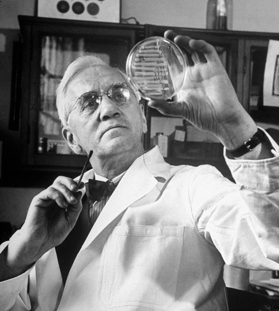
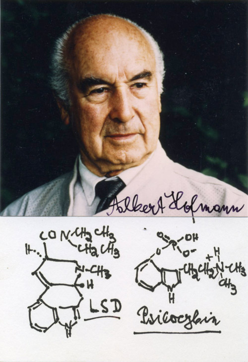

Il termine **Serendipity** deriva da _Serendip,_ l'antico nome persiano dello Sri Lanka e indica lo scoprire una cosa non cercata mentre se ne sta cercando un'altra. Non è pura e mera casualità, come potrebbe portarci a pensare di prima impatto ma racchiude in sé intuizione, fantasia e acume pratico. Per meglio comprendere l'acume che si cela dietro il termine mi piace ricordare la definizione che ne diede il ricercatore biomedico americano H.Comroe:

"_**La Serendipity è cercare un ago in un pagliaio e trovarci la figlia del contadino**_".

Il neologismo fu coniato nel XVIII secolo dallo scrittore **Horace Walpole** che lo usò per la prima volta in una lettera a un suo amico, ispirato dalla fiaba persiana dei "_Tre principi di Serendippo_" scritta da Cristoforo Armeno.

I tre principi coltissimi, educati dai più saggi del regno ma senza alcuna esperienza pratica vengono, con uno stratagemma, allontanati dal regno dal padre e iniziano così il loro viaggio. Incontrano un cammelliere disperato per aver perduto il suo cammello così, per burlarsi di lui, gli riferiscono di aver visto il suo prezioso animale lungo il sentiero percorso. Non solo, ma gli forniscono tre indizi inequivocabili che convincono l'uomo della buona fede dei tre: _" il cammello perduto è cieco da un occhio, gli manca uno dente in bocca ed è zoppo. Ha una soma, carica da un lato di miele e dall'altro di burro, porta una donna, e questa era gravida."_ Ciò nonostante il cammelliere non riesce a trovare lungo il sentiero il suo animale e i tre principi vengono accusati di essere dei ladri e condannati a morte.

Come avranno fatto i tre principi a fornire una descrizione così veritiera e dettagliata sul povero cammello perduto senza averlo realmente mai visto?

... Serendipity... acume, arguzia e spirito di osservazione!!

_Che fosse cieco_ da un occhio era dimostrato dal fatto che, pur essendo l'erba migliore da un lato della strada, era stata brucata quella del lato opposto, a indicare che il cammello vedeva solo da un occhio. _Che fosse privo di un dente_ lo dimostrava l'erba mal tagliata che si poteva osservare lungo la via. _Che fosse zoppo_, lo svelavano le impronte lasciate dall'animale sulla sabbia. È sulla spiegazione del carico, però, che l'abduzione diventa più difficile e mira a stupire: il cammello portava da un lato miele e dall'altro burro perché lungo la strada da una parte si accalcavano le formiche (amanti del grasso) e dall'altro le mosche (amanti del miele); aveva sul dorso una donna perché in una sosta il passeggero si era fermato ai lati della strada a urinare, e questa urina aveva attratto l'attenzione di uno dei principi che, chinatosi per osservarla, aveva visto vicino delle orme di piede umano molto piccolo, che poteva essere di donna o di ragazzo. Per sciogliere la sua curiosità aveva posto un dito nell'urina (cosa non strana per i tempi, e che i medici facevano comunemente al letto del malato) e la odorò, venendo "assalito da una concupiscenza carnale" che può venire solo da urine di donna. Infine la donna doveva essere gravida, perché poco innanzi alle orme dei piedi c'erano quelle lasciate, più profondamente dalle mani, usate dalla donna per rialzarsi a fatica visto il carico del corpo.

Bella favola, vero! Ma come si sposano i due concetti di _Serendipity_ e _Drug Discovery_? La prima basata su una "casualità" degli eventi e la seconda sul puro rigore dell' indagine sistematica? In ogni scoperta è insito il concetto di casualità. Il ricercatore non si limita all'ottenimento di una conferma sperimentale, ma complice dell'intuito o serendipità arriva ad una scoperta scientifica. Quale sia la scoperta scientifica non si sa, non lo sa neanche il ricercatore, ma da qualche parte la serendipity lo condurrà al risultato strepitoso o meno, non pianificato e inaspettato.

La Serendipity è un elemento essenziale dell'avanzamento della Drug Discovery: ecco alcune delle scoperte scientifiche in campo farmaceutico più importanti fatte con il "Metodo della Serendipity".

## **La scoperta della penicillina:Fleming**

Nel 1929 **Alexander Fleming,** medico, biologo e farmacologo britannico, stava lavorando su piastre di ceppi batterici. Si assentò per alcuni giorni per una breve vacanza e al suo rientro notò qualcosa di strano su una delle piastre batteriche. Una piastra, in cui aveva messo in coltura colonie di _Staphylococcus aureus_, non conteneva più le colonie di tale batterio ma si era formato uno strano alone, una muffa aveva contaminato le sue colonie, causandone la morte.

Serendipity? Si, la piastra era stata contaminata da una muffa verde, il \_Penicillium notatum, \_che aveva causato la morte delle colonie di stafilococco. Fleming aveva scoperto la **penicillina**, una muffa capace di produrre una sostanza ad azione battericida.

## La scoperta del viagra: Pfizer

Il **Sildenafil** è un inibitore selettivo della 5PDE, enzima deputato all'idrolisi della cGMP, che agisce con azione vasodilatante sui vasi cardiaci. La molecola era frutto di un lavoro di drug discovery rigorosa da parte di un gruppo di ricercatori della **Pfizer**, che stavano lavorando a un farmaco per la cura dell'_angina pectoris_. Tuttavia durante i test clinici, la molecola mostrò scarsa efficacia sull'angina. Alcuni dei partecipanti alle sperimentazioni, però, riportavano un effetto collaterale singolare: un aumento nel numero di erezioni. A fare la fortuna del sildenafil fu anche la scoperta del meccanismo di rilassamento della muscolatura liscia delle arterie nel pene, con conseguente aumento del flusso sanguigno: l'NO sintasi, enzima responsabile della produzione dell'NO (ossido nitrico). Nel 1993 l’idea del farmaco per il trattamento dell’angina pectoris venne accantonata, e cominciarono gli studi per curare invece la disfunzione erettile.

Il Sildenafil fu brevettato nel 1996 e approvato dalla FDA, per la disfunzione erettile, il 27 marzo 1998.

## La storia dell'LSD-25: Hofmann

L'**LSD** o dietilammide-25 dell'acido lisergico è una fra le più potenti sostanze psicoattive conosciute. È una molecola di sintesi dell'acido lisergico, estratto dall'ergot, un fungo parassita della segale. Nel Medioevo, l'ergot veniva utilizzato dalle donne per indurre le contrazioni uterine durate il parto. Nel 1938, **Hofmann**, chimico svizzero che all'epoca lavorava nei laboratori della **Sandoz**, sintetizzò la dietilmmide dell'acido lisergico, una molecola strutturalmente simile ad uno stimolante del sistema circolatorio (nichetamide), con l'obiettivo di arrivare ad una sostanza ad azione analettica.

L'LSD-25, rimase nei laboratori della Sandoz per cinque anni. Tuttavia, Hoffman, convinto che la sostanza non fosse stata esplorata a fondo, decise di sintetizzarla di nuovo. Fu così che gli cadde una piccola quantità della sostanza sulla mano durante un esperimento di laboratorio provocandogli una notevole irrequietezza e una leggera vertigine, scoprendo così gli effetti psicoattivi della molecola. Era il 16 aprile del 1943.

Serendipity? Ecco la sua definizione dalle parole di Hofmann poco dopo la sua scoperta: _“LSD was not the fruit of a chance discovery, but the outcome of a more complex process that had its beginnings in a definite concept, and was followed up by appropriate experiments, during the course of which a chance observation served to trigger a planned investigation, which then led to the actual discovery.”_
