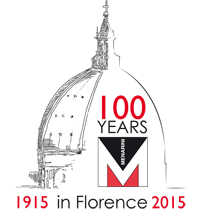
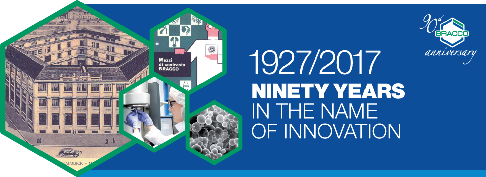
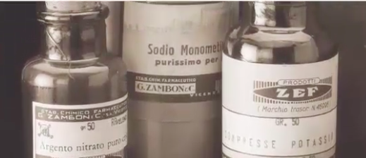
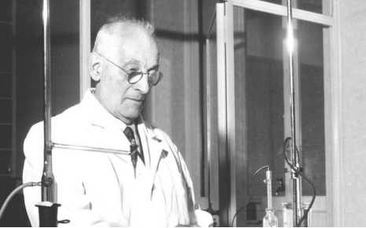

Un tesoretto da quasi 12 miliardi di euro, questo è il valore stimato nel 2017 delle 10 migliori aziende farmaceutiche nate in Italia: Menarini (3.500), Chiesi (1.600), Bracco (1.360), Recordati (1.200), Alfasigma (1.000), Angelini (divisione Pharma, con 850), Zambon (700), Italfarmaco (650), Kedrion (650), Dompé (260), (dati Farmindustria relativi al 2016).

### **I numeri delle Industrie Farmaceutiche in Italia**

Sono circa 200 le aziende associate a Farmindustria , sparse sul suolo italiano di cui circa il 40% a capitale italiano e il restante 60% a capitale estero. Possono contare complessivamente 63.500 dipendenti dei quali il 90% risulta laureato o diplomato e il 43% donne, non contando altri 66.000 nell'indotto. Crescono gli investimenti per le spese di R & D che contano 6.100 addetti alla ricerca, il 52% dei quali risulta essere donna. Si parla nell'anno 2016 di 30 miliardi di euro di produzione, il 73 % dei quali destinato all'export.

In questo articolo volevo focalizzarmi su quel 40% delle Aziende Farmaceutiche che sono nate qui in Italia e si sono distinte, ciascuna nel loro settore fino a creare una ricchezza per l'Italia che non ha eguali in altri settori industriali, sia a livello culturale che economico.

### **MENARINI**

Menarini è il primo Gruppo Farmaceutico italiano nel mondo, presente con i suoi 15 stabilimenti produttivi a: Firenze (Firenze-Sette Santi e Fienze-Scandicci, sede centrale), Pisa, Lomagna, Casaletto Lodigiano,L'Aquila, Badalona (Barcellona), Berlino, Dresda Shannon, Topkapi - Istanbul, Wuhan (Cina), Giacarta,Kaluga (Russia) e Città del Guatemala.

La sua nascita risale al lontano **1886**, quando Archimede Menarini aprì a Napoli il piccolo laboratorio della Farmacia Internazionale. Successivamente spostato a Firenze, oggi ha assunto, in seguito a numerosi investimenti ed acquisizioni in tutto il mondo le dimensioni di una vera e propria "Big Pharma".

**La sua area di ricerca, la vede impegnata nel settore cardiovascolare, oncologico, degli antinfettivi e del dolore.**

### CHIESI

Seconda per fatturato, dietro solo a Menarini, la Chiesi è un’azienda nata a Parma nel **1935**, quando Giacomo Chiesi, un farmacista con il sogno della ricerca, acquista il Laboratorio Farmaceutico Parmense dando così origine alla sua avventura imprenditoriale. All’inizio degli anni Quaranta il laboratorio si ingrandisce fino a quando negli anni sessanta inizia il processo di industrializzazione dell'azienda che ha già ormai acquisito un respiro internazionale. L'azienda conta 26 realtà distribuite in tutto il globo: Parma (sede centrale), Vienna, Bruxelles, Sofia, Shangai, Mosca, San Paolo e Santana de Parnaíba (Brasile), Courbevoie e La Chaussée Saint Victor Blois (Francia), Amburgo, Atene, Città del Messico, GK Rijswijk Den Haag (L’Aia), Khayaban-e-Iqbal (Pakistan), Varsavia, Manchester, Praga, Bucarest, Bratislava, Lubiana, Barcellona, North Carolina, Stoccolma, Istanbul e Budapest.

**Chiesi è specializzata in farmaci per le patologie legate all'apparato respiratorio, per la neonatologia, la fibrosi cistica e le malattie rare (Iperlipidemia severa, LPLD).**

### BRACCO

Al terzo posto si piazza la Bracco, azienda milanese fondata nel **1927** da Elio Bracco. Nata con il nome di _Società Italiana Prodotti E. Merck_, aveva per oggetto la fabbricazione, la confezione e la compravendita dei prodotti chimici della tedesca _E. Merck_. Successivamente con l'ingresso in azienda del figlio Fulvio Bracco e il concomitante ingresso sui mercati del \_Cebion, la \_società inizia ad assumere numeri più importanti fino a quando nel 1949 viene costruito il grande **impianto di Lambrate** che occuperà una superficie di 50.000 mq, di cui 30.000 coperti che avrebbero ospitato la produzione e i nuovi laboratori di ricerca, gestiti dal professor Ernst Felder (uno dei principali referenti scientifici per l’azienda) che lavora soprattutto sulla chemioterapia e **sui mezzi di contrasto per la diagnostica radiologica.**

Attiva nel mercato internazionale nella diagnostica per immagini, Bracco è anche un marchio largamente conosciuto per alcuni storici farmaci quali Cebion, Xamamina, Euclorina, la linea di colliri Alfa e gli integratori per lo sport Friliver. Tuttavia, a seguito dell'accordo siglato nel Novembre del 2016 tra i due colossi italiani, Bracco e Dompé, la divisione Farma del Gruppo Bracco è entrata a far parte del gruppo biofarmaceutico italiano guidato da Sergio Dompé.

Ha una presenza diretta in paesi come Canada, Norvegia, USA, Messico, Brasile, Argentina, Italia, Francia, Germania, Austria, Repubblica ceca, Polonia, Inghilterra e Cina.

### RECORDATI

Quarto posto alla reggiana di nascita Recordati, fondata nel **1926** a Correggio Emilia da Giovanni Ricordati che rileva una piccola farmacia risalente ai primi anni dell'Ottocento trasformandola in una impresa industriale dal nome "Laboratorio Farmacologico Reggiano". Negli anni cinquanta, con l'ingresso in azienda del figlio appena ventitreenne Arrigo, l'azienda viene spostata a Milano ed assumerà dimensioni e fatturati di respiro globale. Oggi conta circa 4.000 dipendenti, sparsi tra le sedi di Milano e Campoverde di Aprilia, in Italia e, nei principali paesi europei, in Russia e negli altri paesi del Centro ed Est Europa, in Turchia, in Nord Africa e negli Stati Uniti d’America.

**Recordati è impegnata nella ricerca e sviluppo di farmaci innovativi per l’area genito-urinaria ed anche di terapie per malattie rare (porfiria epatica, iperammonemia, ecc.).**

### ALFASIGMA

Al quinto posto la giovanissima Alfasigma, nata nel **2015** dall’aggregazione di due storiche aziende italiane: **Alfa Wassermann** e **Sigma-Tau**.

Le sue sedi spaziano in tutto il mondo tra: Italia, Portogallo, Polonia, Tunisia, Cina, Romania, Russia, Messico e Repubblica ceca per gli stabilimenti Alfa Wassermann; Spagna, USA e Francia per quelli a marchio Alfasigma e Italia, Belgio, Svizzera, USA, India e Paesi Passi per gli stabilimenti afferenti al gruppo Sigma-Tau.

### ANGELINI

Di poco sotto alla neo nata Alfasigma, Angelini si posiziona al sesto posto di questa classifica. Nata ad Ancona nel **1919** da un piccolo laboratorio farmaceutico aperto da Francesco Angelini, conoscerà una forte espansione negli anni quaranta quando assumerà il nome di **A.C.R.A.F**. (Aziende Chimiche Riunite Angelini Francesco). Guidato da Francesco Angelini, nipote del fondatore, oggi il gruppo impiega oltre 5.000 persone.

Il marchio Angelini concentra i suoi stabilimenti in Italia: Ancona, Aprilia (LT) e Casella (GE). La produzione farmaceutica avviene nello stabilimento di Ancona per i prodotti finiti e ad Aprilia per le materie prime farmaceutiche, mentre lo stabilimento di Casella è specializzato nella produzione dei disinfettanti a marchio Amuchina. Per la distribuzione a livello globale si affida a partners.

**Angelini è specializzata nelle seguenti aree terapeutiche: dolore e disturbi infiammatori, malattie e disturbi del sistema nervoso, controllo delle infezioni e malattie infettive.** È il gruppo produttore della _Tachipirina_, il farmaco record di vendite in Italia e del noto brand _Amuchina_. Tra i brand internazionali si annoverano Trittico (trazodone, antidepressivo), _Tantum_ (benzidamina, antiinfiammatorio), _Aulin_ (nimesulide, analgesico-antiinfiammatorio), Vellofent (fentanil, analgesico). Nel canale ospedaliero, Angelini è presente con Xydalba (dalbavancina), un antibiotico di nuova generazione per il trattamento delle infezioni acute della cute.

### ZAMBON

Quartultimo posto per il gruppo Zambon, fondato nel **1906** da Gaetano Zambon e il suo socio Silvio Farina a Vicenza con il nome di "Magazzino medicinali Zambon". Con il distacco dalla società del ramo dei Farina negli anni cinquanta, la gestione dell'attività passa ad Alberto Zambon. Nel 1959, con lui la società assume la ragione sociale _Zambon SpA_ e si apre ai mercati esteri.

Oggi il gruppo, presieduto da Elena Zambon, opera direttamente in tre continenti – Europa, Sud America e Asia – con oltre 2.600 dipendenti in 15 Paesi di tutto il mondo.

**Zambon Italia, opera nel mercato farmaceutico in quattro aree strategiche: area respiratorio** (in particolare nel trattamento di patologie severe quali la Broncopneumopatia cronica ostruttiva), **area dolore**, **area donna e area gastrointestinale**. Dal 2012 Zambon entra in due nuove aree terapeutiche: quella del Sistema Nervoso Centrale (CNS) con la molecola Safinamide per il trattamento del **Parkinson** e quella delle Malattie rare con l'acquisizione da Philips di Profile Pharma per il trattamento della **fibrosi cistica**.

### ITALFARMACO

Ottavo, nonché terzultimo posto per Italfarmaco, fondata nel **1938** da Gastone De Santis a Milano.

Oggi il gruppo, presieduto dal figlio Francesco, è presente con la sua attività di vendita di prodotti etici in Italia (la sede centrale di Milano producesiringhe preriempite, fiale e compresse*)*, Svizzera, Francia, Spagna, Portogallo, Grecia, Russia, Turchia, Cile, Perù, Marocco e per la consociata Chemi Spa anche Usa e Brasile dove impiega più di 2.100 persone.

**Italfarmaco orienta i prodotti principalmente alle aree cardiovascolare e osteoporosi, immuno-oncologica, ginecologica, trombosi, ischemia critica e neurologica.**

### **KEDRION**

A pari merito con Italfarmaco, troviamo l'azienda leader in Italia per la raccolta e il frazionamento del plasma umano, la Kedrion. L'azienda nasce nel **2001** a Barga da un processo di integrazione, razionalizzazione e ammodernamento di altre aziende già operanti nel settore. Negli ultimi anni la Kedrion ha ampliato le proprie attività in Germania, Ungheria e negli Stati Uniti e oggi è presente in circa 100 paesi nel mondo, in Asia, Europa, nel Nord e nel Sud America. In Italia sono presenti con il quartier generale a Milano e i tre plant di Napoli, Siena e Lucca (centro di raccolta del plasma).

**I farmaci emoderivati e plasmaderivati che l'azienda produce mirano a curare malattie, patologie e condizioni gravi quali l’emofilia e le immunodeficienze.**

### DOMPE'

_Least but not last,_ la biotecnologica Dompè, che vanta una storia non da poco. È il **1853** quando Gian Antonio Dompé, apre una bottega di speziale in Piazza della Scala a Milano. Bisogna attendere il 1940 quando Franco Dompé, convertendo l’operato del padre in un’attività industriale vera e propria, costituisce Dompé farmaceutici nella sede che tuttora ospita gli uffici centrali dell’Azienda.

Dompé, in Italia ha sede a Milano, dove è presente con il proprio quartier generale, a L’Aquila, con un importante polo industriale e di ricerca biotecnologica, e a Napoli, dove è attivo un segmento di Ricerca & Sviluppo. È presente negli USA (attività di Ricerca & Sviluppo di nuovi farmaci impiegati per la cura di patologie in aree terapeutiche quali il diabete, l’oftalmologia, l’oncologia, e il trapianto d’organo) in Albania (prodotti nell’area della Primary Care), e in Spagna, Barcellona (centri di ricerca per lo sviluppo di soluzioni biotecnologiche innovative). Nel 2016 l'azienda ha annunciato l'espansione verso i mercati europei di Gran Bretagna, Germania e Francia.

**Dompè focalizza il suo impegno su aree terapeutiche mirate, come quella antinfiammatoria, osteoarticolare e respiratoria.**
