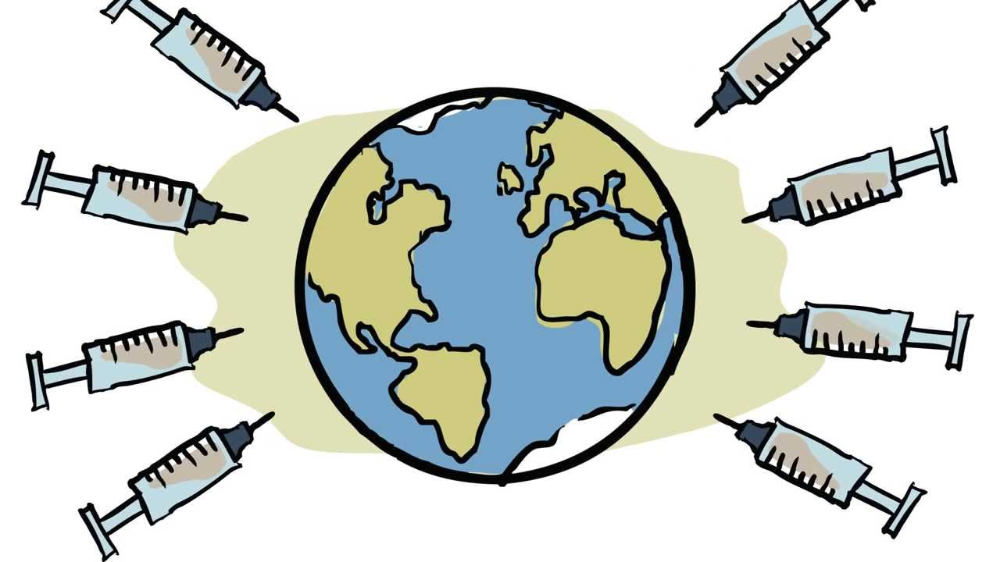
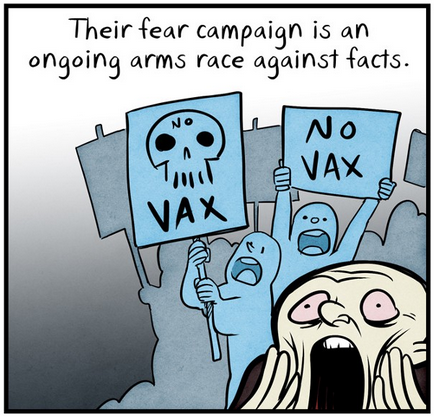
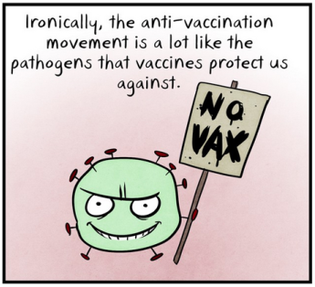
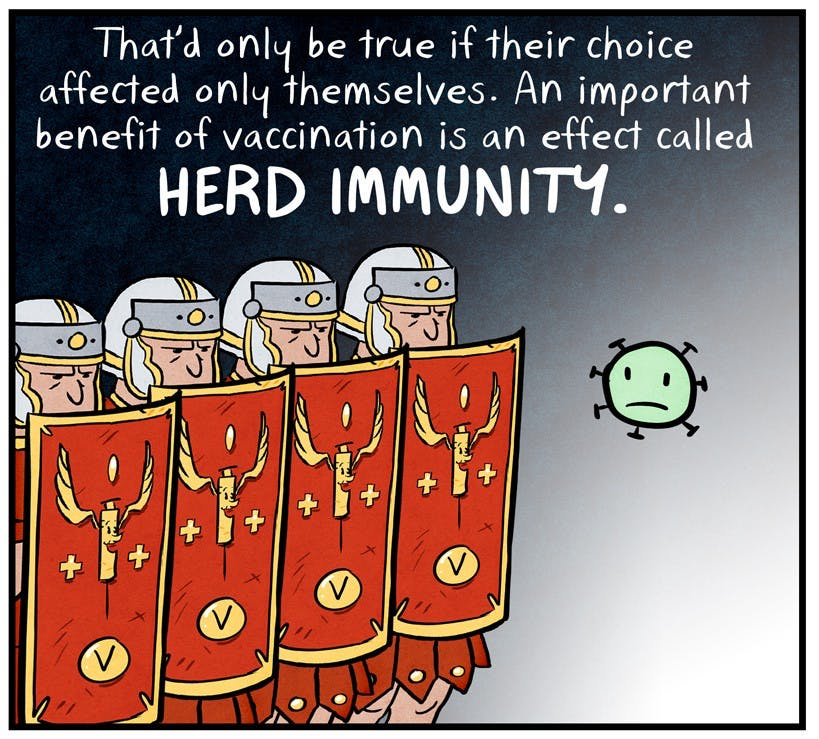

### **Il DECRETO-LEGGE 7 giugno 2017, n. 7**

Siamo sotto assedio? Tutti costringono a vaccinare i nostri figli? Ebbene si, dal **7 giugno 2017**, giorno in cui è stato pubblicato in Gazzetta Ufficiale il testo definitivo di uno dei decreti più discussi d’Italia, quello sulle vaccinazioni obbligatorie per l’iscrizione a scuola, alle nuove generazioni è stato imposto di **proteggersi/ci**!!

il decreto legge, nello specifico, rende obbligatorie **12 vaccinazioni**: antidifterica, antitetanica, antipoliomielitica e antiepatite virale B (le prime quattro già obbligatorie), anti-pertosse, anti-meningococco B e C, anti-morbillo, anti-rosolia, anti-parotite, anti-varicella e il vaccino contro l’Haemophilus influenzae. La mancata presentazione della documentazione di vaccinazione completa preclude l’iscrizione dei bambini da 0 a 6 anni ad asili nido e scuole materne pubblici, mentre per i più grandi (dai 6 ai 16 anni) è garantito l’accesso alla scuola dell’obbligo, ma scatteranno per le famiglie una serie di sanzioni.

### **Il Movimento NO-Vax e la "Herd Immunity"**

_"Queso decreto è un ricatto che mina la libertà di scelta delle famiglie"_

_"No alle imposizioni sulla pelle dei nostri figli e alle minacce a suon di multe"_

_"Vogliamo decidere noi della salute dei nostri figli"_

Queste sono alcune delle voci del popolo, di quella fetta di popolazione che si schiera, in nome della legittimità di prendere proprie scelte nella lotta contro l'imposizione della campagna sulla vaccinazione obbligatoria, i cosiddetti **"NO-Vax"**. Decidere di non vaccinare i propri figli, le generazionie non è una scelta individuale, è una scelta di sanità pubblica. Significa mettere a rischio le generazioni future e tutti noi come collettività.

Infatti, non tutti conoscono la **"Herd Immunity"**, comunemente detta "Immunità di gregge o di gruppo". Ecco come viene definita dall'OMS, Organizzazione Mondiale della Sanità: _"L’immunità di gregge descrive l’immunità che si ottiene quando la vaccinazione di una porzione della popolazione (il “branco”) offre una protezione agli individui non protetti. La teoria dell’immunità di gregge propone che nelle malattie trasmissibili da un individuo ad un altro è difficile mantenere una catena di infezione quando un gran numero della popolazione è immune. Quindi, maggiore è la percentuale di individui immuni in una popolazione, più si riduce la probabilità che una persona suscettibile entrerà in contatto con un agente infettivo. Sia nella teoria che nella pratica, la malattia scompare di solito già prima del raggiungimento di una copertura vaccinale del 100%, questo si è visto con il vaiolo e si spera accadrà con la polio. La percentuale **di individui immuni in una popolazione sopra la quale una malattia non può più persistere è la “soglia dell’immunità di gregge”. Questa percentuale varia con la virulenza e la trasmissibilità di un determinato agente infettivo, l’efficacia e la copertura complessiva del vaccin**o, la copertura vaccinale della popolazione a rischio e il parametro di contatto nella popolazione"._

__

Quindi, in poche parole, una persona non vaccinata che vive tra tanti vaccinati gode di questa Immunità di gregge: i soggetti vaccinati riducono la circolazione dei virus e dei batteri responsabili delle malattie e diminuiscono la possibilità che i non vaccinati possano ammalarsi. Questa immunità di gregge si realizza con quella che l'OMS definisce "soglia dell'immunità di gregge" cioè quando, il **95%** della popolazione è vaccinata contro una determinata malattia.

Si può facilmente comprendere l'attenzione che le autorità della Salute Pubblica hanno su questo tema, non solo per proteggere ogni singola persona da malattie pericolose, ma anche e sottolineerei soprattutto per raggiungere il più alto numero di "soggetti protetti" in modo che l’efficacia dei vaccini si estenda come un ombrello protettivo anche sulla piccola percentuale di soggetti non immuni.

Peccato che siamo ben lontani dal raggiungimento della soglia minima per garantire questa immunità di gregge. Sono ormi anni che siamo ben sotto, di circa un 10%, la soglia del 95%.

### **LA NASCITA DEL VACCINO**

Tutto iniziò nel _1796_ quando** Edward Jenner**, medico e naturalista britannico, colse, qualcosa già noto nella credenza popolare dell’epoca: i contadini che avevano contratto il vaiolo bovino durante la mungitura delle mucche, una volta superata la malattia, non si ammalavano della variante umana del vaiolo , di gran lunga più grave. Fu così che iniettò del materiale preso da una pustola di vaiolo bovino contratto da una giovane donna, ad una giovane ragazzo di 8 anni, figlio della sua portinaia. Il ragazzo non contrasse la malattia, era diventata immune alla forma umana del vaiolo. Fu così che nacque quello che fu il primo tentativo di "Vaccinazione" empirica.

La scoperta si rivelò talmente importante che Napoleone, nel 1805, impose la vaccinazione a tutte le sue truppe e nel 1806 a tutta la popolazione francese. Jenner ebbe il merito di aver iniziato il lungo processo che ha portato all'eliminazione definitiva del virus del vaiolo nel 1980.

Tappa successiva, fondamentale per lo sviluppo dei vaccini si ebbe grazie al biologo e chimico francese **Louis Pasteur**, considerato il fondatore della moderna microbiologia. Pasteur utilizzò per la prima volta un virus attenuato per ottenere l’immunità contro l’infezione; la terapia venne sperimentata con successo su molti cani e nel 1885, iniettò il suo vaccino antirabbico su un bambino già dato per spacciato da altri medici, che era stato morso da un cane idrofobo. Il bimbo si salvò. Dopo quell’episodio la sua fama divenne universale e centinaia di persone, da tutta Europa, morsicate da cani idrofobi si recavano al suo Istituto per essere curati. Il 1 Marzo 1886, Pasteur potè affermare davanti all’\_Accademia delle Scienze \_che, su 350 persone sottoposte al trattamento preventivo del suo vaccino, c’era stata effettivamente una sola morte.

Verso la metà degli anni '50 la situazione cambiò radicalmente quando scoppiarono importanti epidemie di poliomielite, in Europa e negli Stati Uniti. Si rese così necessario sviluppare un vaccino per contrastare l'epidemia dilagante. Il primo tentativo si ebbe ad opera di **Jonas Salk**, medico e scienziato statunitense, che mise a punto il primo vaccino antipolio costituito da virus disattivati con formaldeide nel _1952_; il secondo, fu ad opera di **Albert Sabin**, medico ricercatore americano di origine polacca che sviluppò tra il _1947_ e il _1950_ un vaccino attenuato, ottenuto facendolo riprodurre più volte in cellule non umane e a temperature inferiori a quelle preferite dal patogeno, dotato di un duplice vantaggio, rispetto a quello di Salk: poteva essere somministrato per via orale invece che per via intramuscolare, ed era meno costoso. La vaccinazione antipolio su scala mondiale ebbe inizio nel 1963 con il vaccino di Sabin. Nel 1967 l'Organizzazione Mondiale della Sanità (WHO) avviò una campagna di vaccinazione globale per cercare di debellare il vaiolo in tutto il mondo. L'8 Maggio _1980_ la WHO poté dichiarare la definitiva eradicazione della malattia: uno dei più notevoli successi nella storia della medicina.

### **I DATI AD OGGI DALL'ISS**

Sono al tempo stesso freschi ed allarmanti i dati pubblicati sul 12/mo bollettino settimanale dell'Istituto Superiore di Sanità, nato per monitorare i casi di morbillo e rosolia in Italia (i dati coprono il periodo dal 1 gennaio 2017 all' 11 giugno 2017):

- **2988** casi segnalati dall'inizio del 2017
- l'**89%** dei casi era non vaccinato e il **6%** ha ricevuto solo una dose di vaccino
- il **35%** ha avuto almeno una complicanza (diarrea, stomatite, congiuntivite, polmonite, epatite e insufficienza respiratoria le complicanze più di frequente riscontrate)
- il **40%** è stato ricoverato, il **15%** si è recato in pronto soccorso
- l’età mediana dei casi pari a **27 anni**. La maggior parte dei casi (73%) è stata segnalata in persone di età maggiore o uguale a 15 anni; 177 casi avevano meno di un anno di età
- **237** casi segnalati tra operatori sanitari
- quasi tutte le Regioni (18/21) hanno segnalato casi, ma il 91% proviene da **Piemonte, Lazio, Lombardia, Toscana, Abruzzo, Veneto e Sicilia**

Sono numeri che continuano ad aumentare e che non possono non essere messi in relazione a quelli del drammatico calo della copertura vaccinale cui assistiamo da alcuni anni: nel 2015 solo l’85,29% della popolazione era vaccinata per il morbillo e globalmente la copertura sta calando anche per patologie come poliomielite, epatite B, difterite e pertosse, sotto di quasi il 10% per raggiungere la soglia del 95%, l'immunità di gregge, requisito minimo per fermare la circolazione del virus.

Sono numeri che portano l'Europa e gli Stati Uniti a guardare con preoccupazione l’Italia, come fa riflettere il titolo di un articolo pubblicato sul New York Times "Populismo, politica e vaccini" con cui gli americani criticano la posizione di alcuni esponenti politici sull'emergenza vaccini.

### LASCIAMO PARLARE I NUMERI

È un dato di fatto inoppugnabile che la mortalità infantile dovuta alle malattie infettive, dall’inizio del ‘900 ai nostri giorni sia diminuita drasticamente, passando **dal 1887 da 81.230 decessi fino a diminuire progressivamente negli anni 2000 (gli ultimi dati ISTAT si fermano al 2011 dove sono registrati 4 decessi). **

Dopo la potabilizzazione dell'acqua, che ci tengo a sottolineare non è stato un intervento di carattere medico, possiamo affermare con certezza che **il vaccino è stato lo strumento medico che ha salvato il maggior numero di vite umane.**

L'Organizzazione Mondiale della Sanità calcola che ammontano a **2-3 milioni le vite di bambini che vengono salvate ogni anno,** per il solo fatto di prevenire queste quattro malattie: difterite, pertosse, morbillo, tetano. Si stima, inoltre, che se non avessimo sconfitto il vaiolo con la vaccinazione, ogni anno morirebbero **5 milioni di persone tra bambini e adulti. **

Quello che stiamo assistendo in questo periodo è più di quanto insensato e irrazionale possa esserci, la **"mala informazione scientifica"**, che sta generando caos nella collettività. Che sia una moda del momento, un semplice sfogo di anti conformismo nei confronti di una politica sempre più distante dalle nostre esigenze, questo non può e non deve minare quello che dal 1796 con Jenner ci siamo guadagnati e costruiti, pian piano, ovvero un diritto ad una salute pubblica, una salute collettiva raggiunta grazie ad una delle scoperte mediche più sensazionali, il vaccino.

Decidere di non vaccinare è un rischio, un pericolo serio per te, i tuoi figli e la collettività intera. Io nel mio piccolo ho deciso di dare un contributo, solo la sana divulgazione scientifica, può portarci a rendere noi stessi e chi ci circonda più consapevoli dei rischi che si corrono.

Io sono per **#spreadtherightknowledge**

Io sono per **#immunitàdigregge**

Io sono con **#iovaccino**

**Fonti** http://deadstate.org/this-comic-strip-is-the-definitive-smackdown-to-anti-vaxxers-everywhere/ http://www.epicentro.iss.it/problemi/morbillo/aggiornamenti.asp https://www.istat.it/it/archivio/109861 http://www.epicentro.iss.it/problemi/morbillo/bollettino/Measles\_WeeklyReport\_N12.pdf
