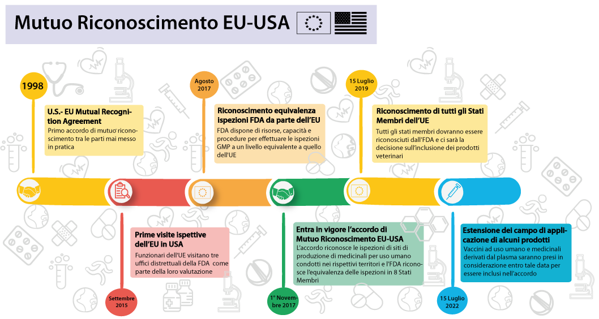

Il **1° Novembre 2017** segna l'entrata in vigore effettivo dell'[accordo di mutuo riconoscimento tra l'Unione Europea (UE) e gli Stati Uniti (USA)](http://www.ema.europa.eu/docs/en_GB/document_library/Press_release/2017/10/WC500237909.pdf), che aggiorna quello del 1998, che riconosce i reciproci risultati delle ispezioni fatte dalle rispettive autorità americane e dei singoli stati membri europei. Ad oggi, infatti nell'UE, le ispezioni dei siti di produzione sono condotte dalle autorità nazionali competenti. L'Agenzia europea dei medicinali svolge un ruolo importante nel coordinamento di queste attività in collaborazione con gli Stati membri.

Ogni anno, le autorità nazionali dell'UE e la FDA ispezionano molti siti produttivi di medicinali nell'UE, negli Stati Uniti e in altre parti del mondo, per garantire che tali siti operino nel rispetto delle buone pratiche di fabbricazione vigenti (cGMP). Nell'ambito dell'accordo di reciproco riconoscimento, le autorità di regolamentazione dell'UE e degli Stati Uniti si affideranno alle ispezioni reciproche e quindi eviteranno duplicazioni. L'accordo consente sia alle autorità dell'UE che alla FDA di utilizzare meglio le proprie risorse ispettive e concentrarsi su siti a rischio più elevato. In casi eccezionali, sia gli enti regolatori dell'UE che la FDA possono riservarsi il diritto di ispezione in qualsiasi momento. Questo accordo nasce anche da un dato chiaro: circa il 40% dei medicinali finiti commercializzati nell'UE proviene dall'estero e l'80% dei produttori di API per medicinali disponibili nell'UE si trovano al di fuori dell'Unione.

I prodotti che rientrano nel campo di applicazione dell'accordo di mutuo riconoscimento sono _prodotti finiti per il commercio ad uso umano_ (gas medicinali, radiofarmaci, prodotti biologici radioattivi, fitoterapia, omeopatici) _e animale, intermedi, alcuni prodotti biologici_ (medicinali biologici-biotecnologici, allergeni), _medicinali per sperimentazione clinica e sostanze attive_. Il sangue umano, il plasma umano, i tessuti umani, gli organi, le terapie avanzate nonché i prodotti immunologici veterinari sono esclusi dallo scopo dell'accordo. I prodotti veterinari non saranno immediatamente inclusi nel campo di applicazione dell'accordo, ma saranno presi in considerazione per l'inclusione entro il **15 Luglio 2019**, così come i vaccini ad uso umano e i medicinali derivati ​​dal plasma che saranno presi in considerazione entro il **15 Luglio 2022**.

Per rendere operativo l'accordo, l'UE e gli USA hanno bisogno di essere rassicurati sul fatto che gli ispettorati GMP di entrambe le parti dispongano delle capacità, delle risorse e delle procedure necessarie per controllare i produttori di medicinali a un livello equivalente. Nel **Settembre 2015**, funzionari dell'UE hanno visitato tre uffici distrettuali della FDA - White Oak nel Maryland, la sede centrale e un laboratorio della FDA - come parte della loro valutazione. Il gruppo dell'UE ha applicato gli stessi criteri che applica all'interno dell'UE quando controlla i propri Stati membri. Ad **Agosto 2017**, la Commissione europea ha confermato che [la Food and Drug Administration (FDA) statunitense dispone di risorse, capacità e procedure per effettuare le ispezioni di buone pratiche di fabbricazione (GMP) a un livello equivalente a quello dell'UE](<http://eur-lex.europa.eu/legal-content/IT/TXT/PDF/?uri=CELEX:22017X0915(01)&from=EN>). Dal canto suo la FDA ha iniziato un programma di osservazione degli audit condotti dalle autorità regolatore di ogni singolo stato membro, il ["Joint Audit Program" (JAP)](http://www.ema.europa.eu/ema/index.jsp?curl=pages/regulation/document_listing/document_listing_000160.jsp&mid=WC0b01ac0580029750). Dopo aver osservato l'audit dell'ispettorato di un paese, la FDA conduce una valutazione indipendente che include una revisione delle politiche di conflitto di interesse del paese, i rapporti di ispezione, i registri di addestramento degli ispettori, l'inventario delle strutture di produzione dei farmaci, il programma di sorveglianza nonché numerose procedure operative standard. Ad oggi, la FDA ha osservato gli audit degli ispettorati responsabili dei medicinali per uso umano nella maggior parte degli Stati membri dell'UE: 8 stati membri dell'UE (**Austria, Croazia, Francia, Italia, Malta, Spagna, Svezia e Regno Unito**) hanno passato con esito positivo questo programma di osservazione. I restanti ispettorati dei paesi comunitari mancanti continueranno a essere valutati fino al 15 luglio 2019. L'accordo salterà se anche uno solo dei paesi membri non verrà considerato idoneo dall'autorità ispettiva americana.

L'Italia è stata una dei primi paesi ai quali l'ispettorato americano ha riconosciuto l'elevato standard di qualità del lavoro di ispettorato della nostra agenzia del farmaco (AIFA). L'AIFA avrà a disposizione 15 giorni di tempo per rispondere all'FDA sulla disponibilità di condurre o meno l'ispezione richiesta da FDA su un sito produttivo italiano. In caso di risposta negativa da parte dell'AIFA, l'FDA avrà tutti i diritti per condurre ugualmente l'ispezione nel territorio italiano affiancata o meno dall'AIFA.

L'attuazione di questo mutuo riconoscimento non ha precedenti poiché la FDA non ha mai riconosciuto l'ispettorato di un altro paese. È un'importante pietra miliare verso una cooperazione più stretta per migliorare l'uso delle risorse disponibili e per salvaguardare la qualità e la sicurezza dei medicinali che arrivano al paziente.
