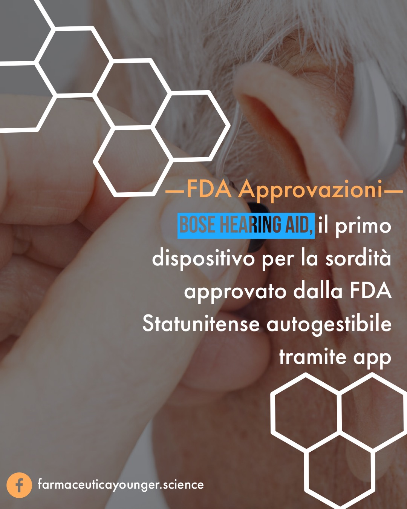

La Food and Drug Administration degli Stati Uniti ha autorizzato la commercializzazione di un nuovo dispositivo medico, l'apparecchio acustico **Bose Hearing Aid**, per soggetti con età maggiore di 18 anni con deficit uditivo da lieve a moderato. È il primo apparecchio acustico autorizzato dalla FDA che consente agli utenti di programmare e controllare il dispositivo in autonomia, senza l'assistenza di un operatore sanitario.

Circa 37,5 milioni di soggetti hanno problemi di udito che vanno da lievi problemi fino alla sordità. La perdita dell'udito può essere causata dall'invecchiamento, dall'esposizione a forti rumori, da determinate condizioni mediche e da altri fattori. Gli individui con perdita dell'udito permanente possono utilizzare gli apparecchi acustici per sentire meglio i suoni intorno a loro, consentendogli di comunicare in modo più efficace con gli altri.

Bose Hearing Aid è un apparecchio acustico a conduzione d'aria senza fili che funziona rilevando le vibrazioni sonore attraverso uno o più microfoni. Il segnale viene elaborato, amplificato e riprodotto attraverso un auricolare posizionato nel condotto uditivo. I pazienti possono regolare l'apparecchio acustico tramite un'app direttamente dal proprio smartphone. Questa tecnologia consente agli utenti di adattarsi direttamente alle impostazioni degli apparecchi acustici, in tempo reale e in ambienti diversi senza dover ricorrere all'assistenza di un operatore sanitario.

Nell'autorizzare la commercializzazione del dispositivo Bose, FDA ha esaminato i dati provenienti da studi clinici su 125 pazienti, che hanno dimostrato come i dati provenienti dall'utilizzo del nuovo dispositivo siano confrontabili con quelli provenienti dall'uso di dispositivi che necessitano di una regolazione da parte di un operatore sanitario. FDA ha concesso l'autorizzazione all'immissione in commercio del dispositivo Bose Hearing Aid a Bose Corporation.

Fonte: https://www.fda.gov/NewsEvents/Newsroom/PressAnnouncements/ucm622692.htm
