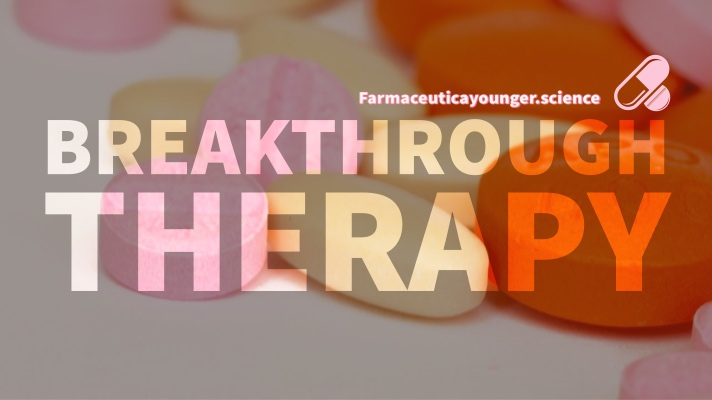

Secondo il dizionario, la parola “breakthrough” significa letteralmente “un improvviso e importante sviluppo o scoperta”. Tuttavia questa traduzione non deve essere forviante poiché non assume lo stesso significato nel processo di approvazione dei farmaci da parte della FDA statunitense.

La designazione di [**Breakthrough Therapy**](https://www.fda.gov/forpatients/approvals/fast/ucm405397.htm) viene concessa dalla FDA statunitense per accelerare lo sviluppo e la revisione del lungo iter di approvazione di un farmaco che è destinato da solo o in combinazione con uno o più farmaci a trattare una condizione grave o potenzialmente fatale, se le evidenze cliniche preliminari dimostrano che questo trattamento offre un miglioramento sostanziale rispetto alla terapia attualmente disponibile per quel tipo di patologia.

La nascita della designazione ha origine nel 2011, quando i sostenitori dell’organizzazione senza scopo di lucro _Friends of Cancer Research_ avevano incitato il Congresso ad accelerare l’approvazione di promettenti farmaci per il trattamento di malattie gravi allo scopo di garantire l’accesso dei pazienti ai farmaci emergenti il più rapidamente possibile. I senatori Orrin Hatch (R-UT), Michael Bennet (D-CO), e Richard Burr (R-NC) avevano quindi introdotto così l’_Advancing Breakthrough Therapies for Patients Act, \_diventato poi legge nel luglio 2012, come_ FDA’s Safety and Innovation Act\_.

La designazione di Breakthrough Therapy è richiesta di solito dalla casa farmaceutica (Sponsor). Se lo sponsor non ha fatto richiesta della designazione, la FDA potrebbe suggerire allo stesso di presentare una richiesta se, dopo aver esaminato i dati e le informazioni presentate (incluse prove cliniche preliminari), l'Agenzia statunitense ritiene che il programma di sviluppo del nuovo farmaco possa soddisfare i criteri per la designazione Breakthrough Therapy e il restante programma di sviluppo del farmaco possono beneficiare della designazione. Le richieste vengono esaminate dal Center for Drug Evaluation and Research (CDER) e dal Center for Biologics Evaluation and Research (CBER). La FDA risponderà alle richieste di designazione Breakthrough Therapy entro sessanta giorni dal ricevimento della richiesta.

I farmaci a cui è stata concessa la designazione vengono sottoposti a una revisione prioritaria (priority review). La FDA collabora con lo sponsor della terapia per accelerare il suo processo di approvazione. Questo processo accelerato può includere revisioni a rotazione, studi clinici più piccoli e alternativi.

La FDA ha altri meccanismi per accelerare la revisione e il processo di approvazione dei farmaci promettenti, tra cui la **fast track designation**, l’**accelerated approval**, e la **priority review**.
