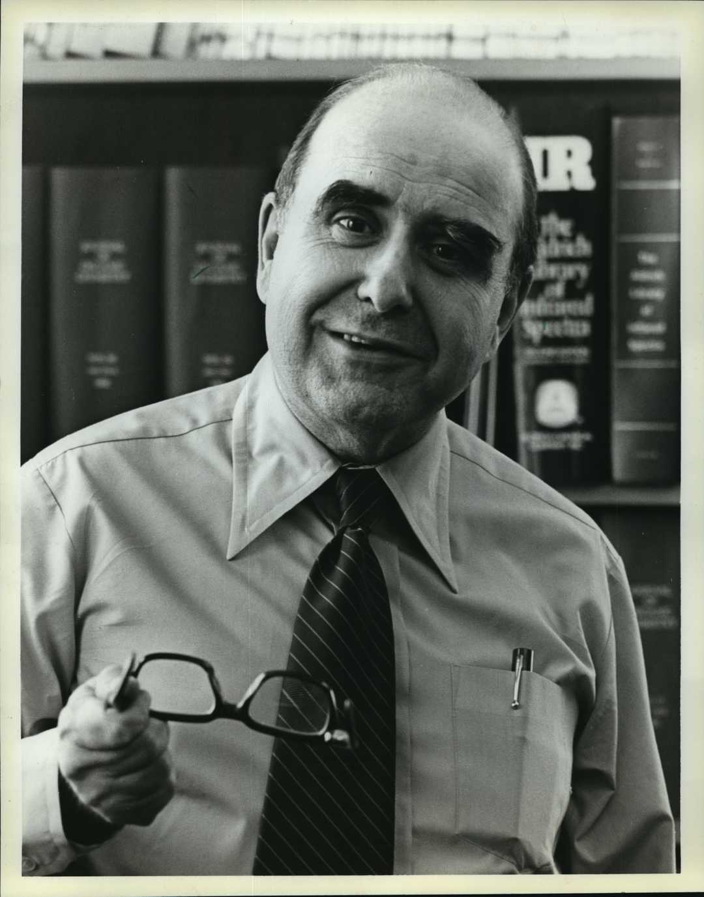

> Ogni volta che ho contemplato qualche risultato nella mia vita, mi sono meravigliato di quante e quanto diverse sono le persone che lo hanno reso possibile.(Alfred Bader, 1965)

Con queste modeste parole, scolpite nel tempo, ricordiamo **Alfred Bader**, deceduto lo scorso 23 Dicembre 2018, icona nel mondo della chimica, della ricerca e della filantropia. Nato a Vienna da una coraggiosa famiglia ebraica e cattolica e orfano di padre a sole due settimane di vita, venne costretto a quattordici anni ad abbandonare gli studi a seguito delle leggi razziali. Fu salvato dalle persecuzioni grazie al progetto _kindertransport_ che gli permise di arrivare sano e salvo in Inghilterra, da lì si spostò infine in Canada e poté proseguire gli studi in collegio. Dopo brillanti anni collegiali nei quali si distinse per la sua attitudine allo studio, si iscrisse alla _Queen’s University_ (Ontario), ottenendo due lauree (in Ingegneria Chimica nel 1945 e in Storia nel 1946) seguite dalla conclusione della laurea specialistica in Ingegneria Chimica nel 1947. Termina gli studi presso la prestigiosa _Harvard University_ con un Master in Ingegneria Chimica nel 1949 e un Dottorato in Chimica Organica nel 1950 studiando col celebre chimico Louis Fieser.

Fonda nel 1951 la **Aldrich Chemical Company** con lo scopo di rifornire con prodotti di alta qualità i piccoli e indipendenti ricercatori. Aveva spesso affrontato la problematica della scarsa qualità o difficoltà di reperimento delle sostanze tanto da dover ricorrere, nei casi più disperati, alla produzione casalinga. La compagnia si espanse a tal punto da ottenere un catalogo imponente di prodotti (circa 50.000 sostanze all’epoca) di cui alcuni autoprodotti e altri acquistati da USA ed Europa. Ciò ebbe un notevole impatto sulla ricerca sia in termini di riproducibilità dei risultati sperimentali grazie ai reagenti standardizzati, sia in termini di tempo di produzione e qualità del lavoro.

Nel 1975 la Aldrich Chemical Company, ormai leader nel settore di prodotti chimici organici per la ricerca, si fonde con la Sigma Chemical Corporation, a sua volta leader fornitore di prodotti biochimici di ricerca. Nasce così la **Sigma-Aldrich Corporation **la quale, sin da allora, si occupa del rifornimento per la ricerca di prodotti di altissima qualità. Il contributo dato da questa compagnia al settore di ricerca mondiale è inestimabile tanto da qualificare il lavoro di Bader come “tra i più importanti contributori all’azienda chimica” con premi quali la medaglia d’oro dell’_American Institute of Chemists_ e il _Pittcon Heritage Award,_ le maggiori gratificazioni in ambito chimico internazionale. La stessa azienda è stata insignita di ben sette riconoscimenti tra cui l’inserimento da parte della rivista Corporate Knights nella Global 100: lista delle migliori aziende per modello economico, sociale ed ecosostenibile.

Nel 2015 la Merck completa l’acquisizione della Sigma-Aldrich Corporation per un ammontare di 17 miliardi di dollari, si tratta di una delle acquisizioni più grandi della storia nel campo farmaceutico. Ciò rese la Merck, azienda farmaceutica e chimica, un pilastro nell’ambito scientifico e tecnologico mondiale con ben tre settori di attività: healthcare, life science e performance materials.

Il valore di Bader e della sua azienda è talmente prezioso da imporci un istante di riflessione poiché, senza il suo contributo, molte grandi scoperte avrebbero faticato a splendere. Dunque,_ “Sapientia et Doctrina Stabilitas”_ Alfred! (Motto della Queen’s University)

Gaia Colosimo
