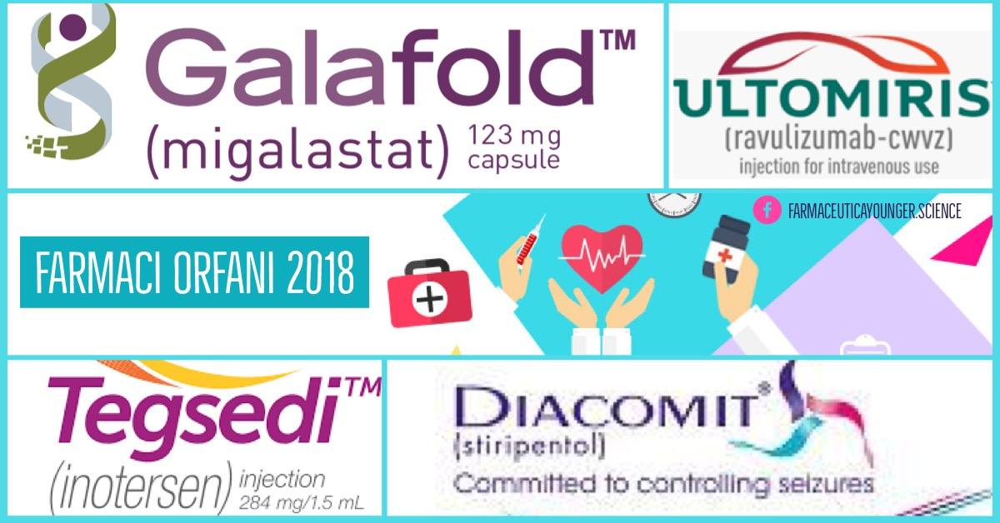

È da poco disponibile sul portale AIFA il [report sui farmaci orfani](http://www.aifa.gov.it/sites/default/files/Report-AIFA_Farmaci_orfani.pdf) pubblicato dall’Agenzia Italiana del Farmaco che si pone l’obiettivo di garantire a tutti l’accesso equo alle cure primarie e tutelare la salute come fondamentale diritto dell'individuo e interesse della collettività. Questi i due dei più importanti obiettivi dell’AIFA soprattutto in materia di malattie rare, patologie che coinvolgono solo in Italia circa 2-3 milioni di persone.

In media si stima che una malattia rara colpisca meno di 5 persone ogni 10.000 abitanti. La problematica maggiore di queste patologie è la carenza di cure. Sviluppare un farmaco è di per sé un processo lungo e costoso, difficilmente affrontabile se si tratta di patologie che colpiscono una nicchia molto ristretta di persone, ragion per cui per le patologie rare è sempre più difficile avere a disposizione cure. D’altra parte i pazienti affetti da patologie rare hanno gli stessi diritti degli altri pazienti di godere di cure e trattamenti, ecco perché sono istituiti degli speciali finanziamenti per le aziende che si dedicano ai farmaci innovativi per la cura delle patologie rare. Nel 2018 l’attenzione per tali malattie è stata alta, ben 8 nuovi farmaci in commercio: Galafold, Diaconit, Tegsedi, Firdapse, Gamifant, Ultomris, Epidiolex e Patisiran.

Il **Galafold** è uno dei farmaci orfani più innovativi. Ha ottenuto l’approvazione accelerata per la malattia di Fabry, un disordine genetico da accumulo lisosomiale. Il gene adibito alla produzione dell’enzima alfa-galattosidasi, responsabile della degradazione dello sfingolipide GL-3, risulta mutato. La conseguenza principale è l’accumulo di GL-3 nelle cellule, specialmente in quelle renali e cardiache con gravissimi effetti multisistemici. Il principio attivo di Galafold è migalastat, una piccola molecola che permette di stabilizzare l’enzima alfa-galattosidasi. L’approvazione è frutto di due studi clinici che hanno coinvolto un totale di 127 pazienti dando un’efficacia paritaria rispetto alla convenzionale terapia enzimatica sostitutiva. L’innovazione rispetto alla terapia enzimatica sta dunque nella via di somministrazione: Galafold può essere assunto per via orale, rispetto alla poco “compilante” via per infusione della precedente terapia. È inoltre un farmaco che presenta come principale effetto collaterale la cefalea.

**Ultomiris**, assegnatario della Priority Review e della designazione di farmaco orfano da parte della Food and Drug Administration statunitens, rappresenta una nuova terapia per il trattamento dell’emoglobinuria parossistica notturna. La malattia viene definita “notturna” in quanto al mattino l’urina presenta una colorazione scura, dovuta all’attacco del sistema del complemento verso i globuli rossi con conseguente emoglobinuria. L’attività di Ultomiris, in quanto anticorpo monoclonale, è quella di legarsi al sistema del complemento e fungere da inibitore terminale, evitando la successiva anemia emolitica. La terapia precedente (Eculizumab) è efficace ma gravosa, con un’iniezione prevista ogni due settimane; mentre Ultomiris viene somministrato ogni 8 settimane senza compromissione dell’efficacia. Tale parametro è stato validato da due studi clinici, nei quali si sono ottenuti risultati similari rispetto alla terapia di prima linea con Eculizumab. Dunque, a parità di efficacia, Ultomiris è dotato di una maggiore compliance da parte del paziente.

**Tegsedi** è uno dei farmaci principe di quest’anno. Lo abbiamo già citato nel precedente articolo[ “L’FDA Statunitense chiude il 2018 con 59 nuove approvazioni”](https://www.farmaceuticayounger.science/blog/2019/01/lfda-statunitense-chiude-il-2018-con-59-nuove-approvazioni/) ma ci sembrava onorevole rendergli omaggio elencandolo insieme ai farmaci più innovativi per le malattie rare. Senza aggiungere molto rispetto a quanto già detto ci soffermiamo sul sottolineare che il meccanismo d’azione sfrutta la RNAi interference, tecnica insignita del premio Nobel nel 2006. Piccolo dettaglio che lo fa salire in vetta nel podio dei farmaci più innovativi per le malattie rare.

Ultimo ma non per importanza, **Diacomit**. Il suo principio attivo Stiripentol è noto da tempo nel campo dell’epilessia e da Agosto 2018 è stato approvato dall’FDA per la cura delle crisi da epilessia mioclonica severa dell’infanzia (EMSI o sindrome di Dravet) in pazienti sopra i 2 anni già in terapia con Clobazam. Negli studi clinici il trattamento con Diacomit è risultato superiore al placebo per riduzione della frequenza media delle crisi generalizzate o tonico-cloniche.

In Italia i farmaci orfani sono totalmente a carico del SSN, l’AIFA incentiva lo sviluppo dei farmaci orfani attraverso il finanziamento di studi clinici no profit e i farmaci orfani continuano ad essere valutati in via prioritaria. Ad oggi, queste sono le conquiste ottenute per un numero di patologie tra le 6.000 e le 8.000, che altrimenti continuerebbero a rimanere in silenzio, nel buio della loro singolarità e solitudine numerica.

A cura di Gaia Colosimo
