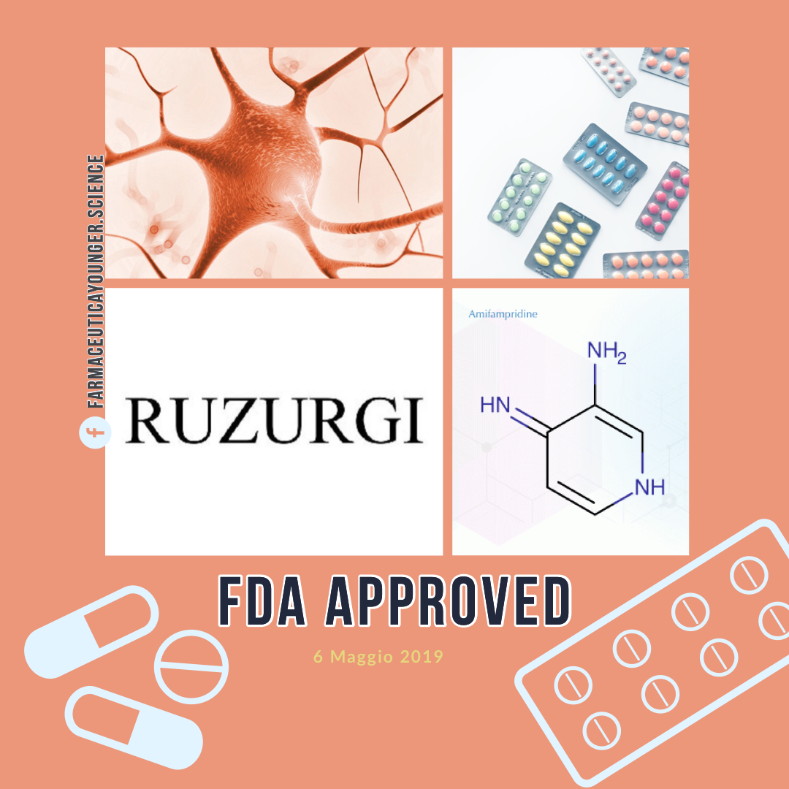

La Food and Drug Administration degli Stati Uniti ha approvato [Ruzurgi (amifampridina)](https://www.fda.gov/news-events/press-announcements/fda-approves-first-treatment-children-lambert-eaton-myasthenic-syndrome-rare-autoimmune-disorder) per il trattamento della sindrome miastenica di Lambert-Eaton (LEMS) in pazienti di età compresa tra 6 e meno di 17 anni. Questa è **la prima approvazione della FDA per il trattamento specifico di pazienti pediatrici affetti da LEMS**. L'unico altro trattamento per la LEMS è approvato solo per l'uso negli adulti.

La LEMS è una rara malattia autoimmune che colpisce la connessione tra i nervi e i muscoli e causa debolezza nei pazienti affetti. Nelle persone con LEMS, il sistema immunitario attacca la giunzione neuromuscolare (la connessione tra nervi e muscoli) e interrompe la capacità delle cellule nervose di inviare segnali alle cellule muscolari. La LEMS può essere associata ad altre malattie autoimmuni, ma più comunemente si manifesta in pazienti con cancro come il cancro del polmone a piccole cellule, dove il suo esordio precede o coincide con la diagnosi di cancro. La LEMS può verificarsi a qualsiasi età. La sua prevalenza nei pazienti pediatrici non è nota, ma la sua prevalenza complessiva è stimata in tre su milione di individui in tutto il mondo.

L'uso di Ruzurgi nei pazienti di età compresa tra 6 e meno di 17 anni è supportato da evidenze provenienti da studi del farmaco effettuati negli adulti con LEMS, dati di farmacocinetica in pazienti adulti, modellizzazione farmacocinetica e simulazione per identificare il regime posologico nei pazienti pediatrici e dati di sicurezza dai pazienti pediatrici da 6 a meno di 17 anni.

La FDA ha concesso a questa domanda la designazione di Priority Review e Fast Track. Ruzurgi ha anche ricevuto la designazione di farmaco orfano, che fornisce incentivi per aiutare e incoraggiare lo sviluppo di farmaci per le malattie rare.

La FDA ha concesso l'approvazione di Ruzurgi alla Jacobus Pharmaceutical Company, Inc.
