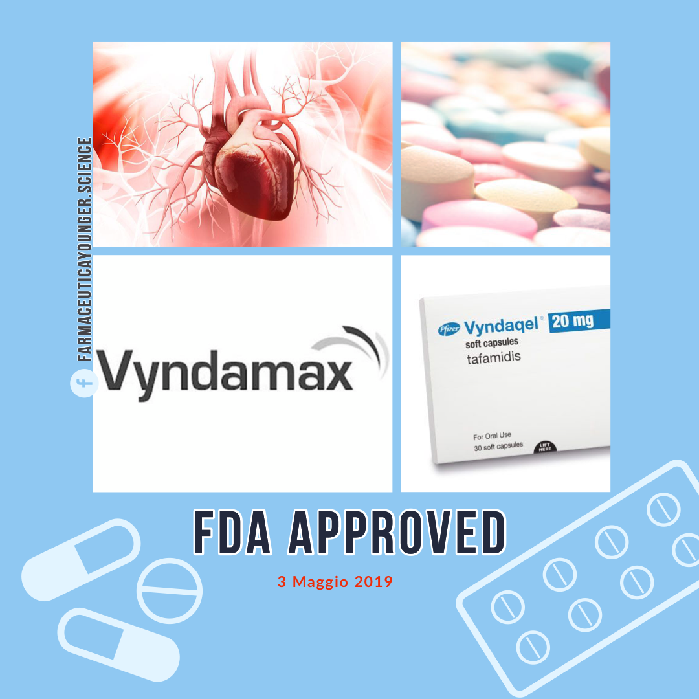

La Food and Drug Administration degli Stati Uniti ha approvato [Vyndaqel (tafamidis meglumine) e Vyndamax (tafamidis)](https://www.fda.gov/news-events/press-announcements/fda-approves-new-treatments-heart-disease-caused-serious-rare-disease-transthyretin-mediated) per il trattamento della cardiomiopatia causata da amiloidosi mediata da transtiretina (ATTR-CM) negli adulti. Questi rappresentano i primi trattamenti approvati dalla FDA per l'ATTR-CM.

L'ATTR-CM è una malattia rara, debilitante e spesso fatale causata dall'accumulo di depositi anormali di proteine ​​note come amiloide negli organi e nei tessuti del corpo. Questi depositi proteici si verificano più frequentemente nel cuore e nel sistema nervoso periferico. Il coinvolgimento del cuore può causare mancanza di respiro, affaticamento, insufficienza cardiaca, perdita di conoscenza, ritmi cardiaci anormali e morte. Il coinvolgimento del sistema nervoso periferico può causare perdita di sensibilità, dolore o immobilità a livello di braccia, gambe, mani e piedi. I depositi di amiloide possono interessare anche i reni, gli occhi, il tratto gastrointestinale e il sistema nervoso centrale.

L'efficacia di Vyndaqel e Vyndamax nel trattamento dell'ATTR-CM è stata dimostrata in uno studio clinico condotto su 441 pazienti randomizzati a ricevere Vyndaqel o un placebo. Dopo 30 mesi, si è registrato un tasso di sopravvivenza più alto nel gruppo Vyndaqel rispetto al gruppo trattato con placebo. Tafamidis può causare danni al feto quando somministrato ad una donna incinta.

La FDA ha assegnato le designazioni di _Fast Track_, _Priority Review_ e [_Breakthrough Therapy_](https://www.farmaceuticayounger.science/blog/2018/12/la-fda-statunitense-e-la-breakthrough-therapy/) a Vyndaqel. Vyndaqel e Vyndamax hanno entrambi ricevuto la designazione di farmaco orfano, che fornisce incentivi per aiutare e incoraggiare lo sviluppo di farmaci per le malattie rare.

L'approvazione di Vyndaqel e Vyndamax è stata concessa a FoldRx, una società di Pfizer.
