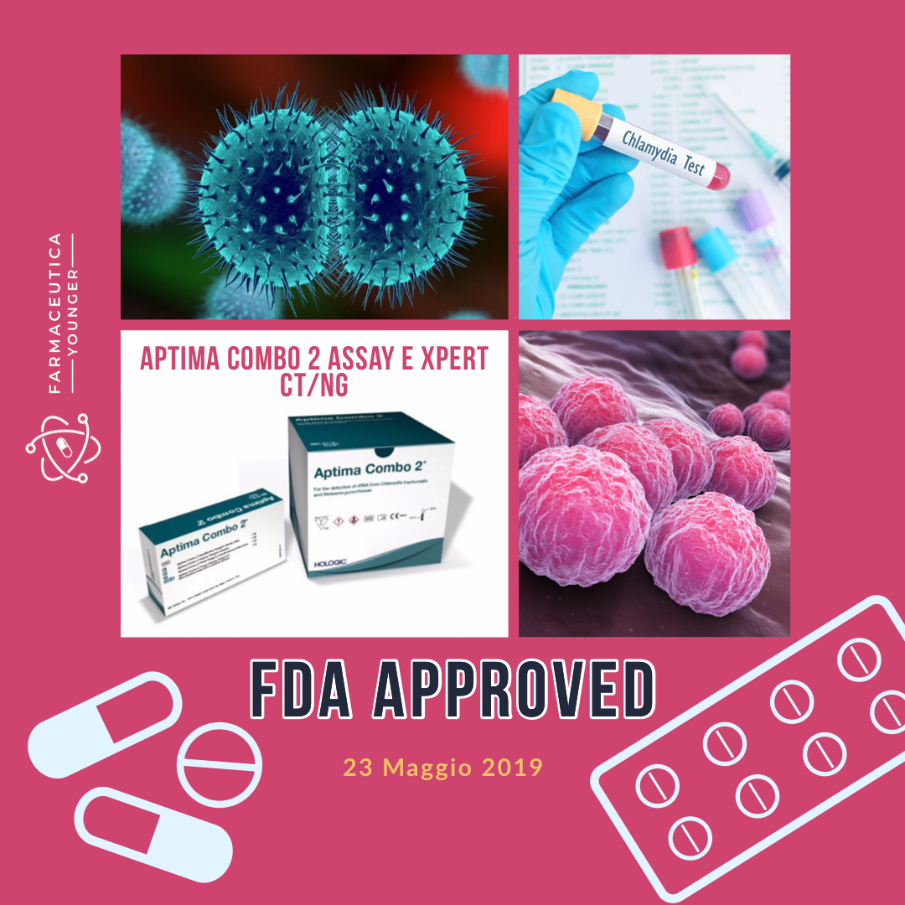

La Food and Drug Administration statunitense ha autorizzato la commercializzazione di due test in grado di rilevare la presenza dei batteri **Chlamydia trachomatis** e **Neisseria gonorrhoeae**, che causano le infezioni sessualmente trasmesse, rispettivamente, la clamidia e la gonorrea, attraverso test diagnostici di campioni extragenitali, [Aptima Combo 2 Assay e Xpert CT/NG](https://www.fda.gov/news-events/press-announcements/fda-clears-first-diagnostic-tests-extragenital-testing-chlamydia-and-gonorrhea). Sono i primi dispositivi approvati dalla FDA per il test diagnostico extragenitale di queste infezioni attraverso la gola e il retto. Questi test sono stati precedentemente autorizzati solo per il test di campioni di urina, vaginali e endocervicali.

Secondo il Rapporto sulla sorveglianza delle infezioni trasmesse sessualmente del Centers for Disease Control and Prevention, il tasso di infezioni sessualmente trasmissibili è in costante aumento, con 1,7 milioni di casi di clamidia e oltre 500.000 casi di gonorrea negli Stati Uniti nel solo 2017. Entrambe le infezioni possono essere contratte attraverso rapporti sessuali vaginali, anali o orali. In genere, entrambe le infezioni possono essere facilmente trattate, ma se non trattate, possono causare gravi complicazioni, inclusa l'infertilità.

Nella valutazione dei dispositivi, la FDA ha esaminato i dati di uno studio clinico che ha arruolato oltre 2.500 pazienti che hanno valutato l'accuratezza diagnostica di più test di amplificazione dell'acido nucleico reperibili in commercio per il rilevamento di Neisseria gonorrhoeae e Chlamydia trachomatis da siti della gola e del retto. I risultati di questo studio, insieme ad altre informazioni esaminate dalla FDA, hanno dimostrato che il Dosaggio Aptima Combo 2 e il CT/NG di Xpert per i campioni extragenital sono sicuri ed efficaci per il test extragenitale di clamidia e gonorrea.

La FDA ha autorizzato il test Aptima Combo 2 a Hologic, Inc. e Xpert CT/NG a Cepheid.
