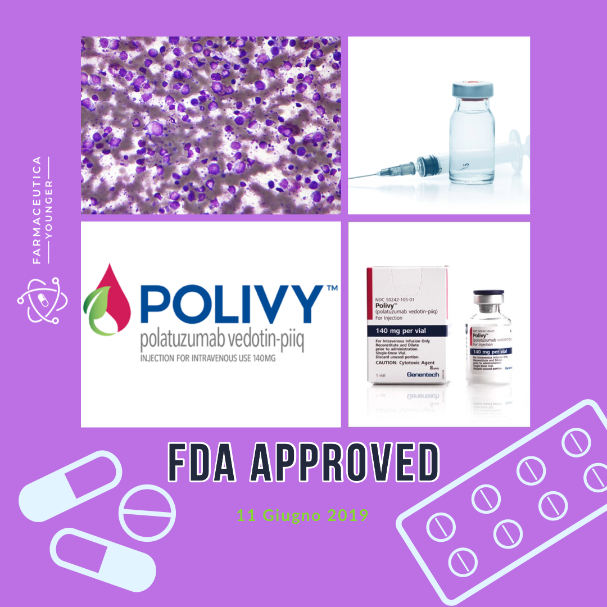

La Food and Drug Administration degli Stati Uniti ha concesso l'approvazione accelerata a [Polivy (polatuzumab vedotin-piiq)](https://www.fda.gov/news-events/press-announcements/fda-approves-first-chemoimmunotherapy-regimen-patients-relapsed-or-refractory-diffuse-large-b-cell), in combinazione con bendamustina e Rituxan (BR), per il trattamento di pazienti adulti con linfoma diffuso a grandi cellule B (DLBCL) con recidiva o refrattario ad almeno due terapie precedenti.

**Polivy rappresenta il primo regime chemioimmunoterapico approvato dalla FDA per i pazienti con linfoma diffuso a grandi cellule B diffuse o refrattarie.**

DLBCL è la forma più comune di linfoma non Hodgkin (NHL), che rappresenta circa uno su tre casi di NHL. DLBCL è un tipo di NHL aggressivo (a crescita rapida), che è generalmente reattivo al trattamento di prima linea. Tuttavia, ben il 40% dei pazienti ha una recidiva, momento in cui le opzioni di terapia sono limitate con una riduzione della sopravvivenza. Si stima che a circa 150.000 persone in tutto il mondo venga diagnosticato DLBCL ogni anno.

Polivy è un anticorpo coniugato a un farmaco chemioterapico, una classe emergente di immunoterapie mirate per il cancro. Polivy si lega a una proteina specifica (chiamata CD79b) che si trova solo sulle cellule B, rilasciando il farmaco chemioterapico in queste cellule. L'efficacia di Polivy è stata valutata in uno studio condotto su 80 pazienti con DLBCL recidivante o refrattario che sono stati randomizzati a ricevere Polivy con BR o BR da solo. Alla fine del trattamento, il tasso di risposta completo, (DOR), definito come il tempo in cui la malattia rimane in remissione, era del 40% con Polivy più BR rispetto al 18% con BR da solo.

La FDA ha concesso a Polivy le designazioni di [Breakthrough Therapy](https://www.farmaceuticayounger.science/blog/2018/12/breakthrough-therapy/), _Priority Review_ e la designazione di _farmaco orfano_, che fornisce incentivi per aiutare e incoraggiare lo sviluppo di farmaci per le malattie rare.

La FDA ha concesso l'approvazione di Polivy a Genentech.
