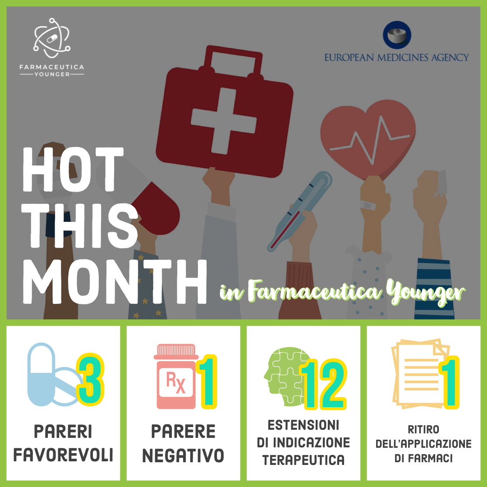

Il comitato per i medicinali per uso umano di EMA (CHMP) ha raccomandato l'approvazione di 3 medicinali nella riunione di giugno 2019, dei quali due farmaci generici. Il CHMP ha inoltre espresso parere negativo per un nuovo medicinale, 12 estensioni di indicazioni terapeutiche e un ritiro dell'autorizzazione all'immissione in commercio.

Il comitato ha raccomandato di concedere l'autorizzazione all'immissione in commercio per **Giapreza** (angiotensina II), per il trattamento dell'ipotensione refrattaria negli adulti con shock settico o di altro tipo.

Altro ok da parte del Comitato per **Azacitidina Celgene** (azacitidina), per il trattamento delle sindromi mielodisplastiche, della leucemia mielomonocitica cronica e della leucemia mieloide acuta; e per **Lacosamide UCB** (lacosamide), per il trattamento delle crisi ad esordio parziale con o senza generalizzazione secondaria.

Il CHMP ha raccomandato un'estensione delle indicazioni per _Victoza_ (liraglutide) per includere il trattamento di bambini e adolescenti di età pari o superiore a dieci anni con diabete di tipo 2. Altre estensioni di indicazione raccomandate dal comitato hanno riguardato _Cyramza_, _Dupixent_, _Ebymect_, _Edistride_, _Fiasp_, _Flebogamma_ _DIF_, _Forxiga_, _Imbruvica_, _Tecentriq_, _Xigduo_ e _Zinforo_.

Il CHMP ha adottato un parere negativo con conseguente ritiro dell'autorizzazione all'immissione in commercio per _Evenia_ (romosozumab), per il trattamento dell'osteoporosi.

Il CHMP ha adottato un parere negativo per un'estensione dell'indicazione terapeutica di _Revolade_ (eltrombopag) per aggiungere il trattamento di pazienti precedentemente non trattati con grave anemia aplastica a partire dai due anni di età.

Il Comitato ha anche adottato un parere negativo per un'estensione dell'indicazione terapeutica di _Translarna_ (ataluren) per aggiungere il trattamento di pazienti con distrofia muscolare di Duchenne che non sono più in grado di camminare.

Il produttore del farmaco _Xyndari_ (glutammina) ha richiesto un riesame del parere negativo della commissione per il suo medicinale adottato nella riunione di maggio 2019. Il CHMP riesaminerà il parere negativo espresso ed emetterà una raccomandazione finale.

Il CHMP ha inoltre raccomandato che i medicinali contenenti lisato batterico autorizzati per le condizioni respiratorie debbano essere utilizzati solo per la prevenzione di infezioni respiratorie ricorrenti, ad eccezione della polmonite. Questa decisione è stata presa in quanto non ci sono dati attendibili che dimostrino che questi medicinali siano efficaci nel trattamento delle infezioni respiratorie esistenti o per la prevenzione della polmonite.

La domanda di autorizzazione all'immissione in commercio per _ABP 710_ (infliximab) è stata ritirata. Questo medicinale era destinato alla cura di alcune malattie infiammatorie.
