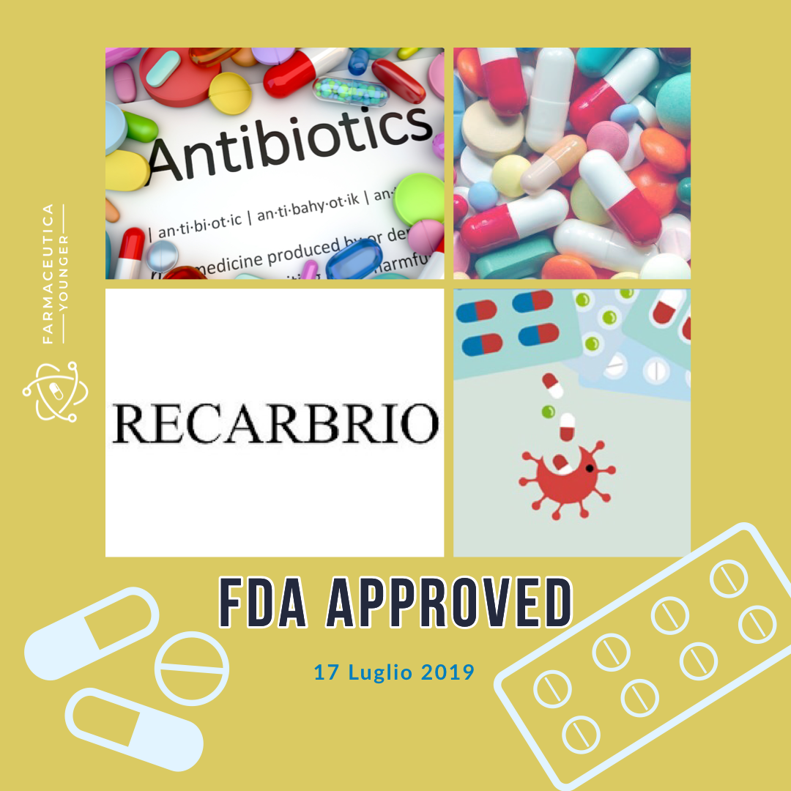

La Food and Drug Administration degli Stati Uniti ha approvato [Recarbrio (imipenem, cilastatina e relebactam)](https://www.fda.gov/news-events/press-announcements/fda-approves-new-treatment-complicated-urinary-tract-and-complicated-intra-abdominal-infections), un farmaco antibatterico per il trattamento negli adulti di infezioni complicate delle vie urinarie (cUTI, complicated urinary tract infections) e complicate infezioni intra-addominali (cIAI, complicated intra-abdominal infections) causate dai seguenti microrganismi Gram-negativi sensibili: Bacteroides caccae, Bacteroides fragilis, Bacteroides ovatus, Bacteroides stercoris, Bacteroides thetaiotaomicron, Bacteroides uniformis, Bacteroides vulgatus, Citrobacter freundii, Enterobacter cloacae, Escherichia coli, Fusobacterium nucleatum, Klebsiella aerogenes, Klebsiella oxytoca, Klebsiella pneumoniae, Parabacteroides distasonis e Pseudomonas aeruginosa. Questa approvazione offre un'opzione terapeutica in più per combattere gravi infezioni batteriche resistenti.

Recarbrio è un'iniezione che combina tre farmaci: _Imipenem_, un farmaco antibatterico penem, la _cilastatina sodica_, inibitore della disidratasi renale e il _relebactam_, inibitore della beta-lattamasi.

L'efficacia e la sicurezza di Recarbrio sono stati valutati mediante studi clinici condotti con la combinazione imipenem-cilastatina per il trattamento di cUTI e cIAI. Il contributo di relebactam nella formulazione di Recarbrio è stato valutato sulla base di dati provenienti da studi in vitro e in vivo. La sicurezza di Recarbrio è stata studiata in due studi per le due patologie, uno per cUTI e uno per cIAI. Lo studio cUTI comprendeva 298 pazienti adulti dei quali 99 trattati con la dose proposta di Recarbrio. Lo studio CIAI ha incluso 347 pazienti dei quali 117 trattati con la dose proposta di Recarbrio.

Recarbrio ha ricevuto la designazione di QIDP (Qualified Infectious Disease Product) dalla FDA, attribuita a prodotti antibatterici e antifungini destinati a trattare infezioni gravi o pericolose per la vita sotto il titolo Generating Antibiotic Incentives Now (GAIN) della FDA Safety and Innovation Act. Come parte della designazione QIDP, Recarbrio ha ottenuto la _Priority Review_ per accelerare l'iter di approvazione del farmaco.

La FDA ha concesso l'approvazione di Recarbrio a Merck & Co., Inc. Merck prevede di rendere disponibile Recarbrio entro la fine dell'anno.
