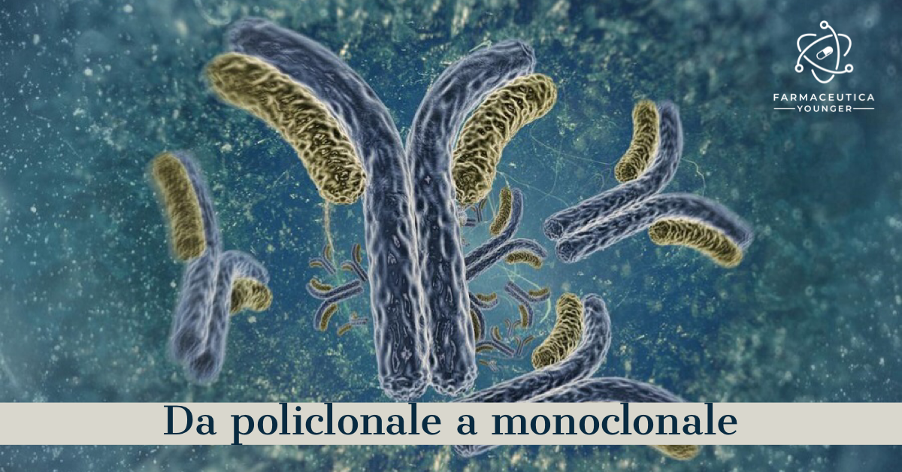

Il concetto di biologico, quando si parla di farmaci, non ha niente a che fare con il concetto di “bio” a cui ci riferiamo quando parliamo di pomodori, uova o cotone.

I **farmaci biologici** sono composti estremamente complessi che, per essere prodotti, hanno bisogno di sofisticate biotecnologie che si basano sulla manipolazione del DNA. In realtà, le biotecnologie applicate al campo farmaceutico esistono dai tempi dei primi farmaci prodotti per sintesi, come l’aspirina. Ovviamente la tecnologia per produrli all’epoca non era poi così sofisticata.

L’antisiero equino grezzo, prodotto inoculando nei cavalli il batterio che nell’uomo causa la difterite, è un lontano parente del _Trastuzumab_, un anticorpo monoclonale umanizzato dalla enorme rilevanza clinica per il carcinoma mammario Her-2 positivo. Il farmaco veniva ottenuto purificando al meglio il plasma ricco di anticorpi equini anti-tossina difterica, e veniva somministrato per ridurre gli effetti devastanti della malattia. Il problema di questa prima rudimentale terapia con immunoglobuline, era la forte immunogenicità, con rischio di gravi reazioni anafilattiche.

Quei sieri sostanzialmente contenevano il risultato di una risposta **policlonale** di un organismo non umano. La risposta policlonale è sostanzialmente quella fisiologica.

Ogni nostro linfocita possiede sulla membrana recettori (Ig, anticorpi, immunoglobuline, utilizzate il termine che preferite) che riconoscono un solo antigene. Tutte le cellule derivate da un’unica cellula iniziale (clone) produrrà un solo tipo di anticorpo. Il punto è che gli antigeni sono strutture anche molto complesse, e solitamente hanno più “frammenti” immunogenici (questi frammenti sono detti epitopi o determinanti antigenici). L’_epitopo_ è quella piccola parte di antigene che lega l’anticorpo specifico; ogni benedetta singola molecola di antigene può contenere molti epitopi ed essere riconosciuto quindi da anticorpi diversi. Nelle risposte policlonali quindi molti cloni singoli generano anticorpi con affinità molto variabile nei confronti dell’antigene, questo perché ognuno di essi riconosce un epitopo differente.

Questo è quello che succede con il nostro sistema immunitario e non ci possiamo lamentare perché è una macchina straordinaria che riesce a produrre più di 100 milioni di anticorpi differenti.

Ma la risposta policlonale è anche quella che avviene quando si somministrano i sieri. I sieri hanno un sacco di difetti: sono molto immunogenici, molto variabili come risposta (l’efficacia può variare da cavallo a cavalo per restare in tema di siero equino grezzo), non sono molto potenti e rischiano di essere un veicolo di malattie dall’animale.

La vera svolta arrivò quando fu sviluppata una tecnica che permetteva di produrre anticorpi **monoclonali**, originati da una stessa cellula clone, tutti uguali, quindi con la stessa affinità per antigene, ed in grande quantità.

Tra il 1975 e il 1976 Kohler e Milstein svilupparono una tecnica con cui poter produrre anticorpi monoclonali in grande quantità che valse loro il premio Nobel nel 1984.

In un animale da laboratorio, solitamente un topo, si induce una risposta immunitaria verso un antigene specifico, somministrando lo stesso antigene al topo. Una volta verificata l’avvenuta stimolazione immunitaria, vengono prelevati i linfociti B del topo immunizzato dagli splenociti (ovvero dalle cellule della milza). I linfociti B vengono quindi posti in coltura con cellule tumorali di mieloma murino (un tumore che colpisce proprio i linfociti). Queste cellule tumorali presentano due caratteristiche particolari: non producono anticorpi, e non possiedono l’enzima HGPRT (iposantina-guanina-fosforibosil-trasferasi). Il terreno di coltura scelto, detto HAT, contiene ipoxantina (H), aminopterina (A) e timidina (T), nutrimenti necessari a sintetizzare acidi nucleici.

Se però ci fermiamo un attimo a riflettere una domanda sorge spontanea.

Perché sono state scelti linfociti B tumorali? Perché, come sappiamo, sono sostanzialmente immortali, il loro ciclo cellulare sregolato li induce ad una continua e incontrollata divisione, e per una volta sfruttiamo questa loro “maligna” caratteristica. Allo stesso tempo però affamiamo queste cellule con un terreno di coltura ricco di sostanze per produrre acidi nucleici, ma togliendo loro l’enzima necessario a metabolizzare queste sostanze. Fondamentalmente, saranno anche immortali, ma senza l’enzima HGPRT, sono destinate a una vita breve e senza scopo. Nel terreno di coltura sono presenti anche linfociti B murini sani, che possono produrre anticorpi e che possiedono l’enzima per produrre i loro acidi nucleici. Questi linfociti non sono “immortali” e alla fine del loro ciclo vitale andranno incontro alla loro gloriosa e fisiologica fine. Alla fine però può succedere che alcuni linfociti B sani si fondono con cellule mieloidi dando vita ai cosiddetti _ibridomi_ (esistono “trucchi” per facilitare questo contatto, per esempio utilizzando il polietilenglicole).

Un ibridoma è esattamente quello che il nome suggerisce: un ibrido tra il linfocita B sano, capace di produrre anticorpi e vivere nel terreno di coltura, e un linfocita tumorale “immortale”ma incapace di sopravvivere nello stesso terreno. L’ibridoma è quindi una macchina perfetta per produrre tanti anticorpi di un solo clone, anticorpi monoclonali.

Le biotecnologie fecero così un passo avanti enorme. Successivamente vennero sviluppate altre tecniche, e ad oggi possiamo contare, oltre ad anticorpi murini, anche chimerici, umanizzati e umani, con un potenziale immunogenico sempre più basso.

Ad oggi gli anticorpi, e in generale i farmaci biologici, sono una classe di farmaci dall’enorme impatto clinico e ci si attende che nei prossimi anni lo saranno sempre di più.

_A cura di Emiliano Cappello_
