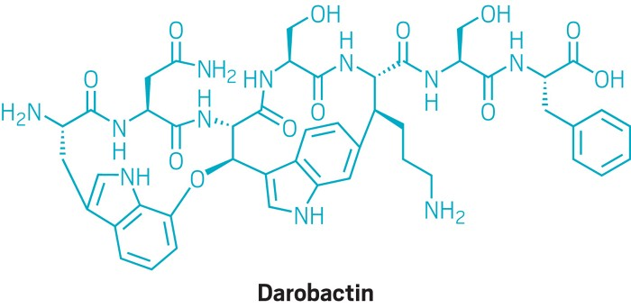

È recente la scoperta di un nuovo antibiotico, la **darobactina**, che, dotato di un meccanismo d'azione particolare, si è dimostrato attivo nei confronti dei più pericolosi batteri Gram-negativi. La darobactina viene prodotta da batteri del genere _Photorhabdus_ che vivono nell'intestino di piccoli vermi parassiti noti come nematodi.

L'Organizzazione Mondiale della Sanità (OMS) ha recentemente lanciato l'allarme sulla crescente necessità di nuovi antibiotici che agiscono contro un folto gruppo di agenti patogeni, i batteri Gram-negativi, in quanto questi batteri stanno diventando sempre più resistenti agli antibiotici esistenti. L'ultima classe di antibiotici individuata contro i batteri Gram-negativi è stata sviluppata negli anni '60 con i flurochinoloni. I batteri Gram-negativi, che includono Escherichia coli, Pseudomonas aeruginosa e Klebsiella pneumoniae, sono particolarmente difficili da eradicare con gli antibiotici attualmente disponibili perché la loro doppia membrana esterna impedisce ai farmaci di penetrare.

Un gruppo di ricercatori dell'Antimicrobial Discovery Center della Northeastern University ha iniziato ad indagare su nuovi antibiotici e lo ha fatto partendo da un posto insolito: l'intestino dei nematodi.

I nematodi hanno attirato l'attenzione dei ricercatori per la loro capacità di nutrirsi di insetti, attaccando le loro larve e rilasciando batteri che combattono patogeni simili a quelli presenti nell'intestino umano. Il team si è concentrato su un batterio chiamato _Photorhabdus_, che vive nel microbioma intestinale dei nematodi. Isolando i batteri intestinali dei nematodi, i ricercatori sono stati quindi in grado di isolare una molecola, la darobactina che, si è visto essere dotata di una buona farmacocinetica in quanto non tossica per il nematode e in grado di viaggiare attraverso i tessuti larvali.

La darobactina ha una struttura chimica insolita. Ha due anelli fusi e uno di questi è costituito da un legame carbonio-carbonio non attivato. Non era mai stato osservato prima questo tipo di legame o struttura nei comuni antibiotici.

La darobactina è anche insolitamente grande per essere un antibiotico, con una dimensione di 965 Dalton. È troppo grande per penetrare nelle membrane batteriche dei Gram-negativi, quindi non è risultato chiaro immediatamente quale fosse il suo meccanismo d'azione. Per scoprirlo, i ricercatori hanno esposto ripetutamente E. coli alla molecola fino a quando non sono emersi batteri resistenti. Questi batteri trasportavano mutazioni in un gene che codificavano per una molecola chiamata _BamA_, una proteina presente sulla membrana esterna dei batteri Gram-negativi, essenziale per la sua sintesi. La darobactina esplica il suo meccanismo d'azione in quanto si lega alla proteina BamA, impedendo la sintesi della parete batterica dei Gram-negativi.

La sostanza inoltre non ha mostrato tossicità cellulare: un prerequisito per l'uso come antibiotico.

La nuova molecola antibiotica uccide diversi batteri Gram-negativi in ​​vitro, tra cui E. coli, Klebsiella, Shigella e Salmonella. I ricercatori hanno testato il composto anche nei topi. Topi protetti dall'antibiotico infettati da E. coli, K. pneumoniae e P. aeruginosa sono guariti mentre gli animali non trattati sono morti entro 24 ore.

Il composto non inibisce la crescita di tutti i batteri Gram-negativi a basse concentrazioni. Tuttavia, la darobactina potrebbe servire come nuovo scaffold da utilizzare per produrre molecole più efficaci nella lotta alla resistenza dei Gram-negativi.

La ricerca condotta da un gruppo di ricercatori statunitensi è stata pubblicata su [Nature](https://www.nature.com/articles/s41586-019-1791-1).

Fonte: https://cen.acs.org/pharmaceuticals/antibiotics/Novel-antibiotic-discovered-guts-worms/97/web/2019/11
