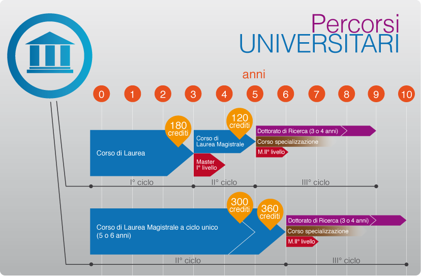

# Master - il Settore Farmaceutico

Affacciandosi al mondo del lavoro si sente spesso parlare di master e corsi di perfezionamento. Neolaureati, ma anche lavoratori con alcuni anni di esperienza, faticano a capire quali siano le reali opportunità che può offrire il settore farmaceutico e soprattutto se una opportunità di master nel settore farmaceutico possa essere indispensabile o meno per accedere al mondo del lavoro.

Cerchiamo quindi di chiarirci un po’ le idee!

_Fonte immagine: [https://www.miur.gov.it/formazione-post-diploma-scegli-in-modo-consapevole](https://www.miur.gov.it/formazione-post-diploma-scegli-in-modo-consapevole)_

#### Cosa si intende per Master Universitario?

Il master universitario è un percorso di perfezionamento scientifico e di qualificazione che permette di ampliare le proprie conoscenze in un determinato campo e acquisire competenze specifiche richieste dal mondo del lavoro.

#### Quale è la differenza tra un Master di primo o di secondo livello?

La differenza principale è il tipo di preparazione che i due Master offrono. Il Master di primo livello permette di avere un primo approccio generico alla materia scelta, partendo dalle basi. La durata minima è annuale (60 CFU). Il Master di secondo livello si focalizzano su argomenti inerenti al settore scelto in modo molto specifico, specializzando lo studente in tale ambito. La durata è minimo annuale (60 CFU).

Inoltre, varia anche il titolo di studio richiesto per accedere ai Master. I master di primo livello sono indirizzati a coloro che hanno completato una laurea triennale, a volte è possibile accedervi anche con un diploma di scuola superiore. Mentre i Master di secondo livello sono accessibili a chi ha conseguito una laurea magistrale, una laurea specialistica o una laurea a ciclo unico.

#### Cosa si intende per Corso di Alta Formazione? C’è differenza con un Master Universitario?

I Corsi di Alta Formazione sono corsi post lauream professionalizzanti, da 10 a 25 Crediti Formativi Universitari (CFU), non prevedono tirocini e sono di solito di durata inferiore rispetto ai Master. I Master di durata minima annuale (60 CFU) prevedono uno stage curriculare e rilasciano il titolo di Master Universitario dalla singola Università.

#### Il Master universitario è NECESSARIO per entrare nell’azienda farmaceutica?

Questa è la domanda che più di qualunque altra ci viene formulata. Non c’è una risposta assoluta e molto dipende dal variegato percorso di formazione proprio del candidato e da ciò che in quel momento l’azienda sta ricercando.

Posso però fornirvi la mia di visione. A mio avviso ci sono aree dell’azienda farmaceutica per le quali il master è molto richiesto, come l’ambito regolatorio o la formulazione cosmetica. Ci sono aree per le quali il master non è strettamente necessario per accedere a quella posizione lavorativa ma è comunque apprezzato. Aver portato a casa un master è certamente ben visto dalle aziende farmaceutiche perchè inizia a specializzare il singolo verso un settore specifico. In ogni caso è sempre bene avere le idee chiare prima di intraprendere un percorso di specializzazione e capire quali sono gli sbocchi a cui porterà.

A tal proposito una delle mission di Farmaceutica Younger è quella di schiarire un pò le idee sulle innumerevoli figure di cui una azienda farmaceutica ha bisogno per poter garantire la Qualità, la Sicurezza e l’Efficacia del prodotto medicinale. E lo abbiamo fatto, complice il periodo di lockdown, attraverso degli ‘incontri digitali’ nei quali abbiamo chiacchierato con dei giovani esperti del farmaceutico che ci hanno raccontato il loro percorso professionale. E’ stato questo un momento utile per fornire degli spunti a chi volesse intraprendere questo percorso nel variegato mondo del farmaceutico.

Sei curioso di scoprire le innumerevoli figure del mondo farmaceutico?

Visita il nuovo canale YouTube di Farmaceutica Younger per scoprirlo insieme al link di seguito ([https://www.youtube.com/channel/UCBzcNd6Z480lWkchyanC4_A](https://www.youtube.com/channel/UCBzcNd6Z480lWkchyanC4_A)).

Ora passiamo in rassegna, attraverso un elenco non esustivo e in continuo aggiornamento, alcuni dei Master Universitari disponibili in Italia.

## Master in Ricerca Clinica

I Master in ricerca clinica sono finalizzati ad acquisire le conoscenze e le competenze necessarie per la conduzione degli studi clinici, in accordo alle Good Clinical Practices (GCP).

### Primo livello

- _“Master in ricerca clinica”_ - **Università degli Studi di Milano** con l'Istituto di Ricerche Farmacologiche "Mario Negri IRCCS" (sede di Milano)
  [https://www.unimi.it/it/corsi/corsi-post-laurea/master-e-perfezionamento/catalogo-master/aa-2019/2020-master-ricerca-clinica-primo-livello](https://www.unimi.it/it/corsi/corsi-post-laurea/master-e-perfezionamento/catalogo-master/aa-2019/2020-master-ricerca-clinica-primo-livello)

* _“Assistente alla ricerca clinica” - **Università Cattolica del Sacro Cuore**_ [https://offertaformativa.unicatt.it/master-assistente-alla-ricerca-clinica-il-master#structure](https://offertaformativa.unicatt.it/master-assistente-alla-ricerca-clinica-il-master#structure)

* “_Data management e coordinamento delle sperimentazioni cliniche_” - **Università del Piemonte Orientale** in collaborazione con l’Azienda Ospedaliera “SS Antonio e Biagio e Cesare Arrigo” di Alessandria
  [https://www.uniupo.it/tuttostudenti/lofferta-formativa-colpo-docchio/i-master/i-livello/data-management-e-coordinamento-delle-sperimentazioni-cliniche](https://www.uniupo.it/tuttostudenti/lofferta-formativa-colpo-docchio/i-master/i-livello/data-management-e-coordinamento-delle-sperimentazioni-cliniche)

### Secondo livello

- _“Sviluppo clinico e pre-clinico del farmaco e monitoraggio post-marketing”_ - **Università Federico II di Napoli**
  [http://www.unina.it/-/1026868-ma_far_sviluppo-preclinico-e-clinico-del-farmaco-e-monitoraggio-post-marketing](http://www.unina.it/-/1026868-ma_far_sviluppo-preclinico-e-clinico-del-farmaco-e-monitoraggio-post-marketing)

* _“Monitoraggio, assicurazione e controllo della qualità dei Clinical Trials”_ - **Sapienza Università di Roma**
  [https://www.uniroma1.it/it/offerta-formativa/master/2020/monitoraggio-assicurazione-e-controllo-della-qualita-nei-clinical](https://www.uniroma1.it/it/offerta-formativa/master/2020/monitoraggio-assicurazione-e-controllo-della-qualita-nei-clinical)

- “_Ricerca e Sviluppo Pre-clinico e Clinico dei Farmaci_” - **Università degli Studi di Milano-Bicocca**, in collaborazione con la Società Italiana di Medicina Farmaceutica (ex SSFA)
  [https://www.unimib.it/didattica/master-universitari/area-medico-sanitaria-aa-201920/ricerca-e-sviluppo-preclinico-e-clinico-dei-farmaci](https://www.unimib.it/didattica/master-universitari/area-medico-sanitaria-aa-201920/ricerca-e-sviluppo-preclinico-e-clinico-dei-farmaci)

* _“Ricerca clinica: metodologia, farmacovigilanza, aspetti legali e regolamentari” - **Sapienza Università di Roma**_
  [https://www.uniroma1.it/it/offerta-formativa/master/2019/ricerca-clinica-metodologia-farmacovigilanza-aspetti-legali-e](https://www.uniroma1.it/it/offerta-formativa/master/2019/ricerca-clinica-metodologia-farmacovigilanza-aspetti-legali-e)

## Master in Discipline Regolatorie

I Master in discipline regolatorie permettono di approfondire la conoscenza delle normative nazionali, europee ed internazionali, le procedure di registrazione e le regole connesse con le diverse tappe regolatorie nello sviluppo del farmaco.

### Secondo Livello

- _“Discipline Regolatorie”- **Università degli studi di Pavia**_
  [http://www-3.unipv.it/scireg/index.html](http://www-3.unipv.it/scireg/index.html)

* “_Tecnologie Farmaceutiche e Attività Regolatorie_” - _**Università degli studi di Perugia, Pavia, Sassari e Torino**_
  [ https://www.dsf.unipg.it/didattica/alta-formazione/master-di-ii-livello-in-tecnologie-farmaceutiche-e-attivita-regolatorie](https://www.dsf.unipg.it/didattica/alta-formazione/master-di-ii-livello-in-tecnologie-farmaceutiche-e-attivita-regolatorie)

- “_Discipline regolatorie del farmaco_” - **_Università degli studi di Catania_**
  [ https://www.unict.it/it/didattica/master-universitari/2019-2020/discipline-regolatorie-del-farmaco](https://www.unict.it/it/didattica/master-universitari/2019-2020/discipline-regolatorie-del-farmaco)

- “_Farmacovigilanza e discipline regolatorie del farmaco_” - **_Università degli studi di Verona_**
  [http://www.medicina.univr.it/fol/?ent=iscrizionecs&cs=547](http://www.medicina.univr.it/fol/?ent=iscrizionecs&cs=547)

- “_Tecnologie Farmaceutiche e Attività Regolatorie_” - **_Università degli Studi di Torino_**
  [https://www.dstf.unito.it/do/home.pl/View?doc=master_tecnologie_farmaceutiche.html](https://www.dstf.unito.it/do/home.pl/View?doc=master_tecnologie_farmaceutiche.html)

- “_Aspetti regolatori, brevettuali ed economici dello sviluppo dei farmaci e dei dispositivi medici”_ - **_Università degli Studi di Ferrara_**
  [http://www2.unife.it/studenti/pfm/mast/2019-20/aspettifarmaco](http://www2.unife.it/studenti/pfm/mast/2019-20/aspettifarmaco)

- “_Gestione regolatoria del ciclo di vita di un farmaco_” - _**Università di Camerino**_
  [https://didattica.unicam.it/Guide/PaginaCorso.do?corso_id=10254](https://didattica.unicam.it/Guide/PaginaCorso.do?corso_id=10254)

## Master in Sviluppo Farmaceutico

I Master in formulazione e sviluppo farmaceutico permetteranno di affinare le conoscenze riguardo ai principali metodi di caratterizzazione chimico-fisica di una sostanza, valutare i fattori formulativi e di processo che influenzano la liberazione di un farmaco dalla forma farmaceutica e le conoscenze teoriche e pratiche sulla procedura GxP adottata nell’industria farmaceutica per la validazione di metodi analitici e per il controllo chimico e tecnologico dei formulati.

### Secondo livello

- _“Pre-formulazione, Sviluppo Farmaceutico e Controllo di Medicinali”_ - _**Università degli studi di Pavia**_
  [https://sites.google.com/a/unipv.it/masterpsc/](https://sites.google.com/a/unipv.it/masterpsc/)

- “_Progettazione e Sviluppo dei farmaci_” - _**Università degli studi di Pavia**_
  [https://psfmaster.unipv.it/](https://psfmaster.unipv.it/)

- "_Sviluppo di Processo per la Produzione di Principi Attivi Farmaceutici_" _**Università degli studi di Perugia**_
  [https://www.dsf.unipg.it/alta-formazione/pro-api](https://www.dsf.unipg.it/alta-formazione/pro-api)

### Master in Management Sanitario

I Master in Management Sanitario permettono di acquisire conoscenze manageriali specifiche per gestire le risorse umane in ambito di SSN, sviluppando competenze organizzative che favoriscano il processo di integrazione tra diverse funzioni e ruoli.

### Primo Livello

- _“Management e coordinamento dei servizi sanitari e sociosanitari”_ - **Università Federico II di Napoli**
  [https://www.mastersociosanitario.com/destinatari-i-livello.html](https://www.mastersociosanitario.com/destinatari-i-livello.html)

* _“Management per le funzioni di coordinamento delle organizzazioni sanitarie (XII ed.)”_ - **Università del Piemonte Orientale**
  [https://scuolamed.uniupo.it/tutto-studenti/post-laurea/master/i-livello/management-le-funzioni-di-coordinamento-delle](https://scuolamed.uniupo.it/tutto-studenti/post-laurea/master/i-livello/management-le-funzioni-di-coordinamento-delle)

* _“Management per il coordinamento del servizio sociale nelle organizzazioni socio-sanitarie, sanitarie e socio-assistenziali (MACOSS)” - **Università del Piemonte Orientale**_
  [https://www.uniupo.it/tuttostudenti/lofferta-formativa-colpo-docchio/i-master/i-livello/management-il-coordinamento-del-servizio-sociale-nelle-organizzazioni-socio-sanitarie-sanitarie-e](https://www.uniupo.it/tuttostudenti/lofferta-formativa-colpo-docchio/i-master/i-livello/management-il-coordinamento-del-servizio-sociale-nelle-organizzazioni-socio-sanitarie-sanitarie-e)

* _“Management per le funzioni di coordinamento delle organizzazioni sanitarie (XII ed.)” - **Università del Piemonte Orientale**_
  [https://www.uniupo.it/tuttostudenti/lofferta-formativa-colpo-docchio/i-master/i-livello/management-le-funzioni-di-coordinamento-delle-organizzazioni-sanitarie-xii-ed](https://www.uniupo.it/tuttostudenti/lofferta-formativa-colpo-docchio/i-master/i-livello/management-le-funzioni-di-coordinamento-delle-organizzazioni-sanitarie-xii-ed)

* “_Management per funzioni di coordinamento delle professioni sanitarie_” - **Sapienza Università di Roma**
  [https://www.uniroma1.it/it/offerta-formativa/master/2020/management-funzioni-di-coordinamento-delle-professioni-sanitarie](https://www.uniroma1.it/it/offerta-formativa/master/2020/management-funzioni-di-coordinamento-delle-professioni-sanitarie)

* “_Management dei servizi socio-sanitari-asssistenziali 4.0_” - _**Università Telematica San Raffaele di Roma**_
  [http://www.uniroma5.it/master-aa-2019-2020/master-universitario-di-i-livello-in-management-dei-servizi-socio-sanitari-assistenziali-40.html](http://www.uniroma5.it/master-aa-2019-2020/master-universitario-di-i-livello-in-management-dei-servizi-socio-sanitari-assistenziali-40.html)

### Secondo livello

- _“Direzione, management e coordinamento delle strutture sanitarie, sociali e socio-assistenziali territoriali”_ - _**Università Federico II di Napoli**_
  [https://www.mastersociosanitario.com/i-nostri-master/master-di-ii-livello.html](https://www.mastersociosanitario.com/i-nostri-master/master-di-ii-livello.html)

* _“Economia e management della sanità”_ - **Università Ca’ Foscari di Venezia**
  [https://www.unive.it/pag/4996/](https://www.unive.it/pag/4996/)

- _“Management strategico e Leadership delle Organizzazioni Sanitarie” - **Università degli studi di Pavia**_
  [https://www.emmlos.it/](https://www.emmlos.it/)

* “_Farmacia dei Servizi_” - **Università degli studi di Pavia**
  [https://masterfarmaciadeis.wixsite.com/pagina-ufficiale](https://masterfarmaciadeis.wixsite.com/pagina-ufficiale)

- “_Marketing Management nel settore farmaceutico_” - _**Università degli studi di Pavia**_
  [http://mamaf.mccannhealth.it/](http://mamaf.mccannhealth.it/)

- “_I manager chiave nell’azienda nutraceutica e cosmeceutica_” - **Sapienza Università di Roma**
  [https://www.uniroma1.it/it/offerta-formativa/master/2020/i-manager-chiave-nellazienda-nutraceutica-e-cosmeceutica](https://www.uniroma1.it/it/offerta-formativa/master/2020/i-manager-chiave-nellazienda-nutraceutica-e-cosmeceutica)

* “_Manager di dipartimenti farmaceutici_” - _**Università di Camerino**_
  [https://didattica.unicam.it/Guide/PaginaCorso.do?corso_id=10292](https://didattica.unicam.it/Guide/PaginaCorso.do?corso_id=10292)

## Master in Marketing e Market Access

I Master in Marketing Farmaceutico e Market Access si pongono l’obiettivo di fornire le competenze per gestire attività di sviluppo e commercializzazione del prodotto farmaceutico con particolare attenzione agli aspetti della regolazione e della farmacovigilanza del prodotto.

### Primo Livello

- _“Market access, marketing e affari istituzionali in life science“_ - **Sapienza Università di Roma**
  [https://www.uniroma1.it/it/offerta-formativa/master/2020/market-access-marketing-e-affari-istituzionali-life-science](https://www.uniroma1.it/it/offerta-formativa/master/2020/market-access-marketing-e-affari-istituzionali-life-science)

* _“Marketing, Sales and Digital Communication” & “Marketing, Sales and Management dell’Industria Alimentare”_ - **Università degli Studi di Torino**
  [https://www.master-marketing.it/](https://www.master-marketing.it/)

### Secondo Livello

- “_Discipline regolatorie e market access in ambito farmaceutico e biotecnologico (XII ed.)_” - _**Università del Piemonte Orientale**_
  [https://www.uniupo.it/tuttostudenti/lofferta-formativa-colpo-docchio/i-master/ii-livello/discipline-regolatorie-e-market-access-ambito-farmaceutico-e-biotecnologico-xii-ed](https://www.uniupo.it/tuttostudenti/lofferta-formativa-colpo-docchio/i-master/ii-livello/discipline-regolatorie-e-market-access-ambito-farmaceutico-e-biotecnologico-xii-ed)

- _“Prodotti nutraceutici dalla ricerca e sviluppo al marketing”_ - **Università Federico II di Napoli**
  [http://www.unina.it/-/18355814-ma_far_prodotti-nutraceutici-dalla-ricerca-e-sviluppo-al-marketing](http://www.unina.it/-/18355814-ma_far_prodotti-nutraceutici-dalla-ricerca-e-sviluppo-al-marketing)

- “_Master in Marketing Farmaceutico_” - **Polo Universitario "Città di Prato" Servizi didattici e scientifici per l’Università di Firenze**
  [https://www.pin.unifi.it/pharmamark](https://www.pin.unifi.it/pharmamark)

## Master in Cosmesi

Su questo sito potrete trovare una lista dei principali master e corsi di perfezionamento del settore.

- [https://www.cosmeticaitalia.it/education/formazione-scientifica/master-e-corsi-di-perfezionamento-in-cosmetologia/](https://www.cosmeticaitalia.it/education/formazione-scientifica/master-e-corsi-di-perfezionamento-in-cosmetologia/)

## Altri

### Primo livello

- _“Bioinformatics for Health Sciences”_ - **Università degli Studi di Torino**
  [https://www.dbmss.unito.it/do/home.pl/View?doc=/Master/Master_MB4HS.html](https://www.dbmss.unito.it/do/home.pl/View?doc=/Master/Master_MB4HS.html)

- _“Data Science”_ - **Alma Mater Studiorum Università di Bologna**
  [https://www.unibo.it/it/didattica/master/2020-2021/data-science](https://www.unibo.it/it/didattica/master/2020-2021/data-science)

### Secondo livello

- _“cGMP compliance and validation nell’industria farmaceutica”_ - **Università degli studi di Pavia**
  [http://cgmp-validation.unipv.it/](http://cgmp-validation.unipv.it/)

* _“Esperti in chimica analitica per l’industria farmaceutica”_ – **Università degli studi di Pavia**, con il patrocinio di AFI e AssoBIotec
  [https://mastercaif.wixsite.com/home-page](https://mastercaif.wixsite.com/home-page)

- “_Malattie rare e farmaci orfani_” - _**Università degli studi di Milano Bicocca**_
  [https://www.unimib.it/didattica/master-universitari/area-medico-sanitaria-aa-201920/malattie-rare-e-farmaci-orfani](https://www.unimib.it/didattica/master-universitari/area-medico-sanitaria-aa-201920/malattie-rare-e-farmaci-orfani)

* _“Galenica Magistrale e Officinale”_ - **Università Federico II di Napoli**
  [http://www.unina.it/-/20062481-ma_far_galenica-magistrale-ed-officinale](http://www.unina.it/-/20062481-ma_far_galenica-magistrale-ed-officinale)

- _“Preparazioni Galeniche”_ - **Università di Camerino**
  [https://didattica.unicam.it/Guide/PaginaCorso.do?corso_id=10422](https://didattica.unicam.it/Guide/PaginaCorso.do?corso_id=10422)

* _“Metodologie farmaceutiche industriali”- **Sapienza università di Roma**_
  [https://www.uniroma1.it/it/offerta-formativa/master/2020/metodologie-farmaceutiche-industriali](https://www.uniroma1.it/it/offerta-formativa/master/2020/metodologie-farmaceutiche-industriali)

* _“Scienza e tecnologia dei radiofarmaci” - **Sapienza università di Roma**_
  [https://www.uniroma1.it/it/offerta-formativa/master/2020/scienza-e-tecnologia-dei-radiofarmaci](https://www.uniroma1.it/it/offerta-formativa/master/2020/scienza-e-tecnologia-dei-radiofarmaci)

* _“Scienza del radiofarmaco”_- **_Università di Camerino_**
  [https://didattica.unicam.it/Guide/PaginaCorso.do?corso_id=10463#infoAgg](https://didattica.unicam.it/Guide/PaginaCorso.do?corso_id=10463#infoAgg)

* “_Preparazioni magistrali galeniche per uso umano e veterinario_” - **_Sapienza università di Roma_**
  [https://www.uniroma1.it/it/offerta-formativa/master/2020/preparazioni-magistrali-galeniche-uso-umano-e-veterinario](https://www.uniroma1.it/it/offerta-formativa/master/2020/preparazioni-magistrali-galeniche-uso-umano-e-veterinario)

* “_Farmacia Territoriale “Chiara Colombo”_ - **Università degli Studi di Torino**
  [http://www.mastertorinofarmacia.it/programma/](http://www.mastertorinofarmacia.it/programma/)
