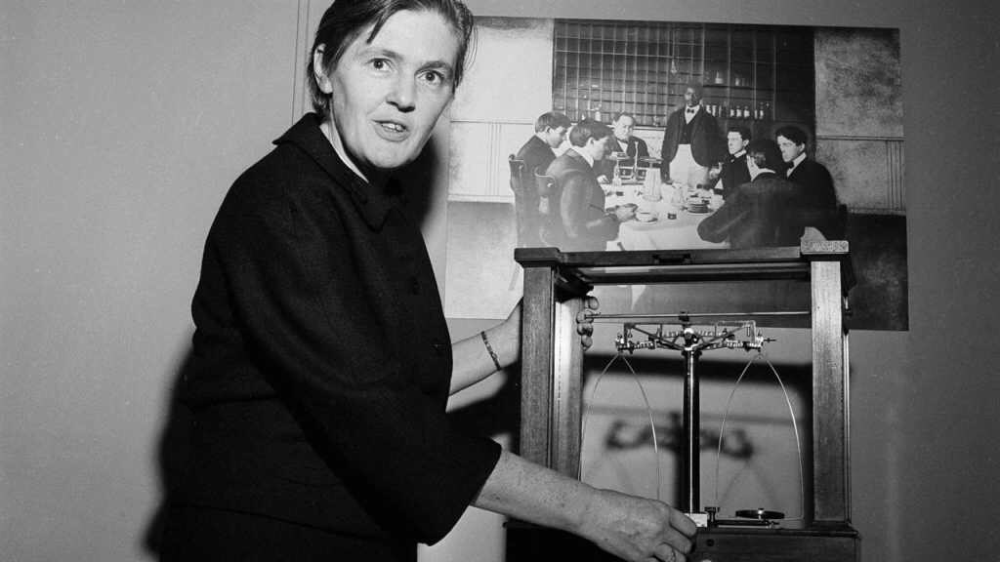

Il 7 agosto del 2015 ci lasciava all'età di 101 anni, Frances Oldham Kelsey. Farmacologa e fisica canadese, fu famosa per aver negato l'autorizzazione da parte della FDA per la quale lavorava, alla commercializzazione della talidomide sul mercato statunitense. Nel 1960, dopo la laurea in Farmacologia presso la McGill University di Montréal, viene assunta dalla Food and Drug Administration a Washington.

Inizia così a lavorare sulla richiesta della casa farmaceutica Richardson-Merrell di commercializzare il farmaco Kevadon contenente il principio attivo talidomide.La talidomide si presentava come un sedativo con proprietà ipnotiche e tranquillanti eccellenti per aiutare le donne in gravidanza a contrastare le nausee mattutine di cui soffrivano.

Nonostante fosse stata approvata in Canada e in altre nazioni europee e africane e nonostante le insistenti pressioni della casa farmaceutica produttrice, Frances non era convinta dei dati sugli studi preclinici presentati. Riteneva che fossero descritti superficialmente e riguardassero un numero esiguo di soggetti, monitorati per un periodo di tempo troppo breve per poter avere una validità scientifica. Questa convinzione motivò la sua ostinazione nel richiedere ulteriori studi.

La Storia le diede ragione e meriti non molto tempo dopo.

Il farmaco non entrò mai in commercio sul mercato statunitense evitando così la nascita di bambini focomelici. Nel 1962 ricevette uno dei più prestigiosi riconoscimenti conferiti dall'allora Presidente americano John F. Kennedy: il President’s Award for Distinguished Federal Civilian Service, che riconobbe “il suo giudizio eccezionale nel valutare un nuovo farmaco per la sicurezza per uso umano che ha impedito una grande tragedia negli Stati Uniti. Attraverso l’alta capacità e la fermezza nella sua decisione professionale ha dato un eccellente contributo alla tutela della salute del popolo americano”.

Fu la seconda donna ad essere insignita del Premio. Nel 2000 fu inserita nella National Women's Hall of Fame.

A lei e al suo instancabile lavoro si deve la nascita della legislazione vigente sulla farmacovigilanza, che ha contribuito a garantire la sicurezza d’uso dei medicinali immessi in commercio e a rafforzare la tutela della salute dei pazienti.
