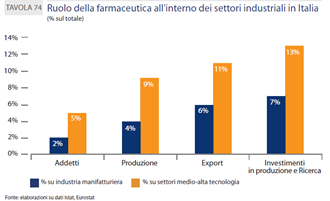
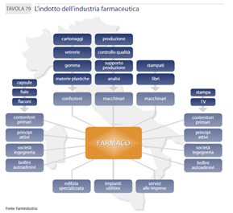
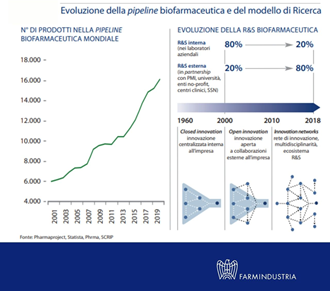
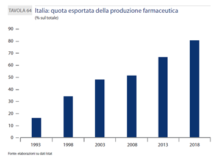
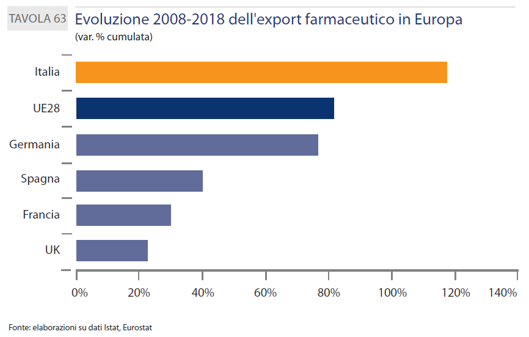
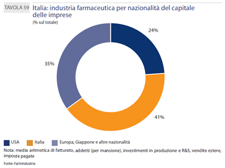
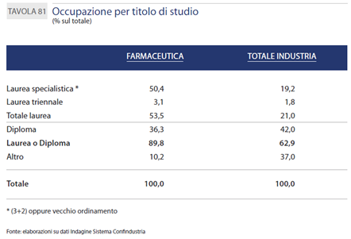

Si è da poco raggiunto un importante traguardo globale per il mondo del farmaco: i prodotti in sviluppo sono giunti alla quota record di oltre 16 mila, la metà dei quali è attualmente in fase clinica.

I dati, tratti dal report Farmindustria sugli indicatori farmaceutici pubblicato a Luglio 2020, fotografano dei segnali positivi nell’ambito Ricerca e Sviluppo (R&S) dell’industria farmaceutica italiana.

Di fronte ad un simile traguardo è legittimo soffermarsi ad analizzare i nuovi trend della _pipeline_ biofarmaceutica e del modello attuale di ricerca scientifica. L’aumento di prodotti in sviluppo ha accelerato la sua crescita negli ultimi dieci anni in concomitanza ad uno sviluppo sempre più massiccio di _innovation networks_. Il _network_, infatti, è oggi un elemento essenziale nel mondo R&S per conciliare insieme entità diverse con specializzazioni e _know-how_ differenti. La collaborazione e la _partnership_ tra aziende diverse permette a figure professionali apparentemente lontane di collaborare in modo efficace basandosi sul principio della multidisciplinarietà, in un mondo farmaceutico che si appresta ad affrontare sfide sempre più complesse e urgenti come l’attuale situazione di emergenza sanitaria ci ha insegnato.

In un mondo in cui l’attività di R&S soffre della ridotta disponibilità di laboratori e risorse interne all’azienda, si fa oggi ampio ricorso al conto terzi (_Contract Development and Manufacturing Organization_, CDMO) con _Contract Research Organization_ (CRO) e centri clinici grandi protagonisti dello scenario farmaceutico odierno. Questa nuova esigenza si concilia con la costituzione del _network_ e trova oggi ampio spazio nel rimodellare le strategie dello sviluppo di un prodotto farmaceutico.

La collaborazione con enti terzi è una realtà sempre più consolidata, tanto da assistere oggi ad una decentralizzazione quasi totale per alcune specifiche attività di ricerca (come _drug discovery_, _process development_, _preclinical profiling_ e _manufacturing_).

### E quale posizione ricopre il nostro Paese in questa corsa allo sviluppo di nuovi prodotti farmaceutici?

Farmindustria, nel suo report, ha evidenziando gli ultimi aggiornamenti in termini di struttura aziendale delle imprese del farmaco, mondo della ricerca e dello sviluppo e domanda farmaceutica e sanitaria del nostro Paese.

Le imprese protagoniste del settore farmaceutico (materie prime e specialità medicinali) operanti in Italia sono 291. Di queste, si evince che il 41% è costituito da imprese a capitale italiano, mentre il 59% da imprese a capitale estero (35% europee e giapponesi, 24% USA), considerando tasso di investimenti, occupazione, vendite estere e imposte pagate.

Dal confronto con l’industria manifatturiera, l’industria del farmaco vince il primato per percentuale di addetti, produzione, export e quota di investimenti destinati a produzione e ricerca. Si tratta di un dettaglio da non trascurare se si pensa quale sia l’indotto di aziende connesse alla filiale farmaceutica che può trarre beneficio da questi dati incoraggianti (ad esempio, aziende di macchinari, vetro e plastica).

L’industria farmaceutica italiana ha aumentato significativamente la quota della produzione esportata (+15% nel quinquennio 2013-2018). A livello europeo, inoltre, il ruolo dell’export si conferma trainante per l’economia italiana risulta molto più di quanto accade negli scenari economici degli altri Paesi dell’Unione. Nel decennio 2008-2018, infatti, l’Italia ha registrato un aumento record nell’export del +118% a fronte di una media europea ferma al +81%.

Un altro primato che spetta all’Italia riguarda la produzione conto terzi: l’Italia è prima in Europa per quanto riguarda il reparto CDMO, contribuendo con 2,1 miliardi di produzione al 25% del totale europeo di tale settore.

Si evince inoltre un’attenzione al mondo biofarmaceutico in quanto tra i prodotti farmaceutici in sviluppo si evidenzia la presenza di farmaci biotecnologici, emoderivati, vaccini, farmaci orfani e terapia avanzate (3 delle 10 autorizzate ad oggi in Europa sono nate in Italia, n.d.r.). Questo dimostra l’impegno del nostro Paese nella sfida delle terapie di prossima generazione (denominate “_Next-Generation Biotherapeutics_”), trend la cui crescita è auspicabile per promuovere la transizione da un approccio tradizionale di gestione della terapia ad un approccio olistico con conseguente maggiore sostenibilità della spesa pubblica sanitaria.

L’Italia ha l’ambizioso compito, in futuro, di continuare ad attrarre sempre più investimenti nella biofarmaceutica, ad esempio aumentando gli studi clinici con procedure amministrative semplificate e più dirette.

In questo scenario di trend di investimenti positivi, aumento dei prodotti farmaceutici in sviluppo e promozione di _network_ che vedono ampio successo di realtà CDMO, _è quindi consigliabile investire sulla propria istruzione universitaria nel settore farmaceutico?_

Volendo concedersi un excursus sugli addetti del settore farmaceutico in Italia, si intravede uno spiraglio di positività e ottimismo per i neo-laureati e laureandi che desiderano conquistare il proprio spazio in un’azienda farmaceutica nel prossimo futuro.

Sul totale degli occupati, i laureati nella farmaceutica sono circa il 54% rispetto al 21% dell’industria manifatturiera e in generale il confronto per titolo di studio evidenzia che nella farmaceutica la quota di personale laureato o diplomato è maggiore rispetto al resto dell’industria (circa il 90% degli occupati rispetto al 63% della media dell’industria).

Il totale delle donne impiegate nel settore farmaceutico è il 42% del totale degli addetti (media del 29% per l’industria non farmaceutica), con una significativa presenza tra i dirigenti e quadri (rispettivamente 30% e 43% del totale nella farmaceutica, rispetto a 13% e 23% nell’industria). La componente maschile, invece, si attesta al 58% del totale, con una maggiore prevalenza tra dirigenti (70%) e operai (71%).

Per una più dettagliata analisi delle cifre e degli andamenti dell’industria farmaceutica italiana si rimanda al testo completo del report di Farmindustria ([https://www.farmindustria.it/app/uploads/2017/12/028\_ IF_DEF4-web_20072020-PUBLIC.pdf](https://www.farmindustria.it/app/uploads/2017/12/028_%20IF_DEF4-web_20072020-PUBLIC.pdf)), ma il messaggio di base sembra essere incoraggiante e di buon auspicio. E questo scenario di dinamicità dell’industria del farmaco del nostro Paese speriamo possa essere vantaggioso per supportare anche la recente candidatura di Milano come nuova sede del Tribunale Unificato dei Brevetti (TUB) notificata ufficialmente dal Governo lo scorso 3 Settembre.

Insomma, è il momento di allenare il nostro ottimismo nel tifare Italia in questa maratona globale del mondo del farmaco e di essere pronti a dare il proprio contributo professionale alle sfide che si presenteranno.
