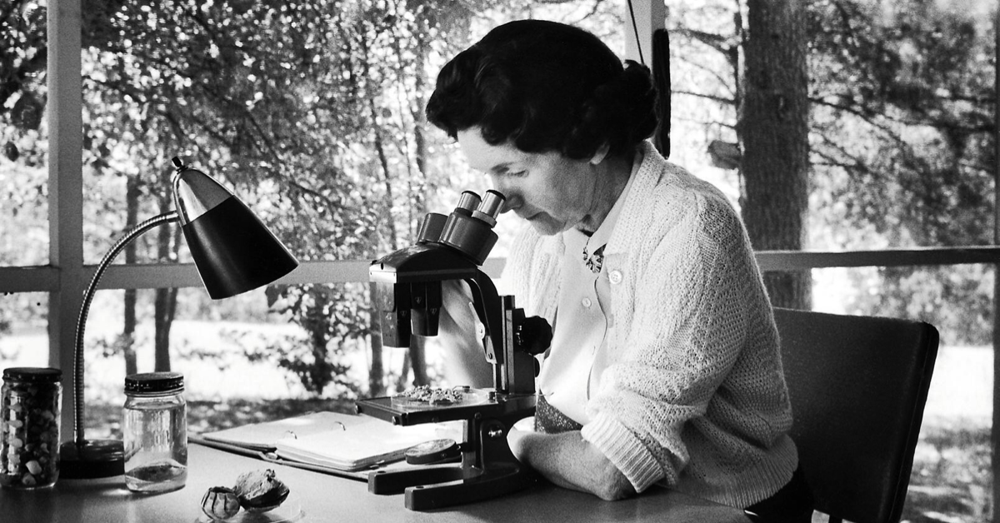

Colesville, Maryland (USA), 27 settembre 1962.

La storia che vi voglio raccontare oggi ha inizio in un mite pomeriggio di settembre, quando la Houghton Mifflin Harcourt di Boston pubblica quello che sarà una pietra miliare per il movimento ambientalista contemporaneo, _Primavera Silenziosa_ di Rachel Carson.

Rachel Carson è una biologia di 55 anni che vive nella sua casa di campagna del Maryland e lavora come editrice capo nell’ufficio per la pesca e la difesa della natura del Dipartimento dell’Interno degli Stati Uniti. E’ una scrittrice scientifica di discreto successo, conosciuta specialmente per la sua divulgazione nell’ambito della biologia marina.

Quel pomeriggio Rachel è pronta. Sa bene che il suo nuovo romanzo avrà un’accoglienza tutt’altro che “silenziosa”. Da quando ha iniziato il percorso di ricerca per la stesura di questo libro, non ha ricevuto altro che insulti, minacce e derisione. Alcuni colleghi l’hanno definita “una semplice _birdwatcher_ con più tempo libero che conoscenza scientifica”, altri la accusano di essere una “donna isterica non qualificata a scrivere un libro di tale portata” fino ad insinuare che “seguendo i suoi insegnamenti si tornerebbe al Medioevo e gli insetti e le malattie erediterebbero ancora una volta la terra”.

Rachel è una donna coraggiosa, sa che si sta scagliando contro le più grandi industrie chimiche dell’epoca. Ma da che quattro anni prima la lettera dell’amica Olga Owens Huckins ha stuzzicato la sua curiosità, non si dà pace e vuole far emergere la verità.

Olga le aveva scritto che da quando negli anni ‘40 il governo del Massachusetts permetteva l’uso massiccio del pesticida DDT per l’eliminazione delle zanzare (portatrici di malaria) trovava diversi uccelli morti intorno alla sua abitazione. La primavera del Massachusetts da allora era diventata per l’appunto più “silenziosa”, senza colonna sonora, vuota e senza vita.

L’amica le aveva chiesto di usare la sua influenza sulle autorità governative per avviare un'indagine sull'uso di pesticidi e fitofarmaci. Ma Rachel aveva deciso che avrebbe avuto molto più effetto parlare del problema in una rivista. Gli editori non erano, però, interessati, per cui alla fine il progetto prese un’altra strada, diventando un libro.

Nonostante l’opposizione di alcuni esponenti del mondo scientifico, il libro divenne un best seller e l’uso dei fitofarmaci una questione pubblica, soprattutto dopo un'apparizione televisiva della Carson nell'aprile 1963 in un dibattito con un portavoce di un'azienda chimica. In quello stesso anno venne eletta membro dell'Accademia Americana delle Arti e delle Scienze e ricevette molti premi e onorificenze, tra cui la medaglia Audubon e la medaglia Cullen della American Geographical Society.

Rachel Carson aveva esplorato le connessioni ambientali legate all’uso di biocidi come il DDT: i suoi effetti investono tutta la catena alimentare, e ciò che era stato pensato per eliminare un insetto finisce per avvelenare gli altri animali e gli uomini. Studi successivi evidenziarono come il bioaccumulo di questo insetticida sia responsabile di tumori epatici, interferisca con i recettori degli ormoni e rechi danni al sistema nervoso riconducibili con l’insorgenza della malattia di Alzheimer.

Le critiche continuarono a pervadere gli ultimi anni di vita di Rachel. Si spense il 14 aprile 1964 a causa di un tumore al seno.

La sua battaglia venne portata avanti anche in sua assenza finché, nel 1972, venne proibito l’uso del DDT negli Stati Uniti.

Nel settembre 2006, l’Organizzazione Mondiale della Sanità (WHO) ha bandito l’uso del DDT ad eccezione dei paesi africani dove può essere impiegato (in concentrazioni appropriate) per il controllo della malaria.

**Fonti**

Rachel Carson’s Silent Spring, su [www.americaslibrary.gov](www.americaslibrary.gov)

Rachel Carson, DDT and the Fight Against Malaria by Clyde Haberman on The New York Times

27 maggio 1907: Rachel Carson e la primavera silenziosa di Edgar H. Meyer su [www.expo2015.org/magazine/it](www.expo2015.org/magazine/it)

_DDT - A Brief History and Status_ su [www.epa.gov](www.epa.gov)

https://www.pbs.org/wgbh/pages/frontline/shows/nature/disrupt/sspring.html

**Citazioni**

_Un consiglio pratico dovrebbe essere "Spruzza il meno che ti sia possibile" piuttosto che "Spruzza al limite delle tue capacità" – R. Carson_

_Più riusciamo a focalizzare la nostra attenzione sulle meraviglie e le realtà dell'universo attorno a noi, meno dovremmo trovare gusto nel distruggerlo – R. Carson_

_È per noi una cosa salutare e necessaria il volgerci di nuovo alla terra e nella contemplazione delle sue bellezze conoscere la meraviglia e l'umiltà – R. Carson_
