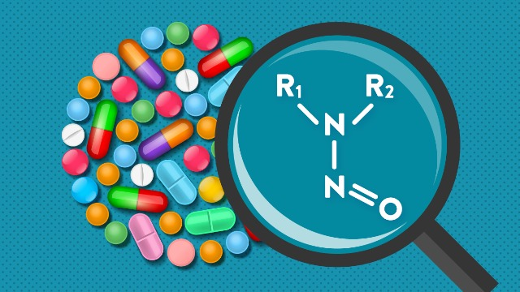
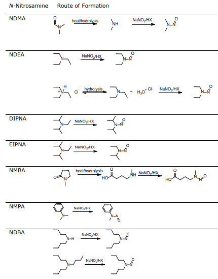

Il comitato per i medicinali per uso umano (CHMP) dell’Agenzia europea per i medicinali (EMA) ha di recente comunicato il suo parere finale riguardo alla sospensione dell’AIC (Autorizzazione all’Immissione in Commercio) di tutti i medicinali a base di ranitidina (_notifica EMA/486378/2020, 18 Settembre 2020_) [1]. La sospensione dell’AIC è stata confermata in questa ultima fase di riesame dopo il parere di sospensione precauzionale che lo stesso CHMP aveva espresso nel mese di Aprile 2020. Unica eccezione sarà fatta per i medicinali a base di ranitidina che vengono somministrati per iniezione o infusione a patto che la posologia sia ridotta ad una singola dose.

Facciamo però un po’ il punto sulla ranitidina e sul processo di riesame che ha visto protagonista questo principio attivo.

La **ranitidina** è utilizzata da circa trent’anni nel trattamento e prevenzione di condizioni patologiche quali bruciore di stomaco, reflusso gastroesofageo e ulcere gastriche poiché riduce la produzione di acido gastrico agendo da antagonista dei recettori H2 dell'istamina. Fino a pochi mesi fa erano disponibili in farmacia molteplici formulazioni a base di ranitidina (tra le quali compresse, sciroppi e soluzioni iniettabili) dispensate previa prescrizione medica o in regime di automedicazione, ma ad oggi la commercializzazione di questi medicinali è stata interdetta in tutta Europa (e di fatto anche al di fuori del Vecchio continente in accordo con le disposizioni della _Food and Drug Administration_, FDA).

_Perché si è arrivati a questa decisione?_ La revisione dei medicinali a base di ranitidina è stata avviata il 12 settembre 2019 su richiesta della Commissione Europea (art. 31, direttiva 2001/83/CE). Questa revisione deve però essere contestualizzata in uno scenario più ampio che include anche il processo di revisione dei medicinali a base di valsartan (iniziato nel Luglio 2018 e poi esteso all’intera classe dei sartani) e alla revisione dei medicinali contenenti metformina (iniziata nel Dicembre 2019).

_Possiamo trovare un minimo comune denominatore tra questi processi di revisione?_ La risposta è sì e può essere riassunta con l’acronimo **NDMA** (**_N-Nitrosodimethylamine_**).

NDMA è una sostanza chimica appartenente alla classe delle **N-nitrosammine**, una impurezza riscontrata nei medicinali che ha innescato complessi processi di revisione da parte delle principali autorità regolatorie. Nello specifico, FDA e EMA si sono prontamente espresse sulla questione con la pubblicazione di linee guida e pareri ufficiali per permettere un’ordinata e informata gestione di valutazione del rischio.

FDA ha pubblicato a Settembre 2020 un documento [2] di immediata implementazione rivolto alle industrie coinvolte nella produzione di medicinali e API (_Active pharmaceutical ingredient_), mentre EMA ha redatto un programma [3] articolato in tre step con termine finale fissato a Settembre 2022 e pubblicato un _assessment report_ aggiornato a Giugno 2020 per riassumere tutte le informazioni ad oggi note sulle N-nitrosammine (_notifica EMA/369136/2020, 25 Giugno 2020_) [4].

_E cosa sappiamo ad oggi di questa classe di impurezze denominata **N-nitrosammine**?_ Le nitrosammine riscontrabili nei farmaci sono sette ad oggi secondo FDA e EMA, dove NDMA è una delle poche insieme a NMBA _(N-nitrosomethylamino butyric acid_) ad avere un limite di assunzione accettabile (_acceptable intake (AI) limit_) fissato a 96 ng/die. Per le altre nitrosammine tale valore è invece di 26.5 ng/die.

Le N-nitrosammine sono impurezze che potrebbero formarsi dalla degradazione del principio attivo (ranitidina \_in primis \_secondo alcune recenti ipotesi anche in condizioni normali di stoccaggio o per via endogena, ad esempio) [5,6], oppure essere il prodotto di reazioni collaterali del processo sintetico o ancora essere impurezze di sostanze impiegate nelle diverse fasi di produzione e confezionamento del medicinale.

_Struttura e possibili reazioni di formazione delle sette N-nitrosammine identificate come possibili impurezze in campo farmaceutico. [3]_

La chimica ci assiste nel suggerirci che la concomitante presenza di un’ammina (secondaria, terziaria o sale di ammonio quaternario) e un sale di nitrito può generare nitrosammine in ambiente acido. Dal sale di nitrito, infatti, si genera acido nitroso che reagisce poi con l’ammina. Il problema però non è così semplice, perché può capitare di ereditare la presenza di sali di nitrito da step sintetici precedenti o che questi siano presenti come impurezze in determinati reattivi (ad esempio, sodio azide o nitrato di potassio). Allo stesso modo, la miscela di reazione con cui stiamo lavorando potrebbe contenere ammine anche se queste non sembrano partecipare direttamente alla reazione che stiamo eseguendo. Ad esempio, utilizzare DMF (N,N-dimetilformammide) come solvente può indurre la formazione di nitrosammine perché DMF (così come N-metilpirrolidone, N,N-dimetilacetammide e N,N-dietilacetammide) può generare ammine secondarie in seguito a degradazione e queste potrebbero poi reagire con eventuale acido nitroso presente nella miscela di reazione a generare nitrosammine.

_Perché però le concentrazioni rilevabili di NDMA devono rimanere all’interno di determinati valori soglia di accettabilità?_ Come si giustifica una così importante presa di posizione da parte delle autorità nel momento in cui si riscontrano valori leggermente anomali?

**NDMA** è ad oggi classificata come **probabile agente cancerogeno per l’uomo7**, ossia in grado potenzialmente di provocare il cancro (classe 2A secondo la classificazione di _World Health’s Organization International Agency for Research and Cancer_ - WHO’s IARC). Tale valutazione deriva da studi condotti sugli animali, dove invece la sua azione cancerogena e genotossica è stata verificata. NDMA non risulterebbe essere pericolosa se ingerita in quantità ridotte e non è accertato che possa aumentare la possibilità di indurre la comparsa di tumore. La sua presenza è stata inoltre rilevata in alcuni alimenti (i nitriti sono usati come conservanti soprattutto in carne e pesce, n.d.r) e forniture d’acqua, ma per questi campi di applicazione ci si deve rifare alle disposizioni rispettivamente di EFSA (_European Food Safety Authority_) e EPA (_Environmental Protection Agency_). Ad ogni modo, è importante che l’assunzione quotidiana di NDMA sia controllata e rimanga al di sotto dei valori ritenuti accettabili, ed ecco perché l’assunzione di farmaci per patologie croniche diventa uno degli aspetti da regolamentare e controllare in modo severo.

Per fare questo è stato imposto dalle autorità alle aziende farmaceutiche e produttrici di API di condurre un _risk assessment_, ovvero un'analisi del rischio dei processi produttivi in accordo con le linee guida ICH Q9 e ICH Q7. Questo impone di considerare con la massima attenzione non solo tutte le fasi della sintesi del principio attivo, ma anche l’acquisizione delle materie prime impiegate nella sintesi (reattivi, solventi, ecc.), la formulazione del medicinale verificando la natura e le purezza degli eccipienti impiegati, il confezionamento del medicinale e la scelta dei materiali di confezionamento (ad esempio, cellulosa e colla impiegata per i blister) ed infine la fase di stoccaggio delle confezioni poi destinate alla vendita, con la conseguente necessità di condurre studi di stabilità.

L’elenco dei fattori da considerare quindi si allunga di molto, ma oltre ad un’analisi critica di tutti i possibili fattori di rischio, bisogna poi occuparsi anche della scelta delle tecniche e dei metodi analitici impiegati per determinare la quantità di nitrosammine. In linea generale, come riportato dalle linee guida rilasciate da FDA e EMA, le strategie di controllo e i valori limite devono essere definiti in accordo con i principi ALARA (_as low as reasonably achievable_) e ALARP (_as low as reasonably possible_).

I limiti di quantificazione (LOQ, limits of quantitation) richiesti sono di norma parti per billione (ppb) e la rilevazione di bassi livelli di nitrosammine viene spesso affidata alla spettrometria di massa (spesso in combinazione con tecniche cromatografiche). Per riferimento si veda, ad esempio, il metodo LC-HRMS (_liquid chromatography - high resolution mass spectrometry_) rilasciato da FDA per la quantificazione di NDMA in farmaci contenenti ranitidina. [8]

In definitiva, possiamo dire che il caso delle nitrosammine è un esempio che si presta bene a dipingere il complesso scenario che un’azienda farmaceutica può dover affrontare. Ruolo chiave nella gestione di uno scenario simile di _risk assessment_ è il reparto di affari regolatori delle industrie farmaceutiche, il quale farà da intermediario tra l’apparato normativo e le esigenze aziendali al fine di armonizzare l’implementazione delle linee guida.

Se sei curioso di capire meglio di cosa si occupa il reparto di affari regolatori, guarda la replica del nostro aperitivo digitale con le esperte del settore, durante il quale abbiamo affrontati vari _hot topic_ del settore tra cui anche quello delle nitrosammine ([https://www.youtube.com/watch?v=Iv50zbpHANw](https://www.youtube.com/watch?v=Iv50zbpHANw)).

**Fonti:**

1. [www.ema.europa.eu/en/documents/referral/ranitidine-article-31-referral-ema-confirms-recommendation-suspend-all-ranitidine-medicines-eu_en.pdf](http://www.ema.europa.eu/en/documents/referral/ranitidine-article-31-referral-ema-confirms-recommendation-suspend-all-ranitidine-medicines-eu_en.pdf)

2. [www.fda.gov/regulatory-information/search-fda-guidance-documents/control-nitrosamine-impurities-human-drugs](http://www.fda.gov/regulatory-information/search-fda-guidance-documents/control-nitrosamine-impurities-human-drugs)

3. [www.ema.europa.eu/en/human-regulatory/post-authorisation/referral-procedures/nitrosamine-impurities](http://www.ema.europa.eu/en/human-regulatory/post-authorisation/referral-procedures/nitrosamine-impurities)

4. [www.ema.europa.eu/en/documents/referral/nitrosamines-emea-h-a53-1490-assessment-report_en.pdf](http://www.ema.europa.eu/en/documents/referral/nitrosamines-emea-h-a53-1490-assessment-report_en.pdf)

5. Juan L. _et al_., _J. Environ. Sci_., 2017, 29, 116-126, doi: 10.1016/j.jes.2017.05.028

6. Le Roux J. _et al_., _Environ Sci Technol_., _2012_, 46(_20_), 11095-11103, doi: 10.1021/es3023094

7. [www.who.int/water_sanitation_health/dwq/chemicals/ndmasummary_2ndadd.pdf](http://www.who.int/water_sanitation_health/dwq/chemicals/ndmasummary_2ndadd.pdf)

8. [www.fda.gov/media/130801/download](http://www.fda.gov/media/130801/download)
