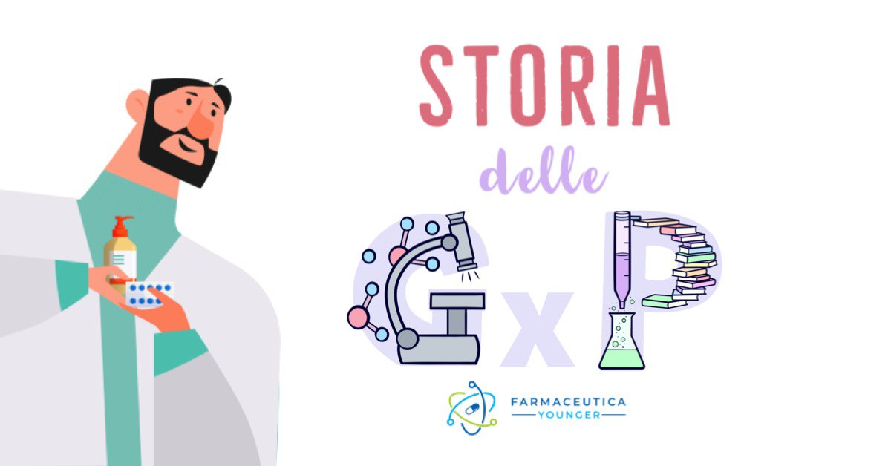

La storia è costellata di grandi disastri che hanno permesso ai posteri di riparare agli errori commessi nel passato. Stessa sorte per le **GxP** che nate non troppi decenni fa, sono state concepite dalla necessità di riparare agli errori causati dall’assenza di regole interne ai processi.

Edward Gibbon, storico e politico inglese diceva: _“I have but one lamp by which my feet are guided, and that is the lamp of experience. I know no way of judging of the future but by the past.”_

Quali errori, quali sbagli sono stati commessi nel passato?

Passiamo in rassegna alcuni dei più grandi disastri nella storia dell'industria farmaceutica.

Nel 1905 Upton Sinclair, scrittore e attivista statunitense, riesce a catalizzare l’attenzione dell’opinione pubblica sulle condizioni antigieniche dei laboratori in cui venivano lavorate le carni conservate e gli insaccati, con il romanzo **_"The Jungle"_**. Il libro ebbe un grande impatto sull’opinione pubblica dell’epoca tanto che si racconta che l'allora presidente degli Stati Uniti d'America, Franklin Delano Roosevelt, dopo aver letto il libro non mangiò per tutta la sua vita carne in scatola.

Nel 1906 Il Congresso approva il _‘Pure Food and Drug Act’_, una delle prime raccolte di leggi che regolamentava la vendita illegale di alimenti o droghe adulterate che portarono, in quell’anno, alla nascita della FDA statunitense.

Nel 1933 una mostra promossa dalla FDA espone alimenti, medicinali, dispositivi medici e cosmetici pericolosi immessi sul mercato prima del 1906. Un giornalista l’aveva soprannominata _"America’s Chamber of Horrors"_. La famosa mostra esponeva un “contraccettivo” che poteva perforare l'utero se inserito in modo errato, un farmaco dimagrante causa di molte vittime, un depilatore causa di casi di calvizie, lozioni e creme potenziali cause di avvelenamento da mercurio, tinture per capelli potenziali cause di avvelenamento da piombo. Eleanor Roosevelt dopo aver visitato la mostra la volle portare alla Casa Bianca, sensibilizzando così l’opinione pubblica con il lancio di una campagna rivolta ad una maggiore protezione dei consumatori.

Ma una tragedia stava aspettando dietro l'angolo.

Nel 1937 un’azienda del Tennesse la S.E. Massengill Company ebbe una idea. Produrre l’antibiotico sulfanilamide in forma liquida in modo da renderlo più facilmente somministrabile. L’idea fu quella di utilizzare il glicole dietilenico per solubilizzare il principio attivo, un solvente comunemente impiegato come liquido antigelo. Peccato che il glicole dietilenico è un composto estremamente tossico, che causa gravi danni ai reni. L’**elixir sulfanilamide** provocò in pochi mesi la morte di più di 100 persone, molte delle quali bambini, prima di essere ritirato definitivamente dal commercio. Prima di allora nessuna autorizzazione era necessaria per immettere sul mercato un prodotto valutandone prima la sua sicurezza.

Nel 1938 Il Congresso approva la _‘Food, Drug, and Cosmetic Act’_, una legge che prevedeva per la prima volta l’obbligo che un farmaco venisse approvato solo dopo aver dimostrato la sua sicurezza.

Nel 1941 circa 300 persone muoiono o riportano gravi complicazioni dall’ingestione di compresse di **sulfatiazolo** contaminate dal sedativo fenobarbital. Da un'indagine interna emerse che l'azienda produttrice del sulfatiazolo confezionava i due prodotti nello stesso locale, dove erano presenti due macchine confezionatrici che spesso venivano intercambiate per produrre i due prodotti. Dopo questo episodio, la FDA fu costretta a rivedere drasticamente i requisiti di qualità che portarono qualche anno più tardi alle GMP, le Good Manufacturing Practices.

La Certificazione dei lotti divenne un requisito obbligatorio per alcuni farmaci a partire dall’insulina (1941) per poi arrivare alla penicillina (1945). Successivamente venne ampliato per includere tutti gli antibiotici. La certificazione venne abbandonata definitivamente nel 1983.

Uno dei più grandi buchi neri della storia del farmaceutico fu la ben nota vicenda della **talidomide**.

Nel 1956 venne messa in commercio sul mercato europeo dall'industria tedesca Chemie Grünenthal come sedativo, anti-influenzale e soprattutto come rimedio contro l’insonnia e gli stati di nausea nelle donne in gravidanza. Lanciato il 1 ottobre 1956 in Germania, venne poi distribuito in ben 46 nazioni. Nei primi cinque anni, solo in Germania furono prodotte circa quindici tonnellate di talidomide. Non passò molto perché si evidenziassero i primi casi di focomelia, una grave malformazione neonatale agli arti. In Europa circa 10.000 casi di deformità infantile furono associati all’assunzione della talidomide nelle donne incinte nel primo trimeste di gravidanza. Il 2 dicembre del 1961 la talidomide venne ritirata in Gran Bretagna, e via via negli altri paesi. In Italia il ritiro avvenne solo nel settembre del 1962.

Una storia ben nota che negli anni ‘60 scosse l'Europa e non solo.

Non altrettanto nota è la vicenda della farmacologa di origini canadesi, **Frances Oldham Kelsey**, il cui nome è legato alle vicende oltreoceano della talidomide. Nel 1960, Kelsey fu assunta dalla FDA a Washington. Fu qui che iniziò a lavorare sulla richiesta della casa farmaceutica Richardson Merrell di commercializzare il farmaco Kevadon contenente il principio attivo talidomide. Proprio sulla scrivania della giovane Frances finì la domanda insistente di autorizzazione della talidomide. La farmacologa canadese rifiutò di approvare la domanda di autorizzazione all'immissione in commercio del farmaco nonostante fosse stato approvato in Canada e in altre nazioni europee e africane. Frances non era convinta dei dati sugli studi preclinici presentati. Riteneva che fossero descritti superficialmente e riguardassero un numero esiguo di soggetti, monitorati per un periodo di tempo troppo breve per poter avere una validità scientifica. Questa convinzione motivò la sua ostinazione nel richiedere ulteriori studi.

Il farmaco non entrò mai in commercio sul mercato statunitense e Frances Oldham Kelsey salvò una nazione intera dal disastro della talidomide.

Nel 1962 ricevette uno dei più prestigiosi riconoscimenti conferiti dall'allora Presidente americano John F. Kennedy, il “President’s Award for Distinguished Federal Civilian Service”, che riconobbe: "_il suo giudizio eccezionale nel valutare un nuovo farmaco per la sicurezza per uso umano che ha impedito una grande tragedia negli Stati Uniti. Attraverso l’alta capacità e la fermezza nella sua decisione professionale ha dato un eccellente contributo alla tutela della salute del popolo americano_".

Fu la seconda donna ad essere insignita del Premio e nel 2000 fu inserita nella National Women's Hall of Fame.

Nel 1960 nacque la prima bozza delle GMP, uno stadio embrionale delle norme che avrebbero regolamentato l'industria farmaceutica. Si dovette aspettare il 1978 affinchè le Good Manufacturing Practices per i medicinali (21 CFR Parte 210 e 211) e per i dispositivi medici (21 CFR Parte 820) siano rese definitive. Il loro scopo era quello di garantire la qualità, la sicurezza e l’efficacia di tutti i prodotti medicinali.

> _“Le Norme di Buona Fabbricazione (GMP), corrispondono a quella parte della assicurazione di qualità che ha lo scopo di assicurare che i prodotti vengano fabbricati in modo da risultare consistentemente di qualità adeguata per l’uso che se ne intende fare. Esse, pertanto, hanno per oggetto sia la produzione che il controllo di qualità.”_ [EU GMP, Part I, Chapter 1]

> "_The minimum regulations for methods to be used in, and the facilities and controls to be used for, the manufacture, processing, packing or holding of a drug to assure that such drug meets the requirements of safety, identity, strenght, quality and purity._" [US CFR 21, part 210-211]

L'anno seguente nacquero le **GLP**, le Good Laboratory Practices.

> "_Good laboratory practices for conducting nonclinical laboratory studies that support or are intended to support applications for research or marketing permits for products regulated by the Food and Drug Administration, including food and color additives, animal food additives, human and animal drugs, medical devices for human use, biological products, and electronic products. Compliance with this part is intended to assure the quality and integrity of the safety data filed._" [US CFR 21, part 58]

Nel 1982 la dodicenne Mary Kellerman ha dei sintomi influenzali e avverte subito i suoi genitori. Prontamente le somministrano una capsula di **Tylenol** extra forte e nel giro di poche ore la bambina muore. Altre sei persone muoiono poco tempo dopo, tra cui tre membri di una famiglia (due fratelli e una delle loro mogli) e una donna che aveva appena dato alla luce il suo quarto figlio. L’azienda produttrice del Tylenon, il colosso farmaceutico Johnson & Johnson fece un richiamo a livello nazionale di oltre 31 milioni di confezioni di farmaco. Un’indagine condotta aveva rivelato che le capsule erano state manomesse, intenzionalmente aperte e contaminate con il cianuro. La Johnson & Johnson distribuì degli avvertimenti agli ospedali e ai distributori e bloccò la produzione e la pubblicità del Tylenol. Il colpevole di questo atto criminale non venne mai trovato.

Nel 1983 il Congresso degli Stati Uniti approvò una legge, la _Federal Anti-Tampering Act_, che rendeva un crimine manomettere i prodotti di consumo confezionati.

Nel 1989 ci fu la prima edizione delle **GMP** europee che includeva anche l’Annex 1, un'appendice appositamente pensato per i medicinali sterili.

Nel 1990 dall’esigenza di un’armonizzazione delle GxP nasce l’International Conference on Harmonization (**ICH**).

Nel 1991 viene pubblicata la seconda edizione con recepimento delle Direttive 91/356 (medicinali a uso umano) e 91/412 (medicinali a uso veterinario), inclusi 12 Annex.

Nel 2005 ci fu una vera ristrutturazione del documento con la divisione in parte I (medicinali) e parte II (principi attivi) e con recepimento delle Direttive 2004/27/EC (medicinali a uso umano) e 2004/28/EC (medicinali a uso veterinario), inclusi 17 Annex.

Nel 2010 un nuovo aggiornamento del testo con l'introduzione della parte III (documenti correlati, di supporto e best practices).

La prima edizione dell'**Annex 1**, _Manufacturing of sterile medicinal products_ è stata pubblicato per la prima volta nel 1971. Negli anni successivi ha subito numerose revisioni (2007 e 2010). Alla fine del 2017, è stata pubblicata la prima bozza della revisione del documento, attualmente ancora in stato di draft, allo scopo di creare una linea guida più strutturata che includesse nuove sezioni e paragrafi estesi su specifici argomenti.
