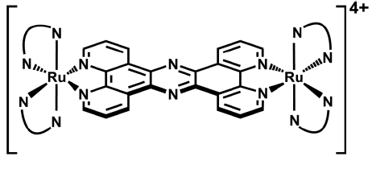

# Kirsty Smitten

Kirsty Smitten, 26 anni. Sheffield, South Yorkshire, Regno Unito.

Appassionata di chimica fin da bambina, Kirsty decide di iscriversi alla facoltà di chimica dell’Università di Sheffield. Qui segue un corso di chimica bio-inorganica e rimane affascinata dai composti anti-tumorali a base di rutenio, a suo dire “il corso più interessante di tutta la sua carriera accademica”.

Decide quindi di orientarsi verso la metallorganica e chiede di poter svolgere un dottorato presso il laboratorio di ricerca del professor Thomas, responsabile del corso che tanto l’aveva ispirata. Viene accettata.

Insieme al professor Thomas, delinea il suo progetto di dottorato indirizzandosi verso la ricerca di innovativi composti anti-microbici che possano far fronte al fenomeno dell’antibiotico-resistenza (AMR).

Ad oggi, Kirsty ha sintetizzato oltre 20 nuovi antibiotici. Due dei quali hanno dimostrato un’attività antibatterica maggiore rispetto agli antimicrobici disponibili in commercio. La sua ricerca è stata premiata con il “Nova Prize in Chemistry 2018” e nel 2020 è entrata a far parte dei Forbes 30 Under 30 in Science and Healthcare.

## Ma cosa si intende per resistenza antibiotica?

L’antibiotico resistenza (ARM) è la capacità dei microrganismi di sopravvivere alla presenza di un farmaco antibiotico. E’ un meccanismo adattativo sviluppato dal alcuni ceppi batterici che normalmente vengono curati con concentrazioni di antibiotico sufficienti ad inibirne la crescita (antibiotici batteriostatici) o in grado di eliminarne l’intera colonia (antibiotici battericidi).

L’antibiotico-resistenza rende quindi molto più difficile curare una patologia infettiva: il decorso della malattia diventa più lungo e aumenta il rischio di complicanze per il paziente, causa circa di 700 mila morti ogni anno. Si stima che, solo in Europa, l’antibiotico-resistenza costi annualmente 1.5 bilioni di euro tra spese di pubblica sanità e perdite in produttività.

Secondo la _Food and Agricolture Organization (FAO)_ l’antibiotico-resistenza è una minaccia crescente che riguarda sia la salute umana che per quella animale. Non solo, l’utilizzo sregolato di antibiotici contamina acqua, suolo e vegetazione rendendo resistenti anche ceppi batteriche che comunemente popolano l’ambiente creando nuovi possibili patogeni.

## Le ricerche di Kirsty Smitten

Kirsty he sviluppato dei complessi poli-piridilici del rutenio(II) che presentano ben due nuclei di rutenio legati tra loro da una struttura aromatica rigida. Rispetto ai farmaci tradizionali, questi composti hanno una struttura 3D complessa che gli permette di attaccare non solo la membrana esterna dei batteri ma anche strutture cellulari interne come il DNA.

I composti di Kirsty si sono dimostrati selettivi, non-tossici e efficaci sia _in-vitro_ che _in-vivo_. Inoltre sono attivi contro ceppi di _Enterobacteriacae_, _Pseudomonas_ e _Acinetobacter carbapenem-resistenti_, ceppi classificati come “critici” dall’Organizzazione mondiale della Sanità (OMS) e perciò di assoluta priorità per lo sviluppo di nuovi antibiotici.

> Throughout my PhD I have doubted my abilities as a scientist. When assays fail or experiments don’t work, and you end up feeling like you have wasted hours of your time it is demoralizing. In these difficult times I remembered that every PhD student goes through this, this is science it won’t always work the first time.

## Fonti

[https://thefemalescientist.com/portrait/kirsty-smitten/2695/meet-kirsty-smitten-passionate-about-antimicrobial-resistance-and-microbiology/](https://thefemalescientist.com/portrait/kirsty-smitten/2695/meet-kirsty-smitten-passionate-about-antimicrobial-resistance-and-microbiology/)

[https://www.sheffield.ac.uk/news/nr/sheffield-researcher-forbes-chemistry-antibiotics-1.884737](https://www.sheffield.ac.uk/news/nr/sheffield-researcher-forbes-chemistry-antibiotics-1.884737)

[https://www.forbes.com/profile/kirsty-smitten/#6d202ae07238](https://www.forbes.com/profile/kirsty-smitten/#6d202ae07238)

[https://www.metallobio.com/](https://www.metallobio.com/)
