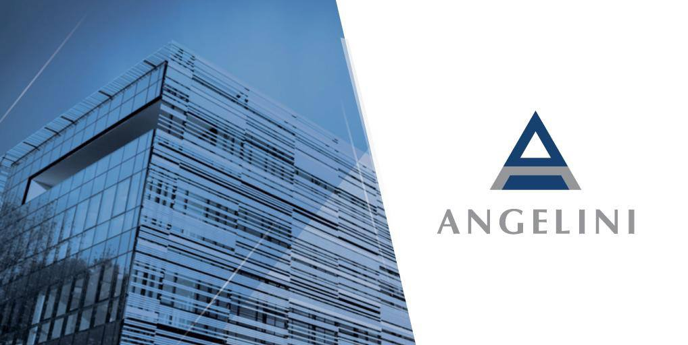

Siamo nel 1919 quando il 32enne Francesco Angelini, farmacista di origini marchigiane, insieme a due soci, costituisce una società per la produzione e la vendita di medicinali con sede ad Ancona.

La società prende il nome di Anfera ed è il primo distributore italiano del settore.

Nel 1941 la società viene sciolta e Francesco Angelini fonda ACRAF, Aziende Chimiche Riunite Angelini Francesco.

Negli anni del dopoguerra il Dobetin è il primo successo commerciale dell'azienda.

Francesco Angelini importa per primo la vitamina B12, in risposta ad una grave esigenza sanitaria, l'anemia perniciosa che affliggeva la popolazione italiana colpita dalla fame durante la guerra.

Gli anni ’50 segnano tre tappe fondamentali nell’espansione dell’azienda.

La scelta di spostare gli uffici direzionali a Roma, l’inizio della commercializzazione di Tachipirina e l’acquisizione della Fater, azienda produttrice di beni di largo consumo.

Fater entra così nelle case delle famiglie italiane con il marchio Lines, rivoluzionando il mercato igienico-sanitario del nostro Paese.

Arrivano i primi pannolini per bambini monouso e la prima linea di assorbenti igienici femminili.

Negli anni '70 Angelini esce dai confini nazionali.

Viene acquisito il gruppo farmaceutico Lepori di Barcellona, da cui inizia un processo di espansione internazionale che inizia da Spagna e Portogallo.

Nel 1985, Angelini intuisce le potenzialità dell'analgesico ibuprofene in Italia e lancia un farmaco di automedicazione specifico contro il mal di testa.

Il Moment® è il primo esempio di marketing applicato a prodotti farmaceutici.

Nel 1992 Angelini consolida ulteriormente la sua posizione nel settore igienico-sanitario, realizzando una joint venture paritetica con Procter&Gamble.

Siamo negli anni 2000 quando Angelini acquisisce Amuchina, azienda genovese nota per i suoi prodotti disinfettanti e igienizzanti.

Nel settore farmaceutico, Angelini focalizza il proprio impegno nelle aree terapeutiche dolore e disturbi infiammatori, malattie e disturbi del sistema nervoso, pediatria.

Nel 2019 Angelini festeggia i suoi cento anni.

Oggi il gruppo Angelini è una realtà internazionale, leader nell’area salute e nei settori farmaceutico e del largo consumo che impiega circa 5700 dipendenti.
