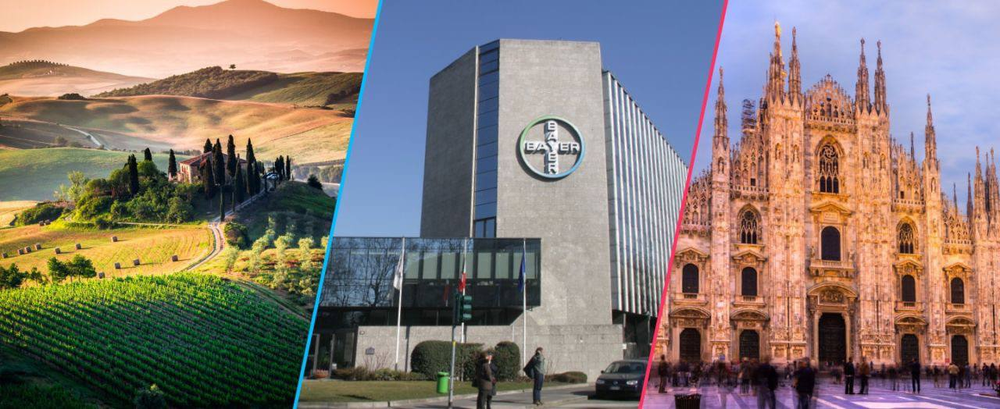

Tutto ha inizio con un'amicizia tra due uomini, l’uomo d'affari Friedrich Bayer e il maestro tintore Johann Friedrich Weskott.

Durante i loro consueti esperimenti scoprono il colorante fucsina.

Il 1° agosto 1863 fondano la "Friedr. Bayer et. Comp." a Wuppertal-Barmen, una specie di startup del XIX secolo con un enorme potenziale di crescita.

Il business dell'azienda è la produzione e la vendita di coloranti sintetici.

Nel 1881 Bayer diventa una società per azioni.

L'impressionante crescita dell'azienda nei suoi primi anni è evidente dalla dimensione della forza lavoro, che passa da tre nel 1863 a oltre 300 dipendenti nel 1881.

Gli anni che vanno dal 1881 al 1914, vedono una trasformazione della Bayer in un'azienda chimica ormai internazionale. Sebbene i coloranti rimangano il core business dell'azienda, Bayer si apre a nuovi settori.

Viene messo in piedi un laboratorio di ricerca scientifico che ha portato alla sintesi di molecole di interesse farmaceutico, prime tra tutte l’Aspirina.

Sintetizzata da Felix Hoffmann a partire dall’acido salicilico, viene lanciata sul mercato nel 1899.

La straordinaria crescita di Bayer viene interrotto dalla prima guerra mondiale.

Gli effetti della guerra furono devastanti. L'azienda perse l’accesso ai mercati esteri e le vennero confiscati brevetti e marchi.

Per riguadagnare l'accesso vitale ai mercati di esportazione, Bayer, BASF e Agfa danno vita alla I.G. Farbenindustrie AG.

Nel novembre 1945, le forze alleate confiscano l'IG e pongono tutti i suoi siti sotto il controllo degli ufficiali alleati. La società viene sciolta in società più piccole.

Una di queste società è la Farbenfabriken Bayer AG, che prende vita il 19 dicembre 1951.

A seguito della seconda guerra mondiale, Bayer perde per la seconda volta le sue risorse estere, compresi i suoi preziosi brevetti.

Era chiaramente vitale ricostruire l'attività estera di Bayer. Così nel 1946, Bayer inizia a ristabilire le sue attività di vendita all'estero, lanciandosi in una ricostruzione che venne definita Wirtschaftswunder, o "miracolo economico".

La crisi petrolifera del 1973/74 pone fine una volta per tutte al “miracolo economico”.

Gli anni che vanno dal 2001 al 2010 vedono una intensa e veloce riorganizzazione del Gruppo.

Nel 2013 Bayer celebra il 150° anniversario della sua fondazione.

Oggi Bayer è una multinazionale con competenze chiave nelle Life Science: Salute e Agricoltura, con un fatturato di 1,17 miliardi di Euro, oltre 1.800 collaboratori e due siti produttivi sul territorio nazionale con impianti fra i più avanzati al mondo.
