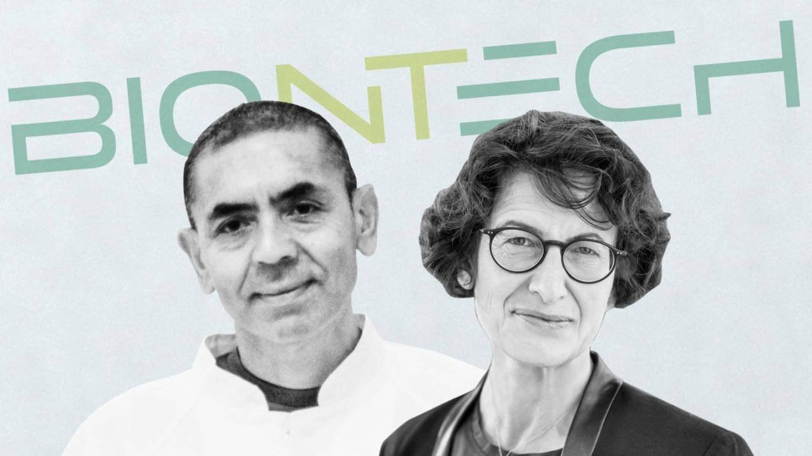

Ugur Sahin e Oezlem Tuereci, 55 e 53 anni, marito e moglie, lui fondatore e ceo della ditta di famiglia, lei chief medical officer dell’azienda che per prima ha ottenuto, insieme all'americana Pfizer, il vaccino per il Covid-19.

La famiglia di Ugur arriva nel 1969 in Germania, dove il padre lavora alla fabbrica della Ford di Colonia.

Il piccolo Ugur ha già le idee chiare, da grande vuole fare il medico.

Prima lavora alla clinica universitaria della città renana, poi a Homburg, dove conosce la sua futura sposa, Oezlem.

"Sono due persone di incredibile intelligenza e di idee visionarie", racconta il presidente della società Mig Ag, che ha investito in diversi fondi della BioNTech: "Si completano in modo straordinario, quando si tratta di assicurarsi che ogni dettaglio è al suo posto".

Da lì il passaggio a Magonza, dove inizia la loro avventura imprenditoriale.

La loro idea di base è semplice ma geniale.

Indurre il sistema immunitario ad “aggredire” le cellule tumorali.

Sahin e Türeci aprono un laboratorio di ricerca all’interno della clinica universitaria di Magonza.

La risposta dell’industria non fu quella attesa.

La loro idea era troppo ardita.

Così decidono di fondare loro prima azienda, la Ganymed, avviando una carriera di ricercatori senza precedenti.

Nel 2001 viene acquisita dal colosso giapponese Astellas per 1,28 miliardi di euro, grazie allo sviluppo delle innovative terapie contro il cancro fondate sugli anticorpi.

La BioNTech viene fondata nel 2008.

La sua sede è sempre a Magonza in una via dal nome che ora sembra un segnale premonitore: An der Goldgrube, ovvero “alla miniera d’oro”.

Il loro obiettivo, riuscire a trovare la terapia specifica per ogni singolo paziente oncologico.

Nel 2019 Sahin viene onorato con il Premio tedesco per la lotta contro i tumori.

Sahin capisce subito, appena letta la prima ricerca sull'esplosione del virus a Wuhan, che il covid-19 si sarebbe trasformato in una pandemia.

Capisce subito che la sua azienda dovrà fare un cambio di rotta.

Capisce subito che lui e il suo team dovranno lavorare a ritmi incessanti per un vaccino basato sull'RNA messaggero.

Per Sahin e Oezlem quello del vaccino anti-covid è "un progetto umanitario", "prima abbiamo un vaccino efficace, prima potremo tornare tutti alle nostre vite".
