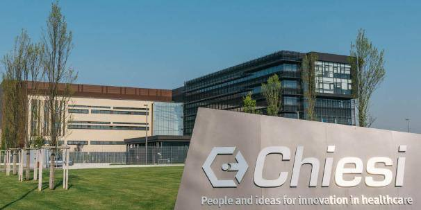

Siamo a Parma, anno 1935 quando Giacomo Chiesi, un farmacista con il sogno per la ricerca, acquista il Laboratorio Farmaceutico Parmense inaugurando la sua avventura imprenditoriale.

Nel 1944 la prima battuta d’arresto.

Buona parte del laboratorio viene distrutta dall’esplosione di una bomba.

Dopo la fine della guerra l’attività riprende con il lancio della prima pomata a base di penicillina.

In questi anni Giacomo Chiesi inizia a valutare la possibilità di acquistare un terreno per costruirvi una “vera fabbrica”.

Il nuovo stabilimento produttivo inaugurato nel 1955 conta 50 dipendenti e una produzione allargata di medicinali di successo.

Il 1979 è l’anno della grande svolta.

Viene lanciato un prodotto cortisonico per le infiammazioni delle vie respiratorie, il #Clenil.

Il successo del farmaco apre la strada per Chiesi nell’area delle malattie respiratorie.

Dopo il successo di Clenil e dell’antiinfiammatorio Brexin inizia la nuova spinta globale dell’azienda.

Oggi Chiesi Farmaceutici è una società che vanta più di 4000 brevetti internazionali.

Prima azienda farmaceutica italiana nel 2019 per deposito di brevetti in Europa, che conta oltre 6.000 dipendenti e tre stabilimenti produttivi in tutto il mondo.
