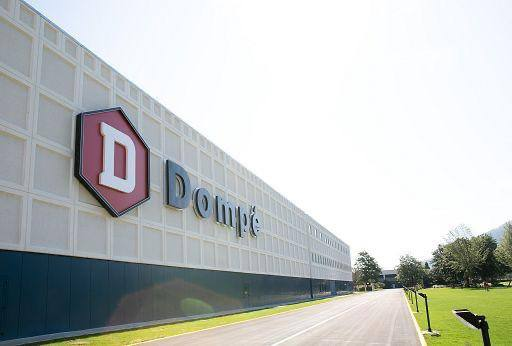

Siamo a Bene Vagienna, un piccolo borgo nel cuneese, quando nel 1843 nasce Gian Antonio Dompé.

Spinto dalla sua passione per le scienze chimico-farmaceutiche inizia negli anni novanta l’avventura imprenditoriale della sua famiglia.

Dopo gli studi di chimica e farmacia alla Regia Università di Torino e la specializzazione a Londra, il figlio di Gian Antonio, Onorato Dompé, fonda con un socio il laboratorio Dompé-Adami a Milano.

Nel 1895 Onorato acquista la Farmacia Centrale di piazza della Scala, forse la più importante di Milano.

Negli anni seguenti si espande acquisendo altre tre farmacie non solo in Italia.

Nel 1905 il laboratorio Dompé-Adami si ingrandisce.

Nel 1924 Onorato acquista l’intero stabile di via San Martino 12 a Milano e vi trasferisce l’azienda e la famiglia.

Continuerà per tutta la vita a condurre personalmente sperimentazioni di nuovi preparati farmaceutici.

Negli anni cinquanta la Dompé farmaceutici si afferma specializzandosi nella produzione di medicinali in fiale.

L'impianto, inaugurato alla presenza del Cardinale di Milano, Monsignor Ildefonso Schuster, è il più grande al mondo.

Nel 1956 l’azienda sponsorizza le Olimpiadi di Cortina d’Ampezzo per le quali assicura anche tutti i servizi medici.

Negli anni Cinquanta e Sessanta lancia una serie di attività di marketing rivoluzionarie per l’epoca.

Negli anni ottanta Sergio Dompé definisce la nuova linea strategica dell’azienda: investire in ricerca e focalizzare l’impegno su aree terapeutiche mirate, infiammazione, dolori osteoarticolari e problemi respiratori.

Nel 1988 nasce Dompé Biotec, polo di riferimento in Italia e in Europa per l’innovazione biotecnologica.

Nel 2010 Dompé acquisisce i diritti per lo sviluppo, la produzione e la commercializzazione dell’NGF nella cura della cheratite neurotrofica, una rara patologia oculare.

È la prima applicazione terapeutica degli studi premiati con il Nobel a Rita Levi Montalcini.

Oggi Dompè è tra le principali aziende biofarmaceutiche italiane impegnate nei settori primary care e biotech che impiega circa 800 persone e una presenza radicata non solo in Europa ma anche in Cina e Stati Uniti.
