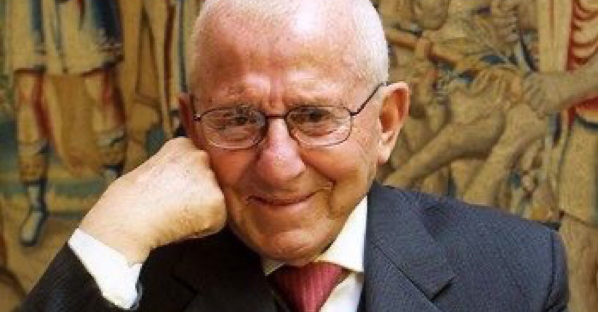

Una delle sue armi era la spiccata intelligenza ed una inarrestabile determinazione, tanto bastava per porre le basi di una delle più grandi aziende farmaceutiche italiane, la MENARINI Group.

A 19 anni lascia Quattro Castella, un paese del Reggiano dove risiede la sua famiglia. Trova impiego presso le "Farmacie Riunite" di Reggio Emilia, si laurea in Scienze Economiche e Commerciali e quattro anni dopo diventa Direttore Generale.
Ha quarant'anni e un obiettivo preciso, passare dal settore della distribuzione al più promettente e stimolante settore dell'industria.

Entra come Direttore Generale della Menarini, un'azienda che in quegli anni sopravviveva a stento e della quale Aleotti diventa prima socio poi proprietario unico.

Il rilancio dell'Azienda fondata da Archimede Menarini è travolgente. Nuovi prodotti e una grande attenzione verso l'informazione scientifica e le persone che diventano il gioiello più prezioso di quella che ormai è la sua azienda.
In un'ascesa che sembra non aver fine Aleotti diventa nel 1978 Presidente di Farmindustria nata dalle ceneri di Assofarma e Farmunione, Presidente dell'EFPIA (la Farmindustria Europea) e dell'IFPMA ovvero L'Associazione mondiale dell'Industria Farmaceutica.

Alberto Aleotti è senz'altro il ritratto di un uomo, un imprenditore, un visionario che ha saputo portare l'eccellenza italiana nel contesto competitivo internazionale.
