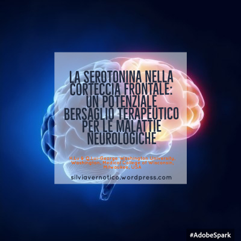

#hotthisweekphchemistry 

**La serotonina** o 5-idrossitriptamina (5-HT) è un neurotrasmettitore monoamminico che ha un'ampia distribuzione nel cervello. Fu scoperto da Erspamer ed Asero, due ricercatori italiani, negli anni '50. La 5-HT è sintetizzato in due fasi: in primo luogo, il triptofano viene convertito in 5-idrossitriptofano (5-HTP) dall'enzima TPH (triptofano idrossilasi); in secondo luogo, il prodotto intermedio, il 5-HTP, viene convertito in 5-HT mediante la decarboxilasi acida aromatica (AADC). La 5-HT è degradata principalmente dalla proteina Monoammina ossidasi A (MAOA) mitocondriale, che porta alla formazione del metabolita, acido 5-idrossiindoleacetico (5-HIAA). La serotonina è anche importante in quanto substrato per la sintesi della melatonina. LA 5-HT viene rilasciato dai terminali assonali dei neuroni serotoninergici e agisce su 14 sottotipi distinti di recettori classificati in 7 diverse famiglie: 5-HT1 (1A, 1B, 1D, 1E, 1F), 5-HT2 (2A, 2B, E 2C), 5-HT3, 5-HT4, 5-HT5 (5A, 5B), 5-HT6 e 5-HT7. Tra tutti questi recettori, solo il recettore 5-HT3 è un canale ionico pentamerico ligando-specifico. Tutti gli altri recettori 5-HT sono ricettori associati a proteine ​​G.

I neuroni serotoninergici si trovano nei nuclei del rafe (strutture localizzate lungo la linea mediana del tronco encefalico proiettando verso diverse regioni del SNC). Di tutte le regioni corticali, il lobo frontale contiene la più alta densità di terminali serotoninergici e recettori per la 5-HT. Studi indicano che la 5-HT regoli funzioni cognitive ed emozionali che si basano sull'attività frontale corticale.

L'omeostasi della serotonina nella corteccia frontale è importante per il comportamento normale di un singolo individuo. Il discostamento dall'omeostasi della 5-HT aumenta l'impulsività. La 5-HT nella corteccia frontale inoltre modula l'attenzione negli esseri umani. Considerato il suo coinvolgimento nella cognizione e nell'impulsività, la 5-HT è fondamentale per la nostra comprensione della psicopatologia e del trattamento di disturbi psichiatrici quali la **depressione, la schizofrenia, i disturbi ossessivo-compulsivi (OCD) e l'autismo**. In tutti questi disturbi si sono evidenziate anomalie locali nella struttura della corteccia frontale, nella neurochimica o nell'attivazione di questa e inoltre, farmaci per questi disturbi, come l'ecstasy e l'anfetamina, hanno dimostrato di pregiudicare la neurotrasmissione corticale della 5-HT.

_Per leggere il paper completo qui il link..._

https://www.omicsgroup.org/journals/serotonin-in-the-frontal-cortex-a-potential-therapeutic-target-forneurological-disorders-2167-0501-1000e184.pdf
