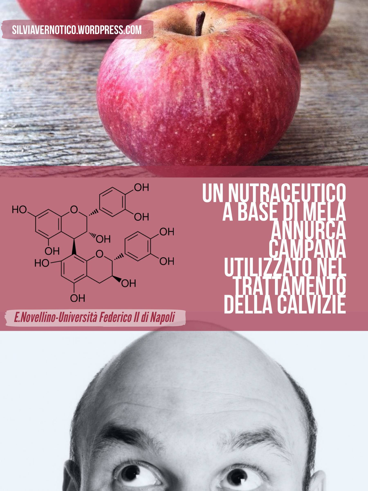

Valutando il contenuto polifenolico di differenti culture di mele, un gruppo di ricercatori del **Dipartimento di Farmacia dell'Università Federico II di Napoli** diretti dal suo Direttore _Ettore Novellino_, hanno scoperto che la varietà Annurca Igp, originaria della regione Campania, è caratterizzata dalla più elevata concentrazione di procianidine oligomeriche e, nello specifico, di **procianidina B2**, con effetti protettivi sulla caduta dei capelli, grazie alla sua azione sul microcircolo.

Il gruppo di ricercatori ha progettato uno studio clinico contro placebo, condotto su 250 volontari sani con **alopecia** moderata, della durata di 16 settimane (1 settimana di placebo, 8 settimane di intervento, 1 settimana di follow-up). A tutti i soggetti è stato chiesto di assumere due compresse al giorno ciascuna da 400 mg di estratto procianidinico di Annurca, 0.20 mg di biotina, 80 mcg di seleniometionina e 21 mg di zinco acetato (**AppleMetS hair**). I risultati dimostrano che l’estratto di Annurca è capace dopo 60 giorni di favorire un aumento di circa il doppio del numero dei capelli per cm quadrati di cute e di incrementare di circa un terzo sia il peso dei capelli che il loro contenuto di cheratina.

_“È interessante notare - \_dice Novellino - \_che la co-presenza di zinco, biotina e selenio, coadiuva, ma in modo poco significativo l’effetto dell’estratto stesso. Pertanto, è possibile affermare che i risultati clinici ottenuti sono quasi interamente da ascrivere all’estratto procianidinico di Annurca”. _

Gli studi presentati dimostrano, per la prima volta, che **l’assunzione per via orale di una formulazione a base del complesso procianidinico della Melannurca è in grado di garantire effetti benefici sulla crescita ed il trofismo dei capelli, nella lotta contro la calvizie**, in modo del tutto efficace nell’ambito della moderna medicina dermatologica, senza però apportare i classici effetti indesiderati dei farmaci attualmente più utilizzati.

Dopo numerosi studi del Dipartimento di Farmacia dell'Università degli Studi di Napoli Federico II (sul Journal of the Science of Food and Agriculture, in un articolo dal titolo _“La Melannurca campana Igp come alimento funzionale per il ripristino di un ottimale profilo colesterolemico plasmatico"_ avevano precedentemente evidenziato le proprietà di questa mela nell'apportare un significativo calo del colesterolo cattivo in favore di un aumento di quello buono, riducendo drasticamente il rischio cardiovascolare senza, a differenza delle statine, causare danni epatici e problemi muscolari) di cui uno in fase di pubblicazione sulla rivista internazionale a impact factor, _Journal of Medicinal food_, ora la formulazione sotto forma di integratore nutraceutico è disponibile nelle farmacie della Campania e del Lazio, e successivamente arriverà in tutta Italia.

_In attesa della pubblicazione dell'articolo, qui il link contenente l'abstract del loro precedente lavoro sulla correlazione mela annurca - diminuzione LDL..._ http://onlinelibrary.wiley.com/doi/10.1002/jsfa.8016/abstract
