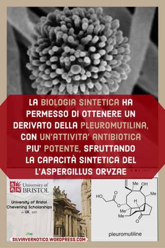

I ricercatori dell'Università di Bristol, grazie alla Biologia sintetica (disciplina a metà strada tra l’ingegneria e la biologia molecolare che mira a ridisegnare i circuiti metabolici e genetici degli organismi viventi) hanno modificato il DNA di un fungo creando la base per la produzione di antibiotici ad attività più potente. I risultati della ricerca sono stati pubblicati su Nature Communications e portano il titolo di ["Heterologous expression reveals the biosynthesis of the antibiotic pleuromutilin and generates bioactive semi-synthetic derivatives".](https://www.nature.com/articles/s41467-017-01659-1)

L'aumento della resistenza agli antibiotici è una grave minaccia per la salute umana. I funghi basidiomiceti rappresentano una fonte ancora poco sfruttata di antimicrobici, come la pleuromutilina, l'unico antibiotico commerciale prodotto da un fungo basidiomicete, in particolare da C. passeckerianus, e ha portato alla generazione di derivati ​​semi-sintetici per uso umano e veterinario mediante complicate modifiche chimiche.

I ricercatori si sono concentrati proprio sulla **pleuromutilina**, un antibiotico prodotto dal **Clitopilus passeckerianus**. Il Dna di questo fungo è stato modificato in modo da renderne piu' semplice il trattamento, ed è stato trasferito in un altro fungo, **l'Aspergillus oryzae**, ottenendo un derivato semi-sintetico della pleuromutilina, dotato di un'**attivita' antibiotica piu' potente,** senza così dover ricorrere alla laboriosa sintesi chimica.

L'Aspergillus oryzae È diventato cosi' una piattaforma per sintetizzare nuove molecole antibiotiche. _"Ci sono molti altri funghi che finora non sono mai stati utilizzati e con questa piattaforma_ \- ha rilevato Foster, uno degli autori dello studio - _si aprono nuove possibilita' per fare ulteriori modifiche chimiche per ottenere una generazione di antibiotici piu' potenti"._
