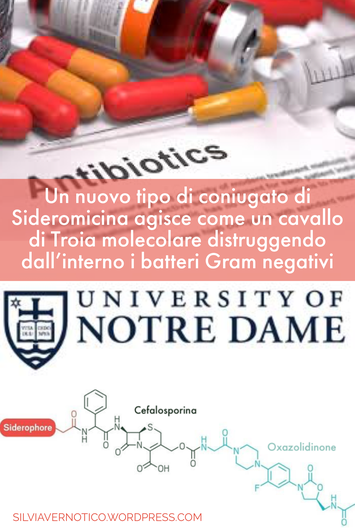

**Un nuovo tipo di coniugato di sideromicina agisce come un cavallo di Troia molecolare: si insinua nei batteri gram-negativi**, dove gli stessi enzimi del batterio fanno in modo che vengano rilasciati gli antibiotici distruggendo dall’interno il batterio.

Per uccidere questi batteri resistenti, I ricercatori dell'**Università di Notre Dame** hanno progettato un tipo di coniugato chiamato sideromicina. La loro sideromicina sintetica comprende un **sideroforo** (un agente chelante che i batteri usano per afferrare e raccogliere il ferro dall'ambiente circostante) e due antibiotici (una **cefalosporina** e un **ossazolidinone**).

Una volta penetrato nel batterio grazie al sideroforo è il batterio stesso che con il suo enzima beta-lattamasi scinde il legame tra i due antibiotici rilasciando sia l'ossazolidinone che la cefalosporina. Questo enzima di solito fa parte della difesa del batterio contro gli antibiotici, ma in questo caso scatena l'arma della sua stessa distruzione.

Inoltre gli oxazolidinoni di solito funzionano solo contro i batteri Gram-positivi. Il team di ricercatori ha dimostrato che una volta all’interno, possono anche uccidere i batteri Gram-negativi, tra cui Acinetobacter baumannii, Escherichia coli e Pseudomonas aeruginosa.

Fonte: [https://cen.acs.org/…/Conjugate-sneaks-antibiotic-G…/96/i15…](https://cen.acs.org/pharmaceuticals/antibiotics/Conjugate-sneaks-antibiotic-Gram-negative/96/i15?utm_source=Facebook&utm_medium=Social&utm_campaign=CEN)
