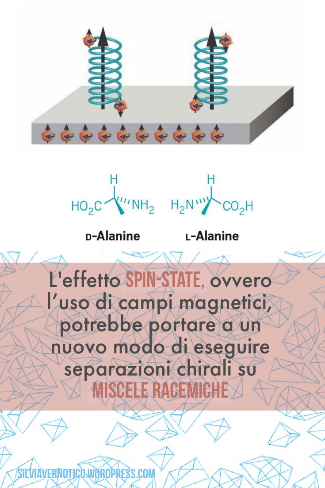

Quando i chimici hanno bisogno di **separare una molecola chirale da una miscela di enantiomeri**, per esempio, quando sintetizzano potenziali molecole per un farmaco, spesso usano la cromatografia liquida ad alte prestazioni (HPLC). **Un nuovo studio pubblicato su _Nature_** suggerisce un'alternativa a questo approccio che **sfrutta i campi magnetici.**

Gli elettroni non si comportano allo stesso modo in un enantiomero come fanno in un altro. Gli elettroni hanno una proprietà intrinseca chiamata spin che può assumere due stati: _spin up_ o _spin down._ In una molecola chirale, questi stati di spin influenzano il movimento degli elettroni. Gli elettroni in uno stato di spin si muoveranno più facilmente di quelli nell'altro stato. I ricercatori hanno dato un nome a questo fenomeno, _chiral-induced spin selectivity_ (**CISS**) ovvero una selettività di spin indotta dalla chiarità delle molecole.

Il CISS potrebbe essere sfruttato per separare gli enantiomeri in una miscela racemica. Quando le molecole si avvicinano a una superficie magnetizzata, diventano polarizzate. A causa dell'effetto CISS, se la molecola è chirale, gli elettroni con uno stato di spin sono più favoriti a muoversi rispetto a quelli nell'altro stato.

Hanno dimostrato l'effetto con nanoparticelle di biossido di silicio rivestite con enantiomeri di un oligomero di polialanina e una superficie magnetizzata rivestita d'oro. Attraverso immagini al microscopio elettronico a scansione, il team ha osservato che le nanoparticelle di oligomero di l-alanina sono state assorbite otto volte di più rispetto alle nanoparticelle di d-alanina quando il campo magnetico puntava in su rispetto alla superficie, e le nanoparticelle di d-alanina sono state assorbite quattro volte di più quando il campo magnetico puntato verso il basso.

Questo assorbimento preferenziale potrebbe aiutare a separare le molecole chirali. Le separazioni HPLC impiegano colonne riempite con un materiale chirale che assorbe un enantiomero rispetto all'altro. L'idea dei ricercatori è quella di sostituire le classiche colonne in HPLC con colonne magnetiche. Un sacco di lavoro deve essere fatto ancora per dimostrare che questo effetto può risolvere in modo efficiente le miscele racemiche.

Fonte: https://cen.acs.org/analytical-chemistry/separations/Magnetic-fields-fish-enantiomers/96/i20?utm\_source=Facebook&utm\_medium=Social&utm_campaign=CEN
