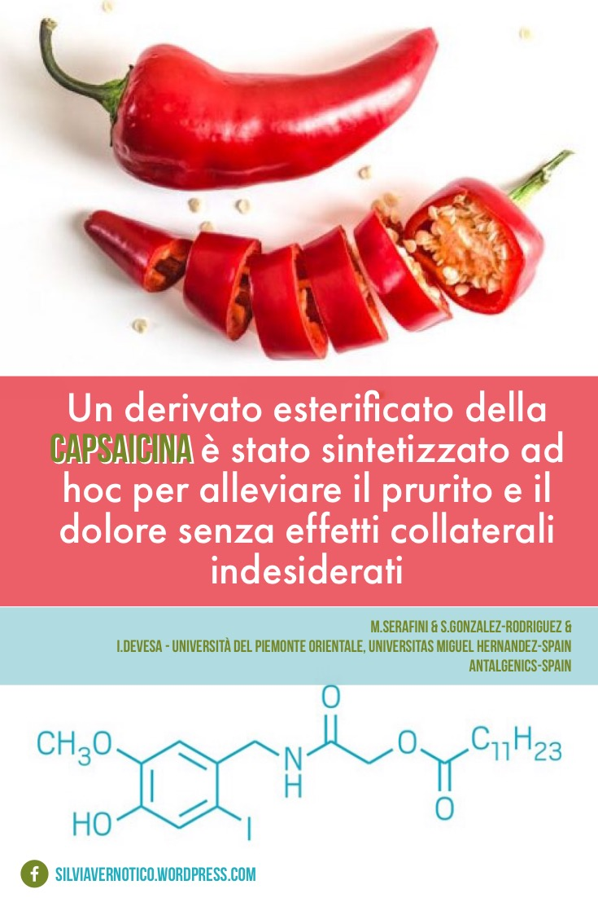

La **capsaicina**, il composto che dà al peperoncino la sua caratteristica piccantezza, nonostante sia una vecchia molecola, è ancora un argomento caldo nella comunità scientifica, e lo sviluppo di nuovi capsaicinoidi è tutt'oggi un p**romettente approccio farmacologico nella gestione dei disturbi della pelle legati all'infiammazione e al prurito. **Ma la capsaicina e alcuni dei suoi derivati ​​possono avere effetti collaterali preoccupanti, quali la forte sensazione di calore, correlata alla sua tipica piccantezza.

La capsaicina calma il dolore e il prurito essendo un agonista del canale ionico **TRPV1** (Transient Receptor Potential Vanilloid 1) nelle cellule. I primi tentativi di realizzare dei derivati che non avessero gli effetti collaterali tipici della capsaicina avevano portato alla realizzazione di derivati ​​realizzati sostituendo l'idrogeno con lo iodio in un punto della molecola di capsaicina. Questi derivati non bruciavano ma disturbavano la regolazione della temperatura nel corpo, causando picchi di febbre chiamati ipertermia. Inoltre potevano favorire la formazione di tumori cutanei nei topi se combinati con la lunga esposizione alla luce del sole. L'esposizione al sole è un problema cruciale per l'applicazione topica di questi prodotti, in particolare perché la capsaicina è lipofila e rimane a lungo sulla pelle.

Per superare questi problemi un gruppo di _ricercatori dell'Università del Piemonte Orientale, dell'Università Miguel Hernandez della Spagna e di AntalGenics_ hanno sintetizzato derivati ​​esterificati della capsaicina in grado di essere disattivati mediante idrolisi delle esterasi cutanee. L'impianto di un gruppo estere nella frazione lipofila dei capsaicinoidi mediante la reazione di Passerini, un tipo di reazione raramente usata in chimica farmaceutica perché rende le molecole più degradabili nel corpo, fornisce sia agonisti che antagonisti che conservano l'attività modulante del canale TRPV1. Questo approccio cosiddetto _"soft drug"_ è stato utilizzato in altri medicinali, come il beta-bloccante esmololo, per controllare la loro eliminazione nel corpo.

L'antagonista più promettente identificato dai ricercatori ha mostrato un'attività anti-nocicettiva in vivo su prurito e iperalgesia senza produrre ipertermia, confermandola così come un nuovo trattamento per queste condizioni dermatologiche. Lo studio apre una nuova possibilità per lo sviluppo di modulatori del canale TRPV1 per trattare potenzialmente altre condizioni che si pensa siano legate all'attività del TRPV1, come il diabete di tipo 2 e l'ipertensione.

Fonte: https://pubs.acs.org/doi/abs/10.1021/acs.jmedchem.8b00109?source=cen
