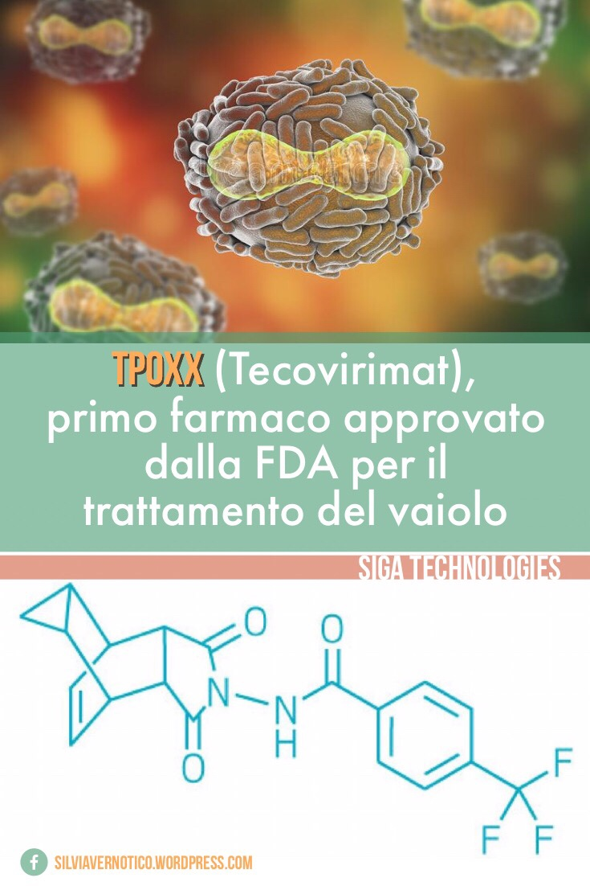

Il 13 luglio scorso, la **Food and Drug Administration ha approvato il primo farmaco specifico per il trattamento del vaiolo**, **TPOXX** (_Tecovirimat_).

Il vaiolo è una malattia infettiva causata da due varianti del virus variola, la Variola maior e la Variola minor. Il virus variola si diffonde principalmente per contatto diretto tra le persone. I sintomi iniziano in genere da 10 a 14 giorni dopo l'infezione e includevano febbre, mal di testa e mal di schiena. Un'eruzione inizialmente costituita da piccoli protuberanze rosa si trasformava presto in pustole piene di pus per poi terminare il suo stadio con croste e cicatrici diffuse. Le complicanze del vaiolo possono includere febbre, dolori muscolari, cefalea e cecità.

Tecovirimat agisce inibendo la produzione di forme virali extracellulari, che sono responsabili della diffusione dell'infezione, precludendo così l'uscita di particelle virali da una cellula infetta. L'infezione viene così rallentata in modo da permettere al sistema immunitario di combattere contro il virus.

Sebbene la World Health Organization (WHO), ovvero l'Organizzazione Mondiale della Sanità abbia dichiarato il vaiolo sradicato nel 1980, si teme che possa essere riesumato come arma biologica. La FDA ha approvato il farmaco sulla base di test su animali infetti da virus simili a vaiolo e su 359 volontari umani sani. Gli effetti collaterali più frequentemente riportati sono stati mal di testa, nausea e dolore addominale.

La FDA ha concesso a questo farmaco le designazioni di _Fast Track,_ _Priority Review e_ di farmaco orfano, creando così un percorso accelerato per la revisione e l'eventuale approvazione normativa. La FDA ha concesso l'approvazione di TPOXX all'azienda farmaceutica [SIGA Technologies Inc](https://www.fda.gov/downloads/AdvisoryCommittees/CommitteesMeetingMaterials/Drugs/Anti-InfectiveDrugsAdvisoryCommittee/UCM605890.pdf).

**Fonte: ** https://www.fda.gov/NewsEvents/Newsroom/PressAnnouncements/ucm613496.htm
