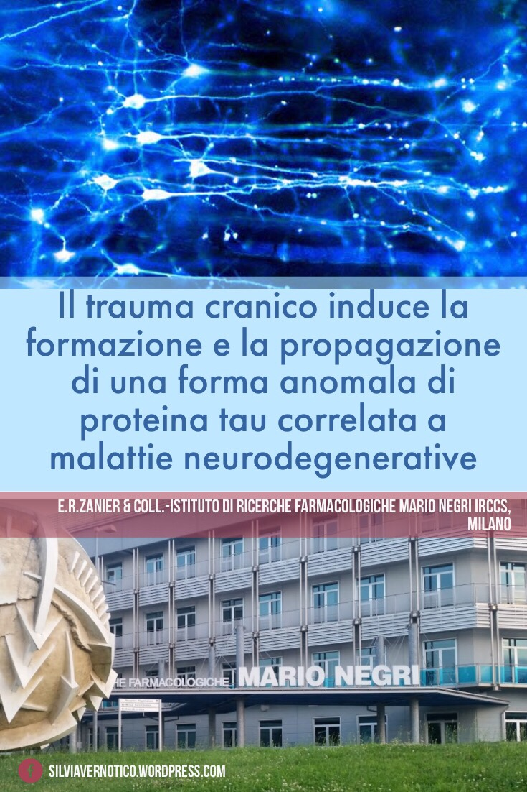

Uno studio realizzato dall’**Istituto di Ricerche Farmacologiche Mario Negri IRCCS** di Milano, pubblicato sulla prestigiosa rivista scientifica _Brain_, ha dimostrato che **il trauma cranico induce la formazione di una forma anomala della proteina tau che si propaga nel cervello causando perdita di memoria e danni ai neuroni**.

Il trauma cranico grave è la principale causa di morte e disabilità permanente nei giovani adulti. Inoltre, anche quando di lieve entità, rappresenta un importante fattore di rischio per l’insorgenza di demenze come l’Alzheimer e l’encefalopatia cronica post-traumatica, malattia tipica degli sport da contatto, come la boxe.

Analizzando il cervello di individui deceduti anni dopo un singolo trauma cranico grave, i ricercatori hanno notato la presenza di depositi diffusi di una forma anomala della proteina tau, tipica di alcune malattie neurodegenerative. Lo stesso fenomeno è stato riprodotto nei topi in cui i ricercatori hanno notato che la proteina tau anomala si forma inizialmente nella zona attigua al trauma ma, col tempo, si diffonde nelle altre aree del cervello. La proteina tau generata dal trauma, propagandosi nel cervello, induce così perdita di memoria e danni alle cellule nervose.

Comprendere il meccanismo responsabile della transizione da danno cerebrale acuto a malattia cronica neurodegenerativa consentirebbe di sviluppare nuove terapie per quelle che tutt’oggi sono malattie che hanno mille concause ma nessuna cura definitiva.

_Fonte:_ https://academic.oup.com/brain/advance-article-abstract/doi/10.1093/brain/awy193/5062642?redirectedFrom=fulltext
