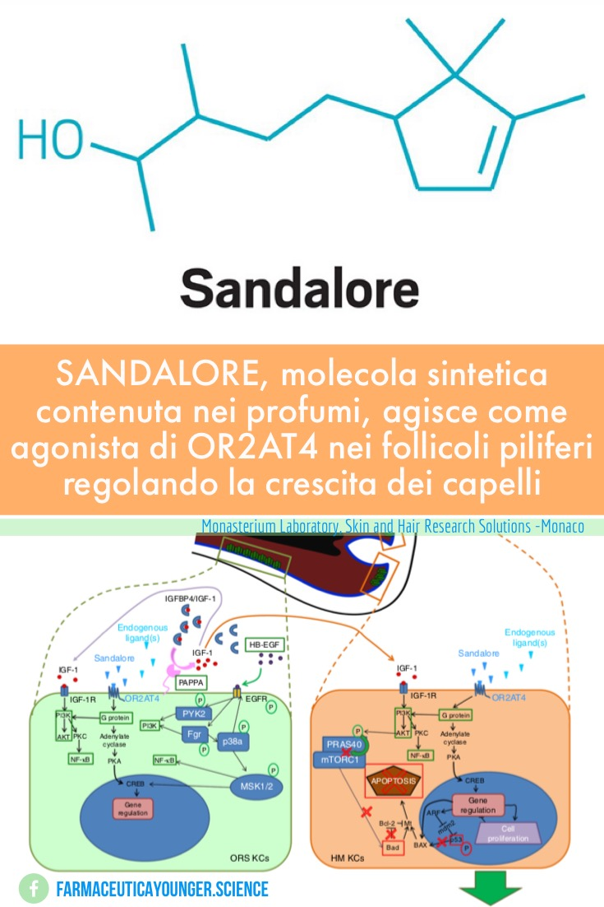

Un team di ricercatori tedeschi del _Monasterium Laboratory, Skin and Hair Research Solutions_ di Monaco hanno scoperto un recettore nei follicoli piliferi (**OR2AT4**) che si attiva in risposta a una molecola sintetica, **Sandalore®**, innescando una cascata cellulare che regola la crescita dei capelli. Lo studio è stato pubblicato su [_Nature Communications_](https://www.nature.com/articles/s41467-018-05973-0).

Originariamente identificati nel naso, i recettori olfattivi (OR), espressi in tutto il corpo, catturano le molecole odoranti, innescando dei meccanismi cellulare che regolano le funzioni fisiologiche delle cellule. Studi precedenti condotti da ricercatori dell'Università di Miami, in Florida su uno specifico recettore olfattivo, OR2AT4, che si trova sulle cellule della pelle, hanno osservato un aumento della proliferazione dei cheratinociti dopo il legame di Sandalore®, una molecola sintetica utilizzata in molti profumi e prodotti, al recettore OR2AT4.

Utilizzando metodi che includono la microscopia a immunofluorescenza, i ricercatori hanno trovato OR2AT4 nei follicoli piliferi. Hanno così trattato i follicoli dei capelli umani in coltura con Sandalore® per sei giorni, e hanno notato un aumento nell'espressione di OR2AT4 e un prolungamento della fase di crescita dei follicoli piliferi.

Sandalore® agendo come agonista del recettore OR2AT4 porta ad un aumento nell'espressione di IGF-1, fattore che promuove la crescita dei capelli, e una diminuzione nell'espressione di TGF-β2, che ne favorisce la perdita.

Lo studio ha messo in luce che i follicoli piliferi umani richiedono una segnalazione mediata dall'interazione tra OR2AT4 e un suo agonista endogeno, ancora sconosciuto, per innescare il meccanismo di crescita dei peli. Si dovrà lavorare per trovare molecole con struttura simile al Sandalore® che possano essere utilizzate nella modulazione del recettore OR2AT4 per la terapia dell'alopecia.
