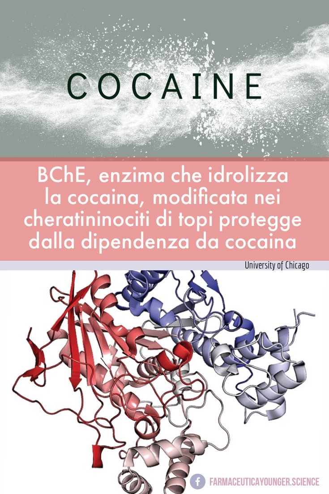

La dipendenza da cocaina è associata alla ricerca compulsiva di droghe, e l'esposizione al farmaco porta alla ricaduta, anche dopo lunghi periodi di astinenza. Varie le strade percorse dai ricercatori per contrastare la dipendenza da **cocaina**, ma ad oggi non esistono farmaci approvati sul mercato per il trattamento della dipendenza da cocaina.

Un team di ricercatori dell'_Università di Chicago_ ha lavorato su una forma avanzata e più efficiente di **butirrilcolinesterasi** (BChE, o pseudo-colinesterasi), un enzima che idrolizza fisiologicamente nel nostro organismo la cocaina, dotato però di breve emivita. Lo studio è stato pubblicato su [Nature Biomedical Engineering](https://www.nature.com/articles/s41551-018-0293-z).

Il team ha ingegnerizzato, usando la tecnologia CRISPR, cellule staminali epidermiche della pelle dei topi per produrre un enzima con emivita più lunga. Le cellule della pelle modificate per esprimere una forma modificata di BChE sono state trapiantate nuovamente nei topi donatori, consentendo un rilascio a lungo termine dell'enzima. L'idea è che se la cocaina viene degradata abbastanza velocemente mentre si trova nel flusso sanguigno, non ve ne è abbastanza per raggiungere il cervello.

L’esperimento ha mostrato come il trapianto di cheratinociti ha efficacemente protetto i roditori dalla ricerca di cocaina, impedendo persino la morte dei topi esposti a dosi letali di cocaina. Mentre una dose letale di cocaina uccideva i topi trattati nel giro di pochi minuti, con le cellule ingegnerizzate i topi riuscivano a sopravvivere. L’enzima inoltre rimaneva stabile per mesi nel circolo sanguigno dei topi.

Saranno necessari ulteriori studi per capire se questi risultati potranno essere portati nella sperimentazione clinica, ma questo approccio potrebbe aprire la strada a una nuova classe di terapie per la gestione dell’abuso di droghe.
