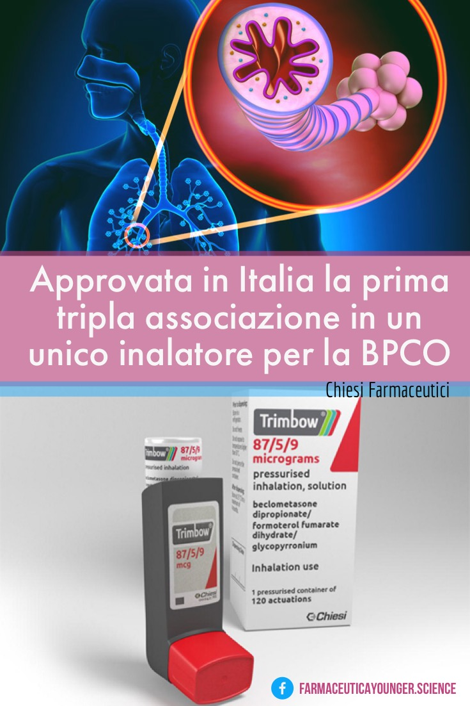

In Italia è stata approvata la prima tripla associazione, somministrata in un unico inalatore, indicata per il trattamento della **broncopneumopatia cronica ostruttiva** (BPCO). Il farmaco firmato [_Chiesi Farmaceutici_](https://www.chiesi.com/nuovo-studio-pubblicato-su-the-lancet-mostra-la-superiorita-della-tripla-associazione-fissa-extrafine-di-chiesi-per-la-bpco/)\_ \_è costituito da beclometasone dipropionato, corticosteroide antinfiammatorio per inalazione (ICS), formoterolo, broncodilatatore beta2-agonista ad azione rapida e a lunga durata (LABA) e glicopirronio, antagonista muscarinico a lunga durata (LAMA).

La tripla associazione fissa **ICS/LABA/LAMA** mette insieme in un unico spray tre principi attivi: uno steroide inalatorio (ICS) e due broncodilatatori (LABA/LAMA). Lo steroide inalatorio interviene sul processo infiammatorio che aumenta il rischio di infezioni e di riacutizzazioni, responsabili della progressione della malattia e del peggioramento della qualità di vita. I broncodilatatori, invece, agiscono sull’ostruzione delle piccole vie aeree, cui è legata la dispnea che è uno dei sintomi principali della BPCO.

Sono oltre 3,5 milioni gli italiani affetti dalla BPCO. Si stima che in Italia la BPCO sia responsabile del 50-55% delle morti per malattie respiratorie. Le persone affette da BPCO presentano una ridotta capacità polmonare che impedisce di respirare normalmente: ad essere colpiti sono principalmente i fumatori assidui (per circa il 90%), nei quali la patologia può insorgere già intorno ai 50 anni.

Oltre al vantaggio di avere un unico device di somministrazione, l'altra peculiarità di questa tripla associazione fissa è la sua formulazione extrafine: i tre principi attivi sono erogati in particelle di piccole dimensioni, rispetto a quelle delle altre associazioni indicate per la BPCO, garantendo una distribuzione omogenea in tutto l'albero bronchiale, comprese le piccole vie aeree, solitamente più difficili da raggiungere.
