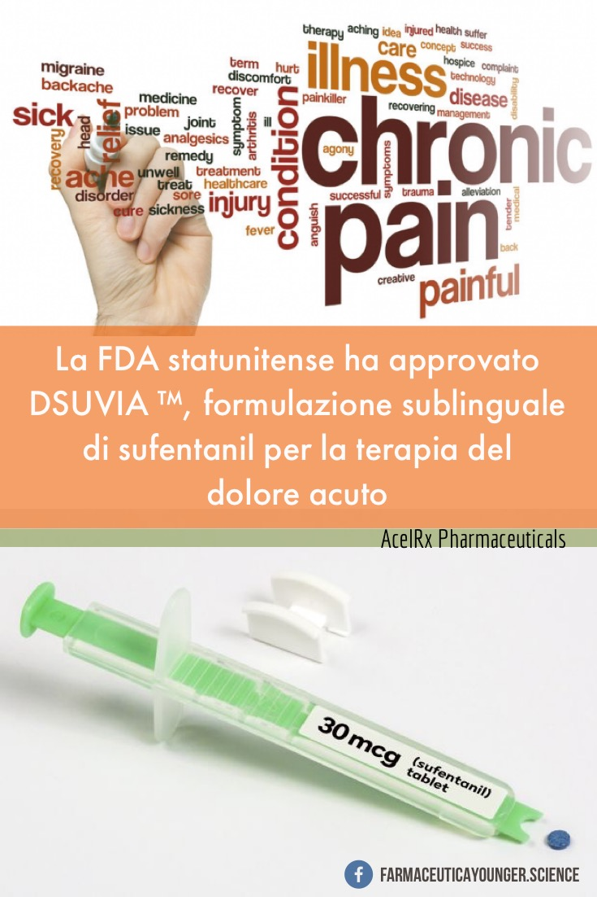

[AcelRx Pharmaceuticals](http://ir.acelrx.com/news-releases/news-release-details/acelrx-announces-fda-approval-dsuviatm), società farmaceutica specializzata sullo sviluppo e la commercializzazione di terapie innovative ospedaliere, ha annunciato l'approvazione di [DSUVIA ™](https://www.fda.gov/NewsEvents/Newsroom/PressAnnouncements/ucm624968.htm) da parte della Food and Drug Administration statunitense (FDA). DSUVIA\*\* \*\*è una formulazione sublinguale di sufentanil da 30 microgrammi che viene erogata attraverso un applicatore monodose, pre-riempito, indicato per la gestione del dolore acuto negli adulti presso strutture sanitarie certificate come ospedali, centri chirurgici e reparti di emergenza.

L'approvazione FDA di DSUVIA è il frutto di 15 anni di ricerca per migliorare lo standard di cura per la gestione del dolore acuto in contesti medici supervisionati. Sufentanil è un analgesico oppiaceo attualmente somministrato per via endovenosa ed epidurale. I limiti più grandi della terapia oppioide standard sono rappresentati dalla difficoltà che alcuni pazienti hanno nel deglutire farmaci per via orale e nell'accesso alla via endovenosa. Il nuovo farmaco sviluppato da AcelRx rappresenta un’opzione analgesica non invasiva in grado di consentire agli operatori sanitari di gestire rapidamente il dolore acuto dei loro pazienti. Per questo motivo il nuovo trattamento vede una sua applicazione in campo militare, dove la somministrazione endovenosa non è possibile per il trattamento del dolore acuto correlato alle ferite da guerra. Inoltre, per quanto riguarda il profilo farmacocinetico di sufentanil, quando viene somministrato per via sublinguale si evitano picchi plasmatici elevati e la breve durata di azione osservata con la somministrazione endovenosa.

L'efficacia e la sicurezza di DSUVIA sono state valutate in uno studio randomizzato, in doppio cieco, controllato con placebo, che ha arruolato 161 pazienti, di età compresa tra 18 e 69 anni, con dolore post operatorio acuto dopo chirurgia addominale. I pazienti sono stati trattati con DSUVIA 30 mcg o placebo. I pazienti che utilizzavano DSUVIA presentavano uno diminuzione del dolore statisticamente maggiore rispetto ai pazienti che utilizzavano il placebo.

DSUVIA è stato incluso nel delicato contesto della crisi della dipendenza da oppioidi, nel cosiddetto programma della FDA, **REMS** (strategia di valutazione e mitigazione dei rischi) per controllarne strettamente la distribuzione e l'uso.

L'Agenzia europea per i medicinali (EMA) ha approvato l'analogo di DSUVIA, DZUVEO per la commercializzazione in Europa nel giugno 2018. DSUVIA sarà disponibile sul mercato americano nel primo trimestre del 2019.
