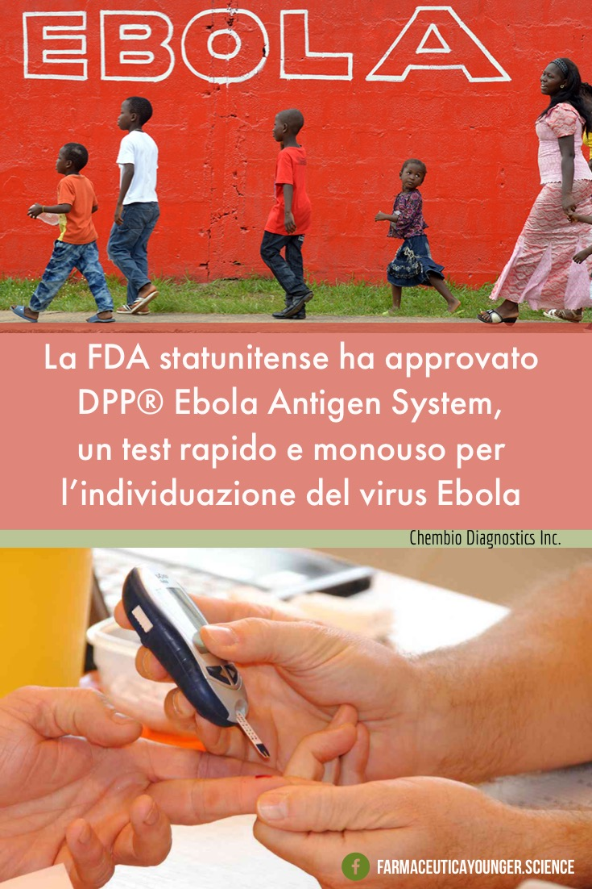

La Food and Drug Administration degli Stati Uniti ha annunciato che è stata rilasciata un'autorizzazione all'uso in emergenza (**EUA**, Emergency Use Authorization) per un test rapido e monouso per l'individuazione del virus Ebola (**EVD**, Ebola Virus Disease), denominato [_DPP Ebola Antigen System_](https://www.fda.gov/NewsEvents/Newsroom/PressAnnouncements/ucm625502.htm). Questo è il secondo test rapido per l'antigene di Ebola disponibile in EUA, e il primo che utilizza un lettore portatile a batteria, che può aiutare a fornire risultati diagnostici rapidi al di fuori dei laboratori. L'autorizzazione EUA viene concessa per l'uso di un prodotto medico non approvato quando non esistono alternative adeguate, approvate e disponibili al momento.

La malattia del virus Ebola è stata scoperta per la prima volta nel 1976 vicino al fiume Ebola, nell'attuale Repubblica Democratica del Congo. L'EVD è una malattia acuta, grave e spesso fatale che si presenta inizialmente con l'insorgenza improvvisa di febbre, stanchezza, dolori muscolari, mal di testa e mal di gola. Anche se ci sono stati e ci sono tutt'ora numerosi focolai di EVD, l'epidemia avvenuta tra il 2014 e il 2016 nell'Africa occidentale ha rappresentato la più grande e complessa mai vista prima.

Il nuovo test è autorizzato per il rilevamento del virus Ebola (specie _Zaire ebolavirus_) in individui con segni e sintomi della malattia da virus Ebola in combinazione con fattori di rischio epidemiologici (incluse località geografiche con alta prevalenza di EVD). Il test rileva gli antigeni virali e fornisce risultati qualitativi in ​​15-20 minuti, se utilizzato con il micro lettore DPP portatile a batteria, per ridurre il rischio di errore umano durante l'interpretazione del test. Il _DPP Ebola Antigen System_ usa campioni di sangue prelevati tramite piccole punture ai polpastrelli tramite **fingerstick** (pungidito), acido etilendiamminotetracetico (EDTA, anticoagulante aggiunto a sangue intero per prevenire la coagulazione) e plasma EDTA.

L'autorizzazione EUA per il Sistema di antigene Ebola DPP è stato concesso dall'ente americano alla società _Chembio Diagnostic Systems Inc._. Il DPP® Ebola Antigen System è autorizzato solo per determinate circostanze di emergenza che giustificano l'esecuzione di test diagnostici in vitro per l'individuazione del virus Ebola e/o la diagnosi di EVD.
