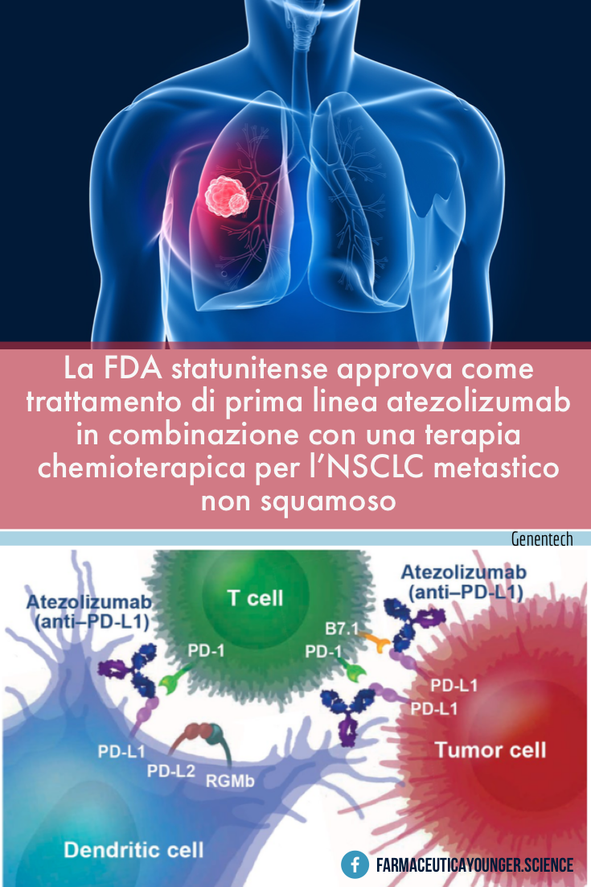

La Food and Drug Administration statunitense ha approvato [atezolizumab](https://www.fda.gov/Drugs/InformationOnDrugs/ApprovedDrugs/ucm627874.htm?utm_campaign=Oncology%2012%2F06%2F2018%20Atezolizumab-bevacizumab&utm_medium=email&utm_source=Eloqua&elqTrackId=3c51932714b64c83b8480472e878b65e&elq=2150a6d19fca473b8b6d5b7bd750b2f0&elqaid=6195&elqat=1&elqCampaignId=5030) (TECENTRIQ, Genentech, Inc.), in associazione con bevacizumab, paclitaxel e carboplatino per il trattamento di prima linea di pazienti con cancro metastatico non squamoso (non-squamous, NSq), una delle forme con cui si manifesta il tumore del polmone non a piccole cellule (non-small-cell lung cancer, NSCLC) senza alterazioni di EGFR (recettore di membrana che lega il fattore di crescita dell’epidermide) o ALK (gene, posizionato sul cromosoma 2 le cui mutazioni, riarrangiamenti causano questo ed altri titoli di tumori).

L‘NSCLC è un tipo di tumore polmonare maligno che si differenzia dal tumore polmonare a piccole cellule (small-cell lung cancer, SCLC) per l’aspetto delle cellule del tumore stesso al microscopio. L’NSCLC è la forma più comune di tumore del polmone e rappresenta l’85% circa dei casi di carcinoma polmonare. Questa patologia rimane, ancora oggi, una delle neoplasie più complesse che gli oncologi si trovano ad affrontare, responsabile ogni anno di 1,6 milioni di decessi al mondo.

Atezolizumab è il primo anticorpo monoclonale che colpisce la proteina PD-L1, bloccandone l’interazione con il suo ligando, PD-1. Il PD-L1 può essere altamente espresso in certi tipi di tumore che, grazie alla sua interazione con la proteina PD1, porta ad una ridotta o perfino assente attivazione della risposta immunitaria. Atezolizumab agisce ripristinando la fisiologica risposta immunitaria soppressa dal tumore.

L'approvazione si é basata sullo studio clinico IMpower150 (NCT02366143), uno studio a tre bracci randomizzato, che ha arruolato 1202 pazienti che hanno ricevuto il trattamento di prima linea per il NSCLC metastatico NSq. Lo studio è stato progettato per condurre confronti tra ciascuno dei tre bracci di trattamento contenenti atezolizumab con il braccio di controllo. I pazienti sono stati randomizzati a ricevere Atezolizumab, carboplatino, paclitaxel e bevacizumab (braccio a 4 farmaci); Atezolizumab, carboplatino e paclitaxel (braccio a 3 farmaci); Carboplatino, paclitaxel e bevacizumab (braccio di controllo).

Le principali misure di efficacia dei trattamenti sono state la sopravvivenza globale (OS) e la sopravvivenza libera da progressione (PFS). Tra i pazienti con NSCLC NSq senza una mutazione EGFR o ALK, la OS mediana stimata é stata di 19,2 mesi per i pazienti trattati con il braccio di 4 farmaci e di 14,7 mesi per quelli trattati con carboplatino, paclitaxel e bevacizumab. La PFS mediana stimata é stata di 8,5 mesi per i pazienti trattati con il regime a 4 farmaci e di 7 mesi per quelli nel braccio di controllo.
