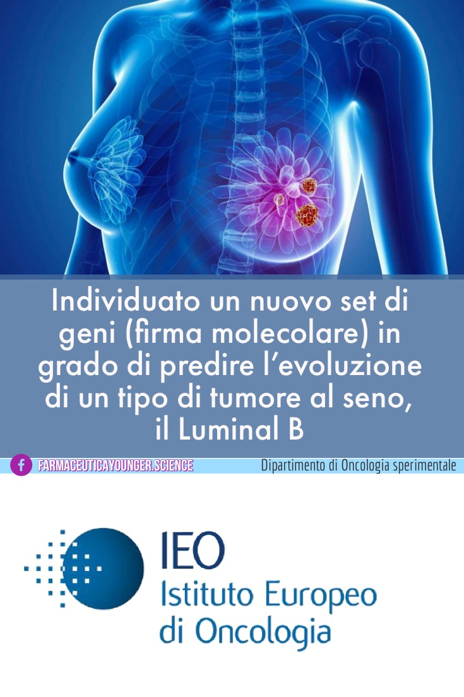

Un gruppo di ricercatori del Dipartimento di Oncologia Sperimentale dell’**Istituto Europeo di Oncologia (IEO) **ha scoperto un nuovo set di geni, la cosiddetta “firma molecolare”, in grado di predire l’evoluzione di un tipo di tumore al seno molto diffuso, il Luminal B, e dunque di identificare le pazienti che possono evitare la chemioterapia, perché dotate di una prognosi favorevole. Il lavoro dal titolo [P53 loss in breast cancer leads to Myc Activation, increased cell plasticity and Expression of a mitotic signature with progonostic value ](https://www.sciencedirect.com/science/article/pii/S2211124718320163)è stato pubblicato sulla rivista Cell Reports.

I ricercatori hanno scoperto che le cellule tumorali possono ritrasformarsi in cellule staminali tumorali e identificato i meccanismi molecolari di questa riprogrammazione. Le cellule staminali del cancro sono anche responsabili della recidiva della malattia e della sua diffusione nell’organismo attraverso le metastasi. Il regista della loro rigenerazione è lo stesso gene che controlla la duplicazione delle staminali tumorali, il P53, in associazione con il gene MYC. I ricercatori hanno scoperto che la cellula tumorale ri-genera le staminali quando si verifica una diminuzione di P53 e un aumento di MYC. Questo asse P53-MYC è alterato nella stragrande maggioranza dei tumori e potrebbe perciò diventare un nuovo bersaglio terapeutico per frenare la progressione del tumore con un intervento radicale, in quanto agisce sulla causa della malattia.

La nuova firma molecolare scoperta è composta dai 189 geni regolati dai due geni registi P53 e MYC. I tumori che hanno un’alta espressione di questa firma molecolare avranno una prognosi più sfavorevole perché le cellule cancerose rigenereranno altre staminali e il tumore continuerà a crescere, mentre i tumori che hanno una bassa espressione cresceranno meno o non cresceranno per niente, e dunque potrebbero non essere trattati. La firma molecolare consentirà di trattare solo le pazienti che hanno una bassa espressione di questa firma molecolare.

L’obiettivo a breve termine è iniziare un trial clinico che confermi i risultati di questa ricerca di base. Ma i ricercatori si aspettano anche qualcosa di più. Il meccanismo molecolare che sta alla base dei geni che compongono la firma molecolare è un meccanismo base della crescita dei tumori e potrebbe consentire di trovare nuovi potenziali bersagli terapeutici, che potrebbero essere valutati per sperimentare nuove terapie per chi al momento non ha sufficienti possibilità di cura.

La ricerca IEO è stata finanziata dai fondi europei dello European Research Council (ERC), dal Ministero della Salute italiano e con il contributo di AIRC e FIRC.
