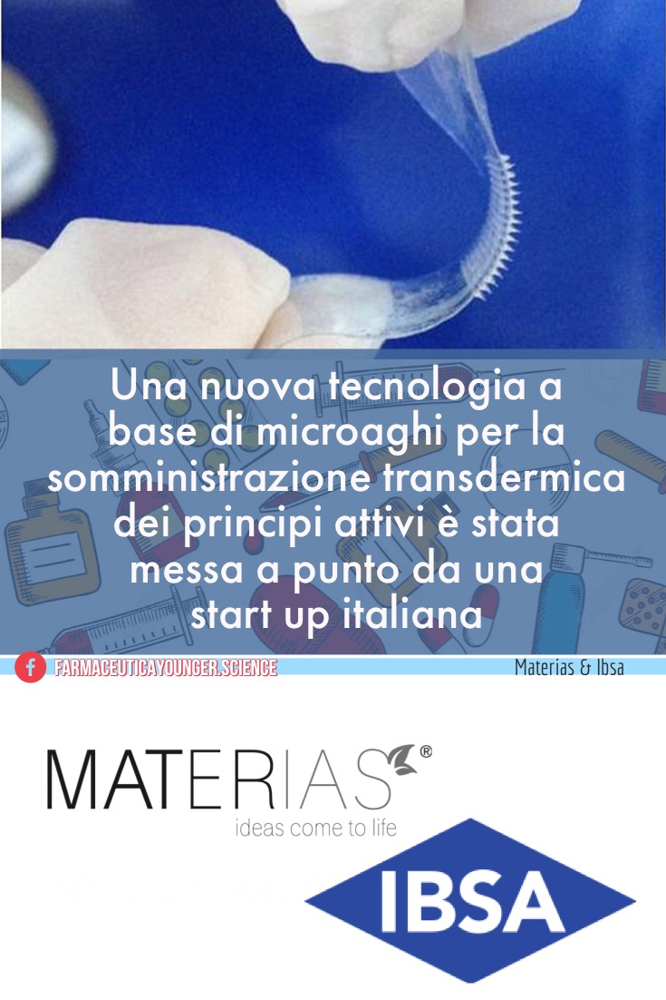

Una nuova tecnologia basata su cerotti a microaghi per la somministrazione di principi attivi per via transdermica in modo efficace e indolore è stata sviluppata dala collaborazione tra Materias e Ibsa.

**Materias** è una Early Stage Combined Accelerator, ovvero una società tutta italiana che mette in connessione il mondo della ricerca con quello delle corporate industriali con l’obiettivo di creare nuove imprese, supportare lo sviluppo di soluzioni innovative nel settore dei materiali avanzati e accelerare il loro ingresso nel mercato di riferimento. **IBSA** è la maggiore azienda farmaceutica a capitale privato in Svizzera, quarta dopo le grandi multinazionali, nell’area fertilità e uno dei leader mondiali nei prodotti a base di acido ialuronico. È presente con i suoi prodotti in 5 continenti e in oltre 80 paesi, tra cui Cina e Stati Uniti. Il Gruppo impiega complessivamente 1.600 persone, distribuite nelle 10 filiali in Europa, Cina e Stati Uniti.

La tecnologia nasce dalla realizzazione tramite tecnica fotolitografica di patch di microaghi composti da materiali polimerici biocompatibili e biodegradabili che hanno la capacità di veicolare principi attivi per uso cosmetico o biomedicale in maniera efficace e indolore, accelerando la velocità d’azione del farmaco, dando inoltre la possibilità di modulare il rilascio dello stesso. Questa nuova tecnologia permette, inoltre, di prevenire possibili effetti collaterali sull’apparato gastrointestinale e di eliminare il dolore dovuto alle iniezioni e consentirebbe di superare i difetti dei cerotti, mantenendone la facilità di somministrazione.

La tecnologia verrà sviluppata da IBSA e Materias in collaborazione con Altergon a Morra De Sanctis (AV), rinomato centro europeo per lo sviluppo di prodotti transdermali e sublinguali.
