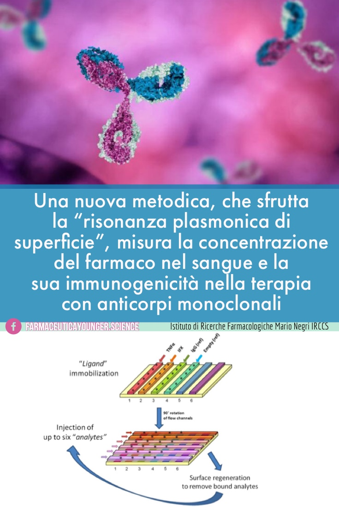

I ricercatori dell’Istituto di Ricerche Farmacologiche Mario Negri IRCCS, in collaborazione con l’Istituto Clinico Humanitas di Rozzano (MI) e l’Azienda Ospedaliero-Universitaria Careggi di Firenze, hanno sviluppato una nuova metodica che consente di misurare contemporaneamente sia la concentrazione di anticorpi monoclonali (il farmaco) nel sangue, sia l’immunogenicità, ovvero la produzione da parte del sistema immunitario di anticorpi contro il farmaco stesso. I risultati dello studio dal titolo [“A Surface Plasmon Resonance-based assay to measure serum concentrations of therapeutic antibodies and anti-drug antibodies”](https://www.nature.com/articles/s41598-018-37950-4) sono stati pubblicati sulla rivista Scientific Reports.

Il monitoraggio della reale dose assunta di farmaci e l’immunogenicità (TDIM, Therapeutic drug and immunogenicity monitoring) è sempre più richiesta per ‘guidare‘ la terapia con farmaci biologici, caratterizzati da un'elevata variabilità interindividuale dei loro livelli ematici, per consentire valutazioni realistiche sulla gestione dei non responder e ridurre interventi costosi non necessari. Tuttavia, il TDIM non è ancora entrato nella pratica clinica, in parte a causa di incertezze riguardanti l'accuratezza e la precisione dei test immunoenzimatici ELISA.

La nuova metodica è una originale applicazione della tecnologia chiamata **risonanza plasmonica di superficie (SPR),** nella quale gli anticorpi di interesse sono catturati da un microchip che funziona da biosensore. Questo permette una misurazione rapida e precisa degli anticorpi, con importanti vantaggi rispetto alle metodiche tradizionali, tra i quali rilevare e misurare direttamente gli anticorpi sierica in pochi minuti, evitando le lunghe fasi di incubazione, separazione, lavaggio e rilevamento dei metodi usati finora, riducendo complessità e variabilità.

La tecnologia è stata messa a punto per misurare le concentrazioni di infliximab, un anticorpo usato per patologie infiammatorie croniche e i corrispondenti anticorpi anti-infliximab. I risultati degli studi hanno evidenziato differenze marcate tra i pazienti in trattamento con Infliximab, sia per i livelli di farmaco nel sangue che per l’immunogenicità. La conoscenza di questi dati per ciascun paziente durante il trattamento può permettere al medico di personalizzare e ottimizzare la terapia, con vantaggi sia per il paziente che per il Servizio sanitario nazionale.

Questo nuovo metodo è stato convalidato per sensibilità e riproducibilità e ha dimostrato un rapporto costo-efficacia superiore rispetto ai kit ELISA in commercio. Può essere inoltre applicato ad altri farmaci biologici. Questi dati spianano la strada allo sviluppo di dispositivi basati su SPR per un'analisi rapida dell TDIM in loco.
