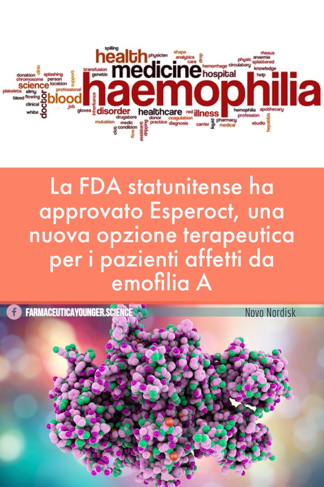

La FDA (Food and Drug Administration) statunitense ha concesso l’approvazione il 22 Febbraio scorso di [N8-GP](https://www.fda.gov/downloads/BiologicsBloodVaccines/UCM631609.pdf), commercializzato con il nome di Esperoct (turoctocog alfa pegol), come terapia preventiva per ridurre la frequenza dei sanguinamenti e per controllare episodi emorragici in bambini e adulti con deficit ereditario del fattore VIII, l’emofilia A. L’approvazione di Esperoct negli Stati Uniti rappresenta un'importante espansione delle opzioni di trattamento per le persone affette da questa patologia ereditaria. L’approvazione è stata concessa alla multinazionale danese Novo Nordisk.

Turoctocog alfa è un fattore VIII di coagulazione umano ricombinante con dominio B troncato. Questa glicoproteina ha la stessa struttura del fattore VIII umano quando attivata. Quando viene infuso in un paziente emofiliaco, il fattore VIII si lega al fattore endogeno di von Willebrand presente nel sangue. Il complesso fattore VIII-fattore di von Willebrand quando attivato agisce come co-fattore del fattore IX attivato, accelerando la conversione del fattore X nel fattore X attivato. Il fattore X attivato converte la protrombina in trombina. La trombina converte quindi il fibrinogeno in fibrina con la formazione di un coagulo.

L'emofilia è una malattia ereditaria legata alla coagulazione del sangue dovuta a livelli ridotti di fattore VIII, il che provoca sanguinamenti abbondanti a livello delle articolazioni, dei muscoli o degli organi interni, sia spontaneamente che a seguito di traumi accidentali o chirurgici. Con la terapia sostitutiva vengono aumentati i livelli plasmatici del fattore VIII, consentendo in tal modo una temporanea correzione del deficit fisiologico del fattore.

La decisione della FDA di approvare Esperoct si è basata su dati pre clinici raccolti da 270 pazienti, bambini e adulti, con emofilia A grave e più di cinque anni di esposizione clinica al farmaco. Gli studi clinici hanno dimostrato che Esperoct fornisce un'efficace profilassi di routine nelle persone con emofilia grave A attraverso un regime posologico semplice e fisso di una iniezione ogni 4 giorni negli adulti e negli adolescenti o ogni 3-4 giorni (due volte alla settimana) nei bambini.

Esperoct, tuttavia, non arriverà sul mercato degli Stati Uniti prima del 2020 a causa di accordi di proprietà intellettuale di terze parti.
