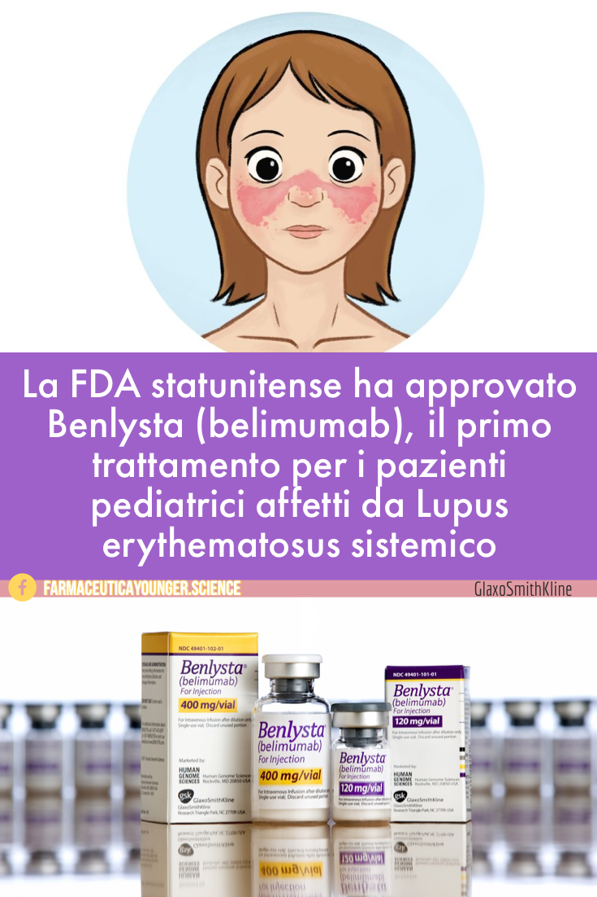

La US Food and Drug Administration ha approvato [Benlysta (belimumab)](https://www.fda.gov/news-events/press-announcements/fda-approves-first-treatment-pediatric-patients-lupus), infusione endovenosa per il trattamento nei pazienti pediatrici del lupus eritematoso sistemico (SLE, o semplicemente lupus), una grave malattia cronica di natura immunitaria che causa infiammazione e danni a vari tessuti e organi del corpo. Questa è la prima volta che la FDA approva un trattamento per pazienti pediatrici con SLE. Benlysta è approvato per l'uso nei pazienti adulti dal 2011 negli Stati Uniti e dall’EMA dal Settembre 2017.

il lupus ad esordio infantile è molto raro, ma quando diagnosticato, è generalmente più reattivo nei bambini e negli adolescenti rispetto ai pazienti adulti, in particolare nel modo in cui aggredisce organi come i reni e il sistema nervoso centrale. Nell'infanzia il lupus si manifesta generalmente tra i 3 e i 15 anni, con un rapporto tra femmine e maschi di 4 a 1 e le tipiche manifestazioni cliniche sono l'eritema a farfalla e la fotosensibilità.

Belimumab è un anticorpo monoclonale IgG1γ specifico per la proteina solubile umana che stimola i linfociti B (BLyS, chiamato anche BAFF e TNFSF13B). I livelli di BLyS sono elevati nei pazienti affetti da LES e altre malattie autoimmuni. Vi è una associazione tra i livelli plasmatici di BLyS e l’attività della malattia LES. Belimumab blocca il legame del BLyS, un fattore di sopravvivenza della cellula B, con i suoi recettori sulle cellule B, impedendo la sopravvivenza delle cellule B, e riducendo così la differenziazione delle cellule B a plasmacellule producenti immunoglubuline.

L'efficacia di Benlysta per il trattamento della SLE nei pazienti pediatrici è stata testata in uno studio clinico che ha coinvolto 93 pazienti pediatrici affetti dal lupus per 52 settimane. La percentuale di pazienti pediatrici che hanno raggiunto l'endpoint primario, l'indice di risposta SLE (SRI-4), era più alta nei pazienti pediatrici trattati con Benlysta associato a terapia standard rispetto al placebo associato a terapia standard. I profili di sicurezza e farmacocinetici del farmaco nei pazienti pediatrici erano coerenti con quelli già sperimentati negli adulti con SLE.

La FDA ha concesso a questa domanda di approvazione una designazione di Priority Review.

La FDA ha concesso l'approvazione di Benlysta a GlaxoSmithKline.
