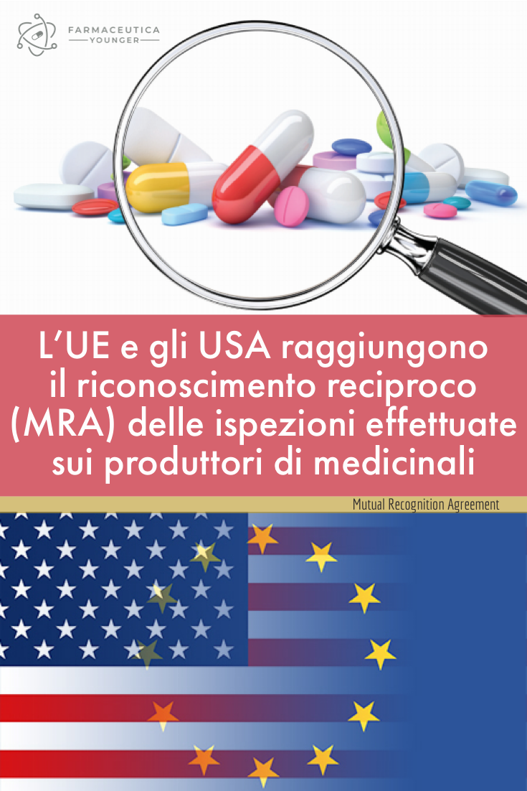

Con il riconoscimento da parte della FDA della Slovacchia, l'Unione europea e gli Stati Uniti hanno ora completato, con tre giorni di anticipo, l'accordo di mutuo riconoscimento (MRA) per quanto riguarda le ispezioni GMP dei siti di produzione di determinati medicinali umani nei loro rispettivi territori. Anche se un solo paese dell’UE fosse risultato non idoneo nella conduzione delle ispezioni dalla FDA l’MRA sarebbe saltato. Da ciò ne deriva l’importanza del raggiungimento di questo risultato che rappresenta una vera e propria pietra miliare nei rapporti tra Stati Uniti e paesi dell’Unione Europea in materia di ispezioni di siti produttori di medicinali.

> Accogliamo con favore l'attuazione di questo accordo, il che significa che le autorità di entrambe le sponde dell'Atlantico potranno ora fare affidamento sui reciproci risultati delle ispezioni. Questa pietra miliare è una testimonianza dell'importanza della nostra partnership strategica con gli Stati Uniti. Supporterà il miglior utilizzo della nostra capacità di ispezione, in modo che i pazienti possano fare affidamento sulla qualità, sicurezza ed efficacia di tutti i farmaci, indipendentemente da dove siano stati fabbricati.

Ha affermato Guido Rasi, direttore esecutivo di EMA.

Ogni anno, le autorità nazionali dell'UE e la FDA ispezionano molti siti di produzione di medicinali nell'UE, negli Stati Uniti e in altre parti del mondo, per garantire che tali siti operino nel rispetto delle GMP. Grazie all'MRA, le autorità regolatorie dell'UE e degli Stati Uniti ora faranno affidamento sulle rispettive ispezioni per i medicinali umani nei loro territori e quindi evitando il lavoro in duplicato. L’accordo consente sia alle autorità dell’UE che alla FDA di utilizzare meglio le proprie risorse ispettive e concentrarsi su siti a rischio più elevato. In casi eccezionali, sia gli enti regolatori dell’UE che la FDA possono riservarsi il diritto di ispezione in qualsiasi momento. Questo accordo nasce anche da un dato chiaro: circa il 40% dei medicinali finiti commercializzati nell’UE proviene dall’estero e l’80% dei produttori di API per medicinali disponibili nell’UE si trovano al di fuori dell’Unione.

Dal maggio 2014, i team della Commissione europea, le autorità nazionali competenti dell'UE, l'EMA e la FDA hanno controllato e valutato le rispettive ispezioni condotte dalle agenzie nei principali siti produttivi di medicinali. l'UE ha valutato positivamente il lavoro ispettivo della sua controparte statunitense, concludendo nel giugno 2017 che la FDA ha le capacità e le competenze per effettuare ispezioni GMP per i medicinali per uso umano a un livello equivalente all'UE. L’FDA, dal suo canto, ha voluto ispezionare ogni singolo Paese dell’Unione Europea per poter dare il proprio assenso. Gli albori di questo accordo risalgono al 1998. All’epoca sono state gettate le fondamenta per un riconoscimento comune in fatto di ispezioni GMP ed è stato pubblicato un documento che poi però non è più stato implementato o aggiornato. Si è rimasti in una situazione di stallo fino al 2014 quando sono ripresi i dialoghi tra le parti e si è arrivati a una conclusione nel 2017.

Ora che questo primo capitolo è stato chiuso le autorità europee e statunitensi puntano a migliorare ulteriormente l’accordo. I prossimi step proseguiranno al fine di estendere l'ambito operativo ai medicinali veterinari, ai vaccini umani e ai medicinali derivati ​​dal plasma.

Fonte: https://www.ema.europa.eu/en/news/eu-us-reach-milestone-mutual-recognition-inspections-medicines-manufacturers
