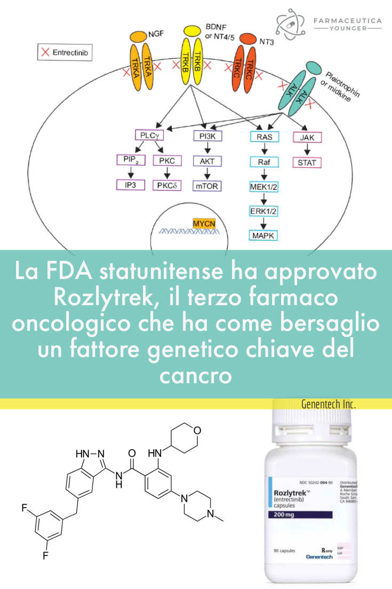

La Food and Drug Administration degli Stati Uniti ha concesso un'approvazione accelerata a [Rozlytrek (entrectinib)](https://www.fda.gov/news-events/press-announcements/fda-approves-third-oncology-drug-targets-key-genetic-driver-cancer-rather-specific-type-tumor), per il trattamento del carcinoma polmonare non a piccole cellule metastatico ROS1-positivo (NSCLC) nei pazienti adulti e per il trattamento di pazienti adulti e pediatrici di età pari o superiore a 12 anni con tumori solidi che presentano una fusione genica del recettore neurotrofico tirosin chinasico (NTRK) per i quali non esistono trattamenti efficaci.

**Rozlytrek è il primo trattamento approvato dalla FDA che prende di mira le fusioni geniche di ROS1 e NTRK** e il terzo trattamento antitumorale basato su un biomarcatore comune a diversi tipi di tumori anziché sulla posizione in cui il tumore ha avuto origine, i farmaci antitumorali cosiddetti "[agnostici dei tessuti](https://www.farmaceuticayounger.science/blog/2019/01/lfda-statunitense-chiude-il-2018-con-59-nuove-approvazioni/)".

ROS1 è una tirosina chinasi, che svolge un ruolo importante nel controllo della crescita e della proliferazione delle cellule. Quando si verifica una fusione del gene ROS1, le cellule tumorali crescono e proliferano in modo incontrollato. Le fusioni del gene ROS1 rappresentano l'1-2% del carcinoma polmonare non a piccole cellule (NSCLC). Il cancro del polmone è la principale causa di morte per tumore in tutto il mondo. Ogni anno, oltre un milione e mezzo di persone muoiono a causa della malattia a livello globale, equivalenti a oltre 4.000 decessi ogni giorno. L'NSCLC è il tipo più comune di carcinoma polmonare e rappresenta l'85% di tutte le diagnosi di carcinoma polmonare.

Il carcinoma neurotrofico del recettore della tirosina chinasi (NTRK) neurosensibile si verifica quando i geni NTRK1/2/3 si fondono con altri geni, con conseguente alterazione delle proteine ​​TRK (TRKA/TRKB/ TRKC) che possono attivare le vie di segnalazione coinvolte nella proliferazione di alcuni tipi di cancro. I ligandi comuni dei recettori delle TRK sono le neurotrofine, una famiglia di fattori di crescita fondamentali per il funzionamento del sistema nervoso. Queste fusioni sono state identificate in una vasta gamma di tipi di tumori solidi, tra cui carcinoma mammario, colangiocarcinoma, colonrettale, neuroendocrino, polmonare non a piccole cellule, pancreatico, tiroideo, etc.

Entrectinib è un inibitore selettivo della tirosina chinasi. Agisce inibendo l'attività della chinasi delle proteine ​​TRK A/B/C e ROS1, le cui fusioni attivanti guidano la proliferazione in alcuni tipi di cancro.

La capacità di Rozlytrek di ridurre i tumori è stata valutata in quattro studi clinici condotti su 54 adulti con tumori positivi alla fusione NTRK. La percentuale di pazienti con sostanziale riduzione del tumore (tasso di risposta globale) è stata del 57%, con il 7,4% dei pazienti in cui si è registrata una scomparsa completa del tumore. Tra i 31 pazienti con contrazione del tumore, il 61% aveva una contrazione del tumore persistente per nove mesi o più. Le sedi tumorali più comuni erano polmone, ghiandola salivare, seno, tiroide e colon/retto.

Rozlytrek ha ottenuto [l'approvazione accelerata](https://www.fda.gov/patients/fast-track-breakthrough-therapy-accelerated-approval-priority-review/accelerated-approval), la Priority Review, la [Breakthrough Therapy](https://www.farmaceuticayounger.science/blog/2018/12/breakthrough-therapy/) e la designazione di farmaco orfano dalla FDA statunitense. Rozlytrek è stato approvato per la prima volta dal Ministero della salute, del lavoro e del benessere (MHLW) del Giappone il 18 giugno per il trattamento di pazienti adulti e pediatrici con tumori solidi ricorrenti avanzati positivi alla fusione NTRK. Ha anche ottenuto la designazione di medicinali prioritari (PRIME) dall'Agenzia europea per i medicinali (EMA).

L'approvazione di Rozlytrek è stata concessa a Genentech, Inc. del gruppo Roche.
